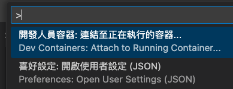
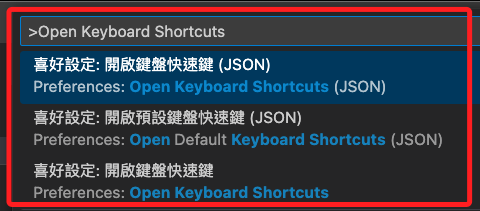
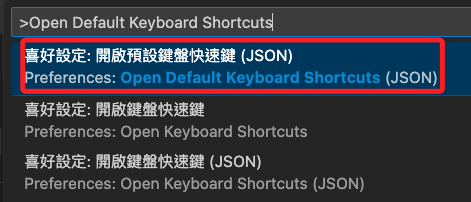
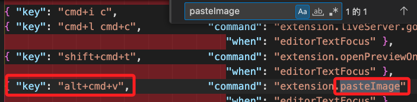
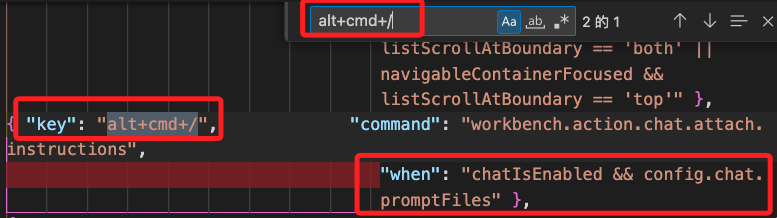
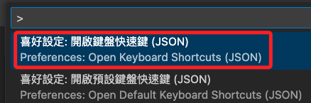

# 自訂快速鍵

_VSCode 預設的快速鍵是不可更改的，但可以替既有或新的功能添加新的快速鍵_

<br>

## 查詢

1. 開啟 `命令選擇區`；使用快速鍵 `SHIFT + command+ P`。

    

<br>

1. 輸入 `Open Keyboard Shortcuts` 可自訂快速鍵。

    

<br>

1. 若要查看預設快速鍵，可選擇 `Open Default Keyboard Shortcuts` ，這部分是不允許更改的。

    


<br>

1. 在預設快速鍵清單中，透過搜尋可以看到 `Paste Image` 這個插件的快速鍵也寫在預設值內，設定為 `alt+cmd+v`；再次說明，Mac 系統的 `option` 與 `cmd` 對應 Windows 鍵盤分別為 `alt` 與 `Windwos`，物理鍵盤的位置是相同的。

    

<br>

1. 假如想更新為 `alt+cmd+/`，先查詢確認這個新的目標設定值與其他預設值都沒有衝突，或是已被定義，但條件 `when` 不衝突；特別說明，這個衝突來自於後來推出的 `AI Copilot` 功能使用了這個快速鍵，但我未使用，所以不受影響。

    

<br>

## 設定

1. 開啟設定文件。

    

2. 設定值如下，快速鍵可自行修改。

    ```json
    // 自定義一組 Paste Image 快速鍵
    {
        "key": "alt+cmd+/", 
        "command": "extension.pasteImage",
        "when": "editorTextFocus"
    }
    ```

<br>

3. 設定完成後，當編輯過程中進行畫面截圖，按下快速鍵便可啟動 `Paste Image` 插件。

___

_END_