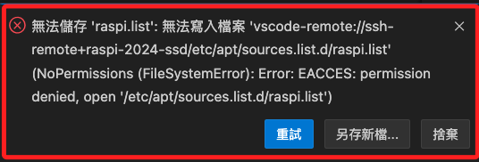
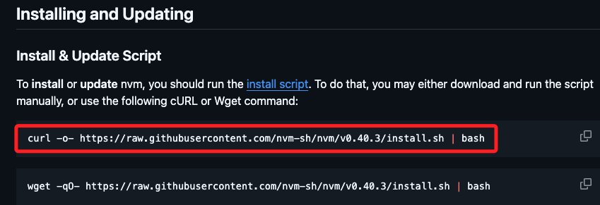
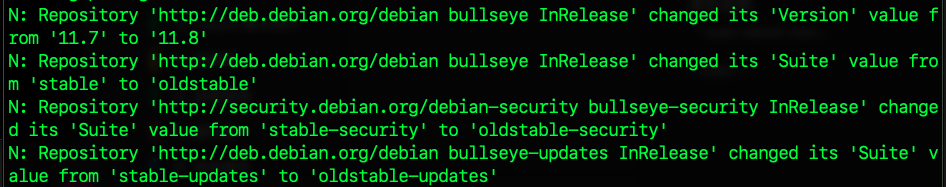

# VSCode 權限問題

_使用 `VSCode` 編輯文件出現權限問題的解決方案；以編輯資料夾 `/etc/apt/sources.list.d` 內的文件為例，裡面存放的是 `APT` 套件來源的補充清單_

<br>

## 說明

1. 使用終端機可透過 `sudo` 進行授權，但使用 `VSCode` 無法進行這種形態的授權，導致於編輯文件出現權限警告。

   

<br>

2. 先使用指令 `ls -l` 查詢當前授權；從預設結果來說，這些檔案都屬於 `root` 擁有，一般使用者只能讀取 `r`，無法修改。

   ```bash
   ls -l /etc/apt/sources.list.d/
   ```

   

<br>

3. 這是一個 `10` 碼的資訊；第一碼為 `文件類型`，當前 `-` 代表 `普通文件`，其他類型還有 `d 目錄`、`l 符號連結` 等；接下來 `9` 碼是 `3` 組各 `3` 個符號的權限值，分別代表 `擁有者`、`擁有者同群組用戶`、`其他用戶` 的權限組合；每個權限組合的 `3` 碼分別代表 `讀 r`、`寫 w`、`執行 x`，對應的數字為 `4、2、1`。

   ```bash
   # 普通文件：（擁有者：可讀寫）（同組：可讀）（其他：無權限）
   -rw-r--r-- 1 root root 113  6月 24 19:51 nodesource.list
   -rw-r--r-- 1 root root 192  6月 24 20:17 raspi.list
   ```

<br>

## 解決方案

1. 先使用 `sudo` 對文件進行授權可讀寫 `666`；如前所述，`讀、寫、執行` 分別對應的數值是 `4、2、1`，所以 `666` 代表對於每個類使用者都賦予 `讀＋寫` 的權限。

   ```bash
   sudo chmod 666 /etc/apt/sources.list.d/raspi.list
   ```

   

<br>

2. 編輯完文件後，恢復原來的權限 `644`，也就是只有 `root` 可以 `編輯`，其餘使用者僅可 `讀寫`。

   ```bash
   sudo chmod 644 /etc/apt/sources.list.d/raspi.list
   ```

<br>

## 通知軟體庫更新

1. 顯示訊息如下時，無需特別進行處理。

   

<br>

## 安全通告 

1. 顯示狀況。

   

<br>

_說明與排除_

<br>

1. 這是一個關於 `Common UNIX Printing System（CUPS）` 的 `安全通告`，具體訊息內容說明省略。

<br>

2. 根據建議進行檢查 `/etc/cups/cupsd.conf`，並對 `CUPS-Get-Document` 的訪問添加限制如下。

   ```ini
   <Limit CUPS-Get-Document>
   AuthType Default
   Require user @OWNER @SYSTEM
   Order deny,allow
   </Limit>
   ```

<br>

___

_END_