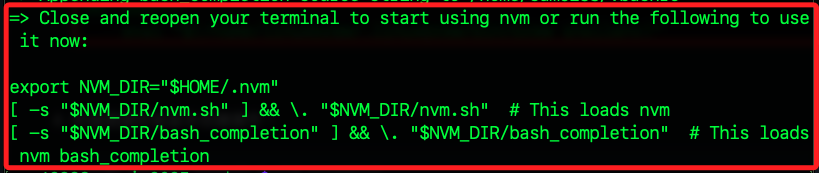

# 無法正確連線 WiFi

_記錄於 2025/06；Windows 系統燒錄 SD 卡之後，無法正確連線 WiFi_

 

## 問題描述

_經查發現以下兩處出現斷行，導致開機後設定出錯_

 

1. 第一。

    

 

2. 第二。

    

 

## 操作

1. 燒錄完成後，先依據指示退出卡片並隨即插回電腦，在檔案總管中會看到一個 `bootfs` 磁區，這就是SD卡片中可讀的區域。

 

2. 其中有一個腳本 `firstrun.sh`，點擊後使用 `VSCode` 或筆記本開啟；特別注意，SD 卡片一但插入樹莓派開機後這個腳本就會因執行而被移除，所以要在啟動前才能進行編輯。

 

3. 將前述三個錯誤斷行處修正，就是取消斷行。

 

4. 以上完成後步驟，在插入樹莓派開機，就可以正確連線了。

 

___

_END_