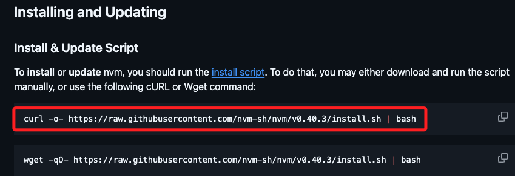

# nvm

_現在安裝已經不會遇到問題了；更新：2025/07_

<br>

## 安裝 nvm

_不會自動安裝 npm_

<br>

1. 前往[官方 GitHub](https://github.com/nvm-sh/nvm)，依據指示安裝最新版本即可。

    ```bash
    curl -o- https://raw.githubusercontent.com/nvm-sh/nvm/v0.40.3/install.sh | bash
    ```

    

<br>

2. 依據指示重啟終端機，或是運行其中代碼套用環境變數。

    

<br>

3. 或執行以下指令，讓 nvm 生效；這是 nvm 的核心啟動腳本，負責載入 nvm 指令、設定 PATH、為 shell session 建立必要的環境變數。

    ```bash
    source ~/.nvm/nvm.sh
    ```

<br>

4. 輸入指令查詢版本，確認安裝完成，參數也可替換為 `--version`；出現版本號即代表安裝成功。

    ```bash
    nvm -v
    ```

<br>

## 常用指令

1. 安裝指定版本。

    ```bash
    nvm install <version>
    ```

<br>

2. 切換至指定版本。

    ```bash
    nvm use <version>
    ```

<br>

3. 列出已安裝的版本。

    ```bash
    nvm ls
    ```

<br>

4. 查看可安裝的版本列表。

    ```bash
    nvm ls-remote
    ```

<br>

5. 設定預設版本。

    ```bash
    nvm alias default <version>
    ```

<br>

6. 移除指定版本。

    ```bash
    nvm uninstall <version>
    ```

<br>

## 實作

_切換版本_

<br>

1. 使用 `nvm` 安裝指定版本。

    ```bash
    nvm install 20
    ```

<br>

2. 切換目前終端機使用的 `Node.js` 版本。

    ```bash
    nvm use 20
    ```

<br>

3. 設定預設的版本，設定完成後，每次打開新的終端機便會使用這個版本；特別注意，這不會影響當前使用版本。

    ```bash
    nvm alias default 20
    ```

<br>

___

_END_