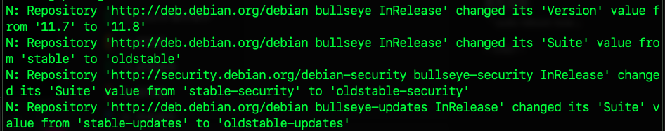
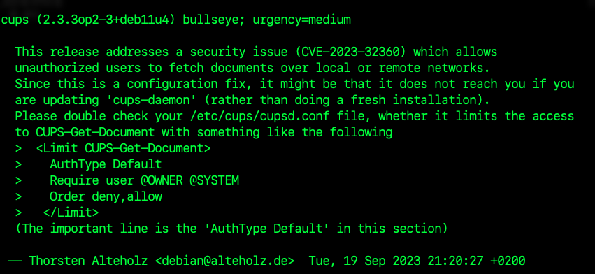

# 系統安全通知

<br>

## 通知軟體庫更新

1. 顯示訊息如下時，代表套件來源的版本如 `11.7 → 11.8` 或套件分類如 `stable → oldstable` 已更新，這些屬於常見的版本調整通知，無需特別進行處理。

    

<br>

## 安全通告 

_Security Advisory_

<br>

1. 如果更新期間出現與特定服務有關的安全性警告，如下圖所示關於 `cups` 的安全通告，建議依照說明修正設定。

    

<br>

_說明與排除_

<br>

2. 此通告指出 `Common UNIX Printing System（CUPS）` 存在未授權存取漏洞如 `CVE-2023-32360`，這可能導致區域或遠端使用者擷取列印文件。

<br>

3. 根據安全建議，應檢查 `/etc/cups/cupsd.conf` 是否已正確限制 `CUPS-Get-Document` 的的存取權限；若無，可新增以下設定，若僅進行 `cups-daemon` 套件更新而非全新安裝，需手動修改設定檔。

    ```ini
    <Limit CUPS-Get-Document>
        AuthType Default
        Require user @OWNER @SYSTEM
        Order deny,allow
    </Limit>
    ```

<br>

4. 如非必要用途，亦可停用 `CUPS` 服務。

    ```bash
    sudo systemctl disable cups
    sudo systemctl stop cups
    ```

<br>

___

_END_
