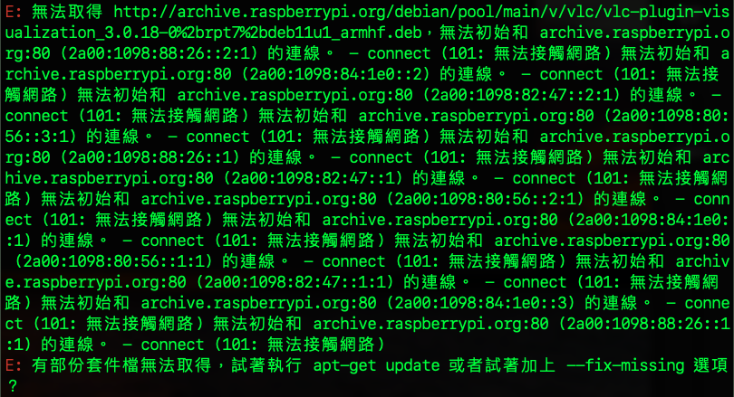
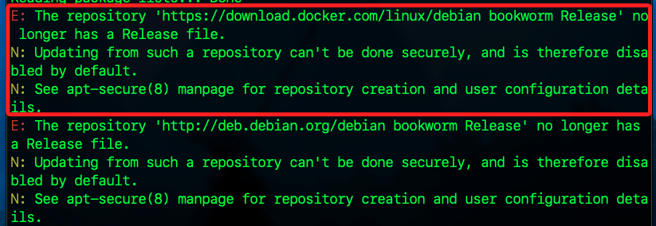
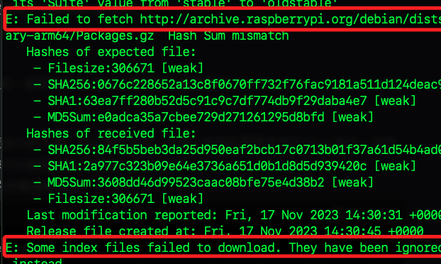
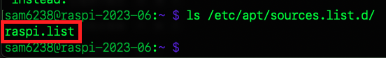
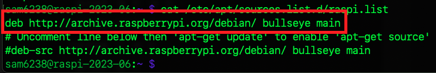
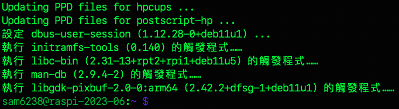

# 更新時常見錯誤 / 訊息

_基本上，執行更新指令 `apt update` 或 `apt upgrade` 時出錯的處理原則就是 `哪裡錯就把哪裡的更新列表註解掉`，重新再更新一次就好。_

<br>

## 關於軟體來源的錯誤

_執行更新時，APT 對各個軟體來源做 `下載索引檔` 與 `完整性檢查` 時拋出的錯誤訊息，但它們各屬不同的錯誤類型_

<br>

1. 連線失敗，APT 無法連到 `archive.raspberrypi.org:80`，典型原因可能是網路中斷、DNS 問題或 IPv6 無法連線。

   

<br>

2. 缺少 Release 檔案；某個來源沒有 Release 檔案，出於安全考量就直接拒絕更新。

   

<br>

3. 雜湊校驗錯誤；檔案可能在傳輸中被截斷、Proxy 快取壞檔或鏡像同步異常。

   

<br>

## 錯誤訊息：欄位變動

1. 錯誤訊息如下，表示 Debian Bookworm 在 `2025-05-17` 發行了第十一個點版本，從 `12.10 → 12.11`，APT 在更新時發現 repository 的 Release 檔案裡 Version 欄位已改變，因此為了安全必須顯式接受這個變更後才能繼續下載套件。

   ```bash
   N: Repository 'http://deb.debian.org/debian bookworm InRelease' changed its 'Version' value from '12.10' to '12.11'
   ```

<br>

2. 臨時接受 ReleaseInfo 變更。

   ```bash
   sudo apt update --allow-releaseinfo-change
   ```

<br>

3. 永久允許 ReleaseInfo 變更。

   ```bash
   echo 'Acquire::AllowReleaseInfoChange "true";' | sudo tee /etc/apt/apt.conf.d/99allow-releaseinfo-change
   ```

<br>

4. 完成後再次更新。

   ```bash
   sudo apt updat
   ```

<br>

## 嘗試排除

<br>

1. 執行更新指令時出現如上方截圖中的錯誤訊息。

   ```bash
   sudo apt-get update && apt-get upgrade -y
   ```

<br>

2. 查看 `sources.list.d` 目錄下所有文件。

   ```bash
   ls /etc/apt/sources.list.d/
   ```

<br>

3. 假如系統是才安裝好的，此時可能只有一個清單文件。

   

<br>

4. 透過 `cat` 指令逐一查看內容。

   ```bash
   cat /etc/apt/sources.list.d/<文件名>
   ```

<br>

5. 使用編輯指令進行編輯，這裡編輯的是 `raspi-list`。

   ```bash
   sudo nano /etc/apt/sources.list.d/<文件名>
   ```

<br>

6. 把報錯的 `鏡像來源` 註解起來。

   

<br>

7. 再次更新，順利完成。

   

<br>

___

_END_