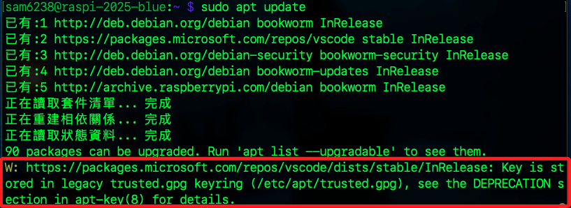
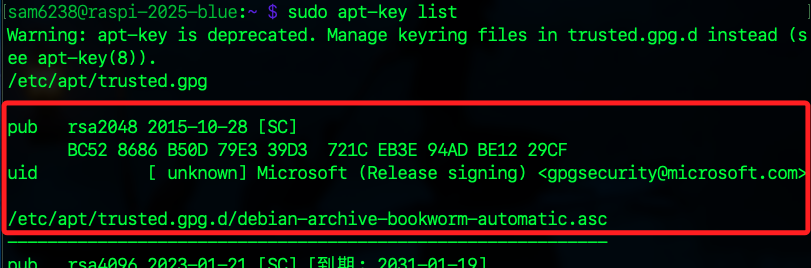
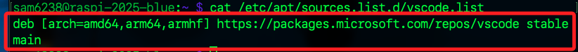

# 金鑰格式過時警告

_更新清單時，若出現關於金鑰格式的警告_

<br>

## 說明

1. 出現警告如下，意思是目前的 VSCode 套件來源所使用的 GPG 驗證金鑰仍儲存在舊的格式 `trusted.gpg` 中，這種做法在新版 `Debian / Ubuntu` 中已被標記為過時（`deprecated`）；雖然這不會造成功能錯誤，系統僅建議移除舊金鑰，改用新版 `.gpg` 金鑰管理方式。

    

<br>

## 轉換新版金鑰管理

1. 查詢 Microsoft 的 `金鑰 ID`，這會儲存在 `/etc/apt/trusted.gpg`，這就是 apt 的警告來源。

    ```bash
    sudo apt-key list
    ```

    

<br>

2. 找到後執行以下指令刪除。

    ```bash
    sudo apt-key del <金鑰ID>
    ```

<br>

3. 重新匯入新版 Microsoft GPG 金鑰。

    ```bash
    wget -qO- https://packages.microsoft.com/keys/microsoft.asc | gpg --dearmor > microsoft.gpg
    sudo install -o root -g root -m 644 microsoft.gpg /etc/apt/trusted.gpg.d/
    rm microsoft.gpg
    ```

<br>

4. 確認來源仍存在。

    ```bash
    cat /etc/apt/sources.list.d/vscode.list
    ```

<br>


    

5. 再次更新套件清單。

    ```bash
    sudo apt update
    ```

<br>

___

_END_