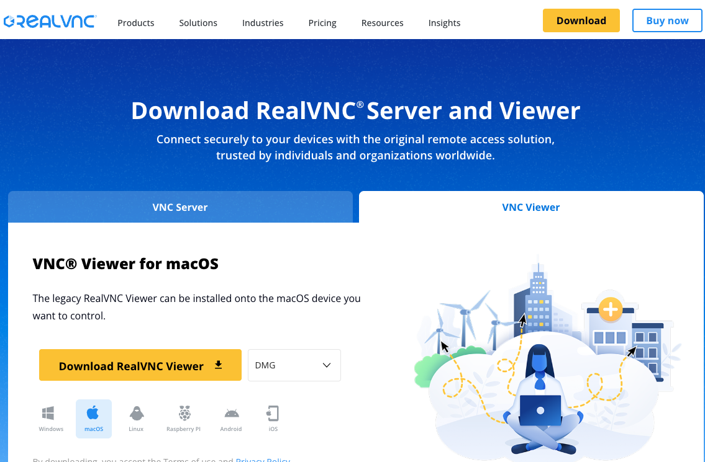
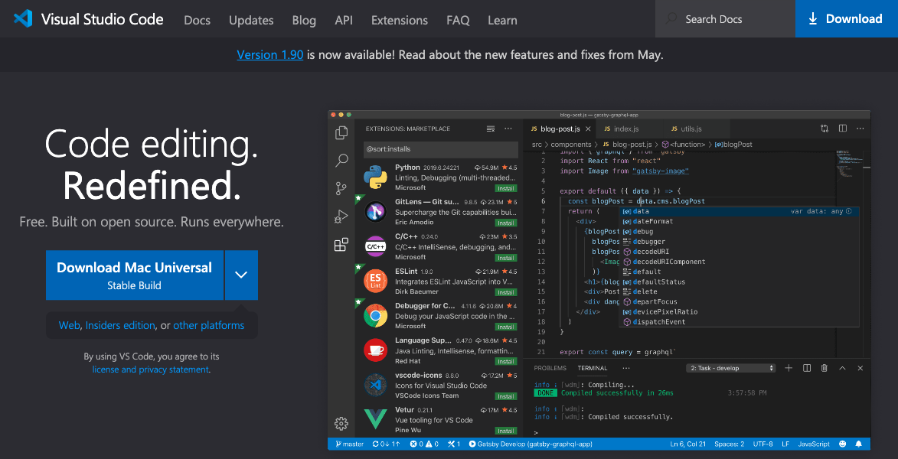
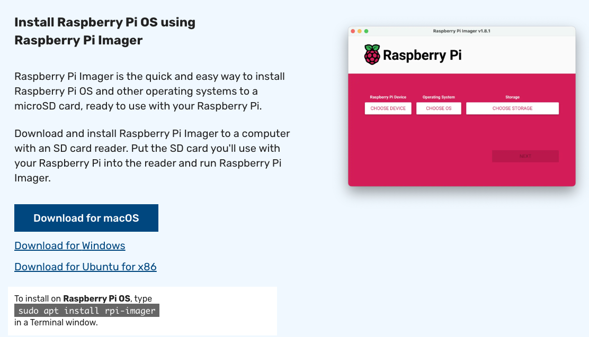
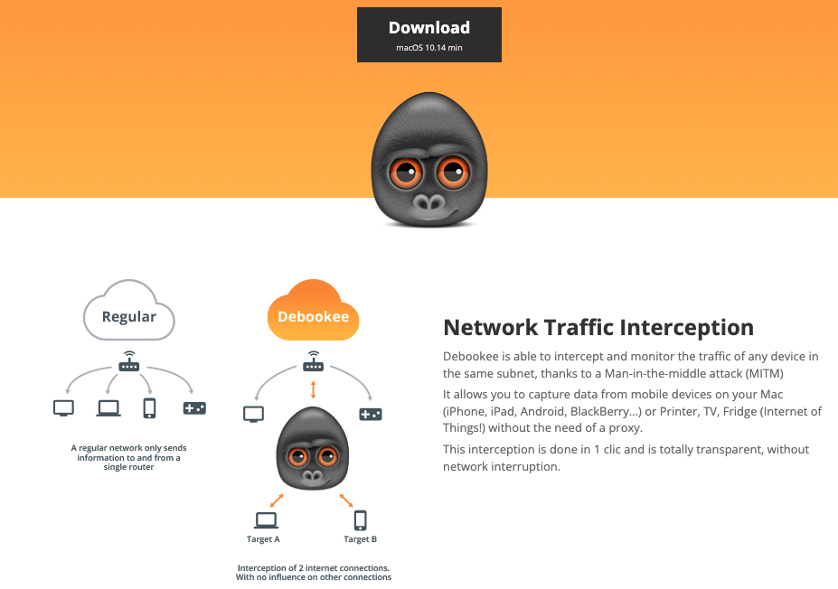

# 開發常用工具

_僅列出清單，不做說明_

 

## [VNC Viwer](https://www.realvnc.com/en/connect/download/viewer/)

_遠端連線樹莓派工具_

 

## [VSCode](https://code.visualstudio.com/)

_程式碼編輯器，可整合為一個 `IDE` 整合開發環境_

 

## [GitHub Desktop](https://desktop.github.com/)

_版本控制桌面應用_

 

## [Raspberry Pi Imager](https://www.raspberrypi.com/software/)

_官方燒錄器_

 

## [Docker Desktop](https://www.docker.com/products/docker-desktop/)

_容器的部署、運行和管理_

 

## [Debookee](https://debookee.com/)

_專為 macOS 設計的網路封包擷取與分析工具_

 

## [Advance IP Scanner](https://www.advanced-ip-scanner.com/tw/)

_免費 Windows 網路掃描工具，可快速偵測並列出區域網路中所有線上裝置的 IP、MAC 與主機名稱_

___

_END_