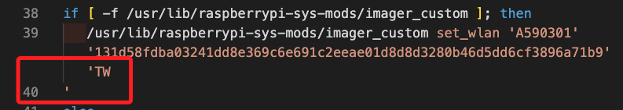
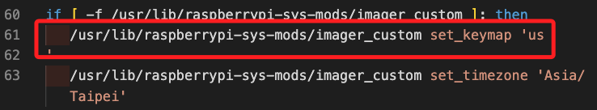
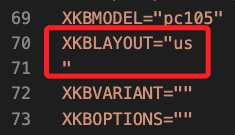
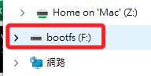
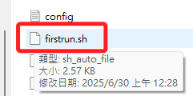
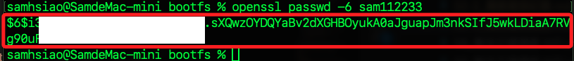

# 燒錄錯誤紀錄

_這是系統的 Bug，Windows 系統燒錄 SD 卡之後，無法正確連線 WiFi；記錄於 2025/06_

<br>

## 問題說明

_經交叉比對，發現在 Win 系統中燒錄的啟動腳本 `firstrun.sh` 文件中，以下三處出現錯誤斷行，導致未能正確進行 WiFi 設置，所以正常開機後無法連線路由器_

<br>

1. 第一處，`'TW'` 後引號被斷行。

    ```bash
    if [ -f /usr/lib/raspberrypi-sys-mods/imager_custom ]; then
    /usr/lib/raspberrypi-sys-mods/imager_custom set_wlan 'A590301' '131d58fdba03241dd8e369c6e691c2eeae01d8d8d3280b46d5dd6cf3896a71b9' 'TW
    '
    ```

    


<br>

2. 第二處，`'us'` 後引號被斷行。

    ```bash
    if [ -f /usr/lib/raspberrypi-sys-mods/imager_custom ]; then
    /usr/lib/raspberrypi-sys-mods/imager_custom set_keymap 'us
    '
    ```

    

<br>

3. 第三處，`"us"` 後引號被斷行。

    ```bash
    XKBLAYOUT="us
    "
    ```

    

<br>

## 修正指引

1. 燒錄完成後，先依據指示退出卡片並隨即插回電腦，在檔案總管或 Finder 中會看到一個 `bootfs` 磁區，這就是 SD 卡片中可讀的 `FAT` 磁區；另外一個啟動磁區無法觀察。

    

<br>

2. 其中有一個腳本 `firstrun.sh`，點擊使用 `VSCode` 或筆記本開啟；特別注意，SD 卡片一但插入樹莓派開機後，這個腳本就會因執行而被 _自動刪除_，所以要在啟動前進行編輯。

    

<br>

3. 將前述三個錯誤斷行處修正，就是取消斷行。

    ```bash
    # 第一處
    if [ -f /usr/lib/raspberrypi-sys-mods/imager_custom ]; then
    /usr/lib/raspberrypi-sys-mods/imager_custom set_wlan 'A590301' '131d58fdba03241dd8e369c6e691c2eeae01d8d8d3280b46d5dd6cf3896a71b9' 'TW'
    # 其餘略 ...

    # 第二處
    if [ -f /usr/lib/raspberrypi-sys-mods/imager_custom ]; then
    /usr/lib/raspberrypi-sys-mods/imager_custom set_keymap 'us'
    # 其餘略 ...

    # 第三處
    XKBLAYOUT="us"
    # 其餘略 ...
    ```

<br>

4. 完成以上步驟後，將 SD 卡插入樹莓派進行開機，若無其他狀況就可以正確連線 WiFi 了。

<br>

## 補充說明

_說明啟動腳本 `firstrun.sh` 中的各項設置，若想手動修正，可在燒錄後、啟動前進行編輯_

<br>

1. 設定主機名稱 `hostname`，共有以下三處；可手動修改 `<填入-主機名稱>`，不用引號包覆、不用加上尾綴 `.local`；代碼表示將自定義 `hostname`，若沒有順利調用 `imager_custom` 寫入，會手動寫入 `/etc/hostname` 和修改 `/etc/hosts` 兩個文件。

    ```bash
    CURRENT_HOSTNAME=`cat /etc/hostname | tr -d " \t\n\r"`
    if [ -f /usr/lib/raspberrypi-sys-mods/imager_custom ]; then
    /usr/lib/raspberrypi-sys-mods/imager_custom set_hostname <填入-主機名稱>
    else
    echo <填入-主機名稱> >/etc/hostname
    sed -i "s/127.0.1.1.*$CURRENT_HOSTNAME/127.0.1.1\t<填入-主機名稱>/g" /etc/hosts
    fi
    ```

<br>

2. 根據樹莓派官方及 Debian 系統的設定規範，密碼雜湊字串不能使用明文，所以要先透過指令將明文轉換為雜湊字串備用。

    ```bash
    openssl passwd -6 <明文密碼>
    ```

    

<br>

3. 設定預設使用者帳號及密碼，以下共計五處、九個名稱、兩個密碼要修正；若要手動變更有多處需要修改。

    ```bash
    # 第一處
    /usr/lib/userconf-pi/userconf '<新使用者名稱>' '<密碼雜湊字串>'

    # 第二處，這裡僅修改密碼
    echo "$FIRSTUSER:"'<密碼雜湊字串>' | chpasswd -e

    # 第三處
    if [ "$FIRSTUSER" != "<新使用者名稱>" ]; then
        usermod -l "<新使用者名稱>" "$FIRSTUSER"
        usermod -m -d "/home/<新使用者名稱>" "<新使用者名稱>"
        groupmod -n "<新使用者名稱>" "$FIRSTUSER"

    # 第四處
    sed /etc/lightdm/lightdm.conf -i -e "s/^autologin-user=.*/autologin-user=<新使用者名稱>/"

    # 第五處
    sed /etc/systemd/system/getty@tty1.service.d/autologin.conf -i -e "s/$FIRSTUSER/<新使用者名稱>/"
    sed -i "s/^$FIRSTUSER /<新使用者名稱> /" /etc/sudoers.d/010_pi-nopasswd
    ```

<br>


4. 設定 WiFi SSID、加密密碼和國家代碼，有兩處要修正 SSID 名稱、兩處 SSID 密碼；無前述工具時，手動寫入 `/etc/wpa_supplicant/wpa_supplicant.conf` 設定 WiFi，並設定權限及解除 wifi 封鎖。

    ```bash
    if [ -f /usr/lib/raspberrypi-sys-mods/imager_custom ]; then
    /usr/lib/raspberrypi-sys-mods/imager_custom set_wlan '<SSID-名稱>' '<WiFi-密碼雜湊>' 'TW'
    else
    cat >/etc/wpa_supplicant/wpa_supplicant.conf <<'WPAEOF'
    country=TW
    ctrl_interface=DIR=/var/run/wpa_supplicant GROUP=netdev
    ap_scan=1

    update_config=1
    network={
        ssid="<SSID-名稱>"
        psk=<WiFi-密碼雜湊>
    }
    ```

<br>

5. 設定鍵盤佈為 `us`、時區為 `Asia/Taipei`；同樣，無該工具時手動重配置 `/etc/timezone`、`/etc/default/keyboard` 及鍵盤設定。

    ```bash
    if [ -f /usr/lib/raspberrypi-sys-mods/imager_custom ]; then
    /usr/lib/raspberrypi-sys-mods/imager_custom set_keymap 'us'
    /usr/lib/raspberrypi-sys-mods/imager_custom set_timezone 'Asia/Taipei'
    else
    rm -f /etc/localtime
    echo "Asia/Taipei" >/etc/timezone
    dpkg-reconfigure -f noninteractive tzdata
    cat >/etc/default/keyboard <<'KBEOF'
    XKBMODEL="pc105"
    XKBLAYOUT="us"
    XKBVARIANT=""
    XKBOPTIONS=""
    ```

<br>

6. 另外也設定啟用 SSH，否則透過 systemd 啟用 ssh 服務。

    ```bash
    if [ -f /usr/lib/raspberrypi-sys-mods/imager_custom ]; then
    /usr/lib/raspberrypi-sys-mods/imager_custom enable_ssh
    else
    systemctl enable ssh
    fi
    ```

<br>

7. 刪除 `/boot/firstrun.sh` 腳本本身；特別說明，即便註解這段指令，啟動後該腳本依舊會被刪除，應該是系統中還有其他程序清理了文件，若想要備份，可進行複製備份。

    ```bash
    rm -f /boot/firstrun.sh
    ```

<br>

8. 從 `/boot/cmdline.txt` 中移除 `systemd.run` 相關參數，避免重複運行。

    ```bash
    sed -i 's| systemd.run.*||g' /boot/cmdline.txt
    exit 0
    ```

<br>

9. 該腳本關閉了遇錯停止 `exit on error` 的功能，即使某條命令失敗，腳本會繼續往下執行。

    ```bash
    set +e
    ```

<br>

## 命令行設定

_關於 `cmdline.txt`_

<br>

1. 可查看 `/boot/cmdline.txt`。

    ```bash
    console=serial0,115200 console=tty1 root=PARTUUID=d1876ee1-02 rootfstype=ext4 fsck.repair=yes rootwait quiet init=/usr/lib/raspberrypi-sys-mods/firstboot splash plymouth.ignore-serial-consoles cfg80211.ieee80211_regdom=TW systemd.run=/boot/firstrun.sh systemd.run_success_action=reboot systemd.unit=kernel-command-line.target
    ```

<br>

2. 以下這三個參數讓系統在啟動時執行 `/boot/firstrun.sh` 腳本，執行成功後會自動重啟，因為前一行已將腳本刪除，所以完成首次設定後會自動移除以下這些參數。

    ```bash
    systemd.run=/boot/firstrun.sh systemd.run_success_action=reboot systemd.unit=kernel-command-line.target
    ```

<br>

3. 延續上一點，正確啟動後被修正如下；這份文件除了保留在原路徑外，並複製一份到 `/boot/firmware/cmdline.txt`，作為實際內核啟動時使用的配置檔；特別注意，`bootfs` 分區是 FAT 格式分區，無論在 macOS 或是 WinOS 中皆可讀取，而系統根分區中的 `/boot/firmware` 為 `ext4` 格式，macOS 和 WinOS 預設無法讀取。

    ```bash
    console=serial0,115200 console=tty1 root=PARTUUID=d1876ee1-02 rootfstype=ext4 fsck.repair=yes rootwait quiet init=/usr/lib/raspberrypi-sys-mods/firstboot splash plymouth.ignore-serial-consoles cfg80211.ieee80211_regdom=TW
    ```

<br>

___

_END_