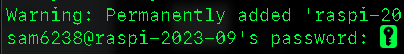
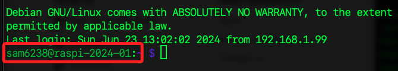
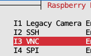
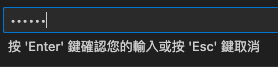

# 第一次啟動

<br>

## 說明

_本階段的工作_

<br>

1. 再次提醒，在前一個步驟燒錄記憶卡時，務必確認 `SSH` 設定狀態，並牢記連線的主機名稱、使用者帳號與密碼。

<br>

2. 接下來先在 `CLI` 使用 `SSH` 指令連線樹莓派，並執行設定指令將樹莓派的 `VNC` 開啟；使用 `Win` 系統的 `CLI` 是 `CMD` 或 `PowerShell`，`macOS` 系統則使用 `Terminal`，兩者都是用來與命令解析器 `Shell` 互動的介面。

<br>

3. 完成以上步驟後，前往下載並安裝 `VSCode`，後續將使用 `VSCode` 連線樹莓派進行相關開發。

<br>

4. 完成以上步驟後，可下載安裝 `VNC`，並用以連線到樹莓派的桌面。

<br>

## 使用終端機連線

_第一次啟動後，先使用 `終端機` 或 `CMD` 進行連線_

<br>

1. 在終端機使用 SSH 連線指令進行連線；務必更改指令中的 `<使用者帳號>` 與 `<主機名稱>` 不包含箭頭括號 `<>`，例如 `ssh pi@raspi.local`。

    ```bash
    ssh <使用者帳號>＠<主機名稱>.local
    ```

<br>

2. 第一次使用 SSH 連線到遠端設備時，系統會提示是否信任該主機，輸入 `yes` 可繼續連線；此後再次連線時，系統不會再出現提示，因為本機已將該遠端設備的資訊儲存在 `~/.ssh/known_hosts` 檔案中。

    

<br>

3. 接著按指示 `輸入密碼`。

    

<br>

4. 完成連線後，終端機命令行的提示字元通常由 `使用者名稱@主機名稱:目前目錄` 及提示符號如 `$` 或 `#` 組成，在 `Linux` 系統中，提示符號 `$` 代表一般用戶，`#` 代表 `root` 用戶；此外，`Linux` 中的 `~` 代表使用者家目錄，對應 `Windows` 系統中的 `C:\Users\<使用者帳號>` 或環境變數 `%USERPROFILE%`。

    

<br>

5. 退出連線；終端機返回本地電腦路徑。

    ```bash
    exit
    ```

    

<br>

## 關於 `mDNS` 解析

_在區域網路內，無需中央 DNS 伺服器就能根據主機名稱找到裝置 IP 的技術_

<br>

1. 在燒錄系統時，`.local` 結尾的主機名稱就是 `mDNS` 的識別標記，如此便可不用查詢 IP 位址，裝置會在區網中廣播自己的名稱與 IP，其他裝置就能辨識並連線；也就是只要在支援 mDNS 的網路中，區域網路將可自動解析主機名稱。

<br>

2. 若不加入 `.local`，則需手動設定本地 DNS 或 hosts 檔案才可正確解析主機名稱；該設定文件在 macOS 系統的路徑是 `/etc/hosts`，Win 系統的路徑則是在 `C:\Windows\System32\drivers\etc\hosts`。

<br>

3. 若要查看文件內容，macOS 可使用 `cat` 指令，Win 系統使用 `type`。

    ```bash
    # macOS
    cat /etc/hosts

    # WinOS
    type C:\Windows\System32\drivers\etc\hosts
    ```

<br>

## 樹莓派設定

_接下來要開啟樹莓派的 VNC（`Virtual Network Computing`） 功能，該功能稱為 `遠端桌面` 、 `虛擬網路控制` 或 `虛擬往復計算`_

<br>

1. 在樹莓派中執行以下指令進入系統設定；特別注意，需以管理員（`root`）權限運行指令，就是以 `sudo` 指令暫時取得 `root` 權限，而執行者本身不一定是超級使用者。

    ```bash
    sudo raspi-config
    ```

    

<br>

2. 使用 `上下鍵` + `ENTER` 進行選取 `Interface`。

    

<br>

3. 接著選取 `VNC`。

    

<br>

4. 以 `TAB` 鍵選取 `YES` 並按下 `ENTER`。

    

<br>

5. 接著選擇 `FINISH` 完成設定。

    

<br>

_到這裡為止已經開啟 VNC 並可透過 VNC 遠端連線到樹莓派的桌面，但以下會先進行 VSCode 的 SSH 連線_

<br>

## 安裝 VSCode

_僅提示重要步驟_

<br>

1. 訪問 [官網](https://code.visualstudio.com/download) 進行下載相應版本；使用 Win 系統可選擇 `System Installer` 的 `x64` 版本。

    

<br>

2. 點擊安裝後，在 `選擇附加的工作` 頁面中，勾選全部項目再點擊 `下一步` 進行安裝。

    

<br>

## 使用 VSCode

_進行遠端連線；預設並未安裝任何遠端連線套件_

<br>

1. 點擊左下角圖標 `開啟遠端視窗` 會自動安裝所需插件。

    

<br>

2. 依據指示輸入連線資訊 `<使用者名稱>@<主機名稱>.local`。

    

<br>

3. 要連線樹莓派，所以選擇 `Linux`。

    

<br>

4. 接著依據提示輸入連線密碼。

    

<br>

5. 初次連線時，右下角會顯示相關訊息。

    

<br>

6. 完成連線後顯示如圖；接著可進行相關操作。

    

<br>

7. 此時在終端機中可使用 code 指令開啟應用。

    ```bash
    code
    ```

<br>

## 再次連線

_進入 VSCode 應用中_

<br>

1. 若已安裝過插件，可點擊透左側 `遠端總管` 插件圖標進行連線。

    

<br>

2. 可選擇現有連線，若要添加新的連線可點擊 `+`。

    

<br>

3. 使用 SSH 連線及主機名稱；特別說明，提示中顯示的是完整連線指令，而實際上可省略 `ssh` 指令。

    ```bash
    ssh <使用者名稱>@<主機名稱>
    ```

    

<br>

4. 選擇保存 SSH 配置的位置，建議儲存在個人文件中。

    

<br>

5. 完成後，可點擊右下角彈窗中的 `Connect` 按鈕進行連線，或是點擊 `Open Config` 查看設定文件；該設定文件的位置就在 `~/.ssh`。

    

<br>

6. 依畫面指示輸入密碼。

    

<br>

7. 連線進行中，右下角會顯示當前工作狀態等訊息。

    

<br>

8. 完成連線時，下方會顯示如同終端機連線一樣的畫面。

    

<br>

## 其他說明

1. 建立連線時，點擊 `Open Config` 可開啟設定檔案。

    

<br>

2. 若設定後未自動刷新，可手動點擊刷新圖標，然後點擊所設定的連線。 

    

<br>

## VNC 連線

_使用 RealVNC Viewer_

<br>

1. 前往 [官網](https://www.realvnc.com/en/connect/download/viewer/)，開啟網頁後會自動選取對應的作業系統，點擊下載並在本機進行安裝。

    

<br>

2. 啟動 VNC Viewer。

    

<br>

3. 不一定需要登入。

    

<br>

4. 在上方對話框中輸入 `主機名稱` 進行連線，特別注意，這裡輸入的不是 SSH 指令。

    

<br>

5. 使用 IP 也可以，若要使用 IP，可先在樹莓派執行指令 `ifconfig` 進行查詢。

    

<br>

6. 可能出現黃色警告彈窗，表示沒有之前的身份記錄，點擊 `Continue` 即可。

    

<br>

7. 若出現紅色警告彈窗也是一樣，這是表示之前已經成功連接過該伺服器，且已記錄伺服器身份，但伺服器的身份資訊與上次連接後不同，這可能是因為重新燒錄系統碟所致，系統基於安全進行提示，點擊 `繼續 Continue` 即可。

    

<br>

8. 輸入 `帳號`、`密碼`，並選擇 `記住密碼`，然後點擊 `OK`。

    

<br>

9. 完成進入桌面。

    

<br>

## 樹莓派基本指令

_這裡僅是示範，後續將會進一步說明_

<br>

1. 關機。

    ```bash
    sudo shutdown now
    ```

<br>

2. 重新啟動。

    ```bash
    sudo reboot now
    ```
<br>

## 多人 VNC 連線

1. 可多人同時透過 VNC 連線進入同一台樹莓派主機，且會看到多個滑鼠指標，但這些滑鼠指標會同步控制。

<br>

2. `樹莓派 3` 應可以正常顯示，`樹莓派 4` 可能會出現 `Cannot currently show the desktop` 的錯誤，隨著版本的變化與更新，相關錯誤訊息會有所不同。

<br>

## 身份紀錄

_`known_hosts`，該文件用於存放已信任主機的公鑰，防止中間人攻擊_

<br>

1. 當第一次透過 SSH 連線樹莓派伺服器時，伺服器會送出它的 SSH 公鑰到正進行連線的客戶端設備，這就是是第一次在文件中出現的內容；同時間，客戶端會提示是否信任這台樹莓派主機，也就是輸入 `yes` 但尚未輸入密碼的那個時間點。

    

<br>

2. 輸入密碼之後，除了原本以 `ssh-ed25519` 加密的公鑰外，還會添加一組傳統的 `RSA` 金鑰，以及一組使用 `Elliptic Curve DSA（橢圓曲線演算法）` 產生的公鑰，`nistp256` 是採用 NIST 曲線 P-256 的演算法，體積介於 RSA 和 Ed25519 之間。

<br>

3. 未來若主機的公鑰改變，SSH 會警告 `WARNING: REMOTE HOST IDENTIFICATION HAS CHANGED！`；公鑰會在多種情況下產生變化，例如重灌系統。

<br>

4. 由此可知樹莓派的 SSH 伺服器預設啟用多種 HostKey 演算法，客戶端會向主機詢問所有支援的金鑰類型並記錄。

<br>

5. 在本地電腦中刪除指定遠端主機的 Host Key，這裡以 `raspi-2025-blue.local` 為例。

    ```bash
    ssh-keygen -R raspi-2025-blue.local
    ```

<br>

___

_END：以上完成第一次啟動_