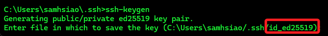
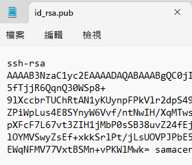
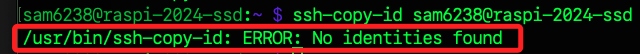
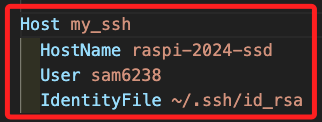
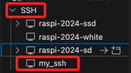
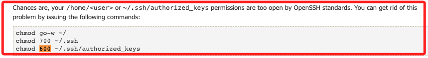

# 連線免密碼

_`Windows` 或 `Mac` 相同；以下將從工作原理開始說明_

<br>

## SSH 認證

_詳細說明 SSH 連線及驗證身份的過程_

<br>

1. 建立 TCP 連線：在本地電腦執行 `ssh` 指令時，第一個程序是本地 `SSH 客戶端` 會嘗試與 `遠端伺服器` 建立 `TCP 連線`，預設使用 `22` 端口；這一步驟確保兩端之間的網路通道是開通的。

<br>

2. 交換協商：`客戶端` 與 `伺服器` 交換並協商支持的 `加密算法`、`壓縮算法` 等，這一步驟確保雙方可以使用一致的協議和加密方式進行後續通訊，並生成 `會話密鑰` 用於 `加密` 後續的通訊。

<br>

3. 驗證伺服器身份：`客戶端` 通過 `伺服器` 提供的金鑰對伺服器的身份進行驗證，以確保連接到的伺服器不是惡意伺服器；這步驟的具體機制包括檢查伺服器的金鑰是否在本地已知的主機列表中（known_hosts 文件）中，如果匹配則通過身份驗證，如果不匹配，客戶端會提示用戶進行手動驗證和確認，用以確保所連接的伺服器不是惡意偽裝的伺服器；特別注意，這個伺服器發送到客戶端的金鑰是 `伺服器金鑰`，不是本地客戶端提供給伺服器的金鑰。

<br>

4. 讀取和發送金鑰：`客戶端` 會讀取 `本地私鑰`，並在本地資料夾 `~/.ssh` 中尋找對應的金鑰將其發送到 `伺服器` 進行比對；若對應的金鑰不存在於本地，則 SSH 會從私鑰進行計算並推導出對應的金鑰，相同的私鑰每次推導金鑰的結果必然一致。

<br>

5. 伺服器檢查金鑰：`伺服器` 檢查所接收到的金鑰是否存在 `~/.ssh/authorized_keys` 文件中。

<br>

6. 生成挑戰（Challenge）：如果存在且匹配成功，`伺服器` 會生成一個稱為 `挑戰（challenge）` 的隨機數據，並用金鑰加密數據後發送回 `客戶端`。

<br>

7. 解密挑戰並簽名：`客戶端` 使用私鑰解密這個加密的數據，並生成數字簽名，然後將簽名發送回 `伺服器`。

<br>

8. 伺服器驗證簽名：`伺服器` 驗證簽名是否正確，如果正確則身份驗證成功，`伺服器` 認為該連線請求是合法的，並允許連線。這個驗證過程確保私鑰不會離開本地主機，保證了私鑰的安全； `伺服器` 使用金鑰加密隨機數據，確保只有擁有正確私鑰的 `客戶端` 能夠解密。

<br>

## 建立密鑰

_在本機中生成密鑰_

<br>

1. 在本機中開啟終端機。

    

<br>

2. 若本地尚未建立過公私鑰，可運行以下指令進行建立；若已存在可跳到下一個 `查看` 步驟。

    ```bash
    ssh-keygen
    ```

<br>

3. 一直都按下 `ENTER` 以預設值建立即可。

    

<br>

4. 特別注意，當前版本預設密鑰對的加密方式是 `id_ed25519`。

    

<br>

## 查看

_完成後，可查看內容_

<br>

1. Windows 指令。

    ```bash
    type %userprofile%\.ssh\id_ed25519.pub
    ```

<br>

2. MacOS 指令。

    ```bash
    cat ~/.ssh/id_ed25519.pub
    ```

<br>

3. 複製或保留該視窗，稍後步驟會需要複製貼上金鑰內容。

    

<br>

## 設置遠端設備

_使用 nano 編輯工具在樹莓派上建立金鑰檔案_

<br>

1. 連線樹梅派並在 `家目錄` 建立一個資料夾 `ssh`；使用參數 `-p` 可用於建立 `多層級` 的資料夾，如此可避免父目錄或中間目錄不存在而報錯。

    ```bash
    mkdir -p ~/.ssh
    ```

<br>

2. 在資料夾內建立新文件 `authorized_keys` 並進行編輯，接著貼上前面步驟生成的金鑰內容，完成時使用組合鍵進行儲存 `control + o` 與關閉 `control + x`。

    ```bash
    nano ~/.ssh/authorized_keys
    ```

<br>

3. 可透過 cat 指令查看以確認編輯完成。

    ```bash
    cat ~/.ssh/authorized_keys
    ```

<br>

4. 假如要寫入多台設備公鑰，每一行直接斷行再接續下一組公鑰即可。

    

<br>

## 快速複製公鑰到遠端

_特別注意，這個步驟只是複製公鑰到遠端，並未重新導出公鑰_

<br>

1. 使用以下指令將公鑰 `複製` 到遠端伺服器，若進行樹莓派開發就是遠端的樹莓派上；透過該指令複製時，無須先在遠端電腦建立資料夾；另外，若文件已經存在，不會覆蓋遠端電腦的 `authorized_keys` 文件，而是會在文件中添加新的公鑰。

    ```bash
    ssh-copy-id <使用者名稱>@<遠端主機名稱或 IP>
    ```

<br>

2. 透過過程中顯示的訊息可知，這對公私鑰是由 `Ed25519` 算法所生成，這是一種相較於原本複製的 `RSA` 更安全的密鑰，生成後會要求輸入一次密碼來安裝金鑰到遠端。

    

<br>

3. 可明確指定使用的私鑰文件。

    ```bash
    ssh -i ~/.ssh/<私鑰檔案名稱> <使用者名稱>@<遠端主機名稱或 IP>
    ```

    _如範例中自動生成的 `id_ed25519.pub`_

    ```bash
    ssh -i ~/.ssh/id_ed25519.pub <使用者名稱>@<遠端主機名稱或 IP>
    ```

<br>

4. 若本地金鑰文件被刪除，這個複製將會錯誤，可透過下一個步驟重新導出並手動編輯遠端 `authorized_keys` 文件，或是複製下一個步驟導出的金鑰重建本地金鑰文件。

    

<br>

## 手動導出金鑰

_特別注意，這個金鑰不會重新自動儲存_

<br>

1. 若本地僅剩下私鑰，進行連線是沒問題的，可使用以下指令再次使用 `私鑰` 導出 `公鑰` 並顯示在螢幕上。

    ```bash
    ssh-keygen -y -f ~/.ssh/id_rsa
    ```

<br>

2. 若再次執行 `ssh-keygen` 指令會生成新的公私鑰對，原本的私鑰將被覆蓋。

<br>

## 預設金鑰優先權

_在沒有使用參數指定私鑰的情況下，SSH 會按照以下順序嘗試配對本地私鑰_

<br>

1. id_rsa 和 id_rsa.pub：RSA 密鑰。

<br>

2. id_dsa 和 id_dsa.pub：DSA 密鑰。

<br>

1. id_ecdsa 和 id_ecdsa.pub：ECDSA 密鑰。

<br>

4. id_ed25519 和 id_ed25519.pub：Ed25519 密鑰。

<br>

5. id_ecdsa_sk 和 id_ecdsa_sk.pub：這是使用 `FIDO/U2F 安全密鑰` 的 ECDSA 密鑰對。

<br>

6. id_ed25519_sk 和 id_ed25519_sk.pub：這是使用 `FIDO/U2F 安全密鑰` 的 Ed25519 密鑰對。

<br>

## 修改設定檔案

_非絕對必要，有時候沒設定也可以正常運行_

<br>

1. 編輯 SSH 的設定檔。

    ```bash
    sudo nano /etc/ssh/sshd_config
    ```

<br>

2. 取消以下三行的註解。

    ```bash
    # 是否允許使用金鑰認證來驗證用戶身份
    PubkeyAuthentication yes
    
    # 指定存放已授權金鑰的文件路徑
    AuthorizedKeysFile .ssh/authorized_keys
    
    # 是否允許使用密碼進行身份驗證
    PasswordAuthentication yes
    ```

<br>

## 連線設定檔

_無論使用哪一種開發工具，只要進行 SSH 連線皆可指定使用相同設定檔_

<br>

1. 在 `~/.ssh` 資料夾中有個預設的連線設定文件 `config`，格式如下；其中 `Host` 是自訂的連線名稱，`HostName` 是主機名稱，`User` 是帳戶名稱，同時可以使用 `IdentityFile` 指定私鑰檔案。

    ```bash
    Host myserver
        HostName example.com
        User myuser
        IdentityFile ~/.ssh/specific_key
    ```

    

<br>

2. 完成設定後，無論使用 VSCode 進行遠端連線，或使用終端機、命令行進行連線，皆會讀取該設定文件中的設定值；以下是示範連線名為 `myserver` 的設定。

    ```bash
    ssh my_ssh
    ```

    

<br>

## 編輯權限

_關於編輯檔案所需的權限_

<br>

1. 修改 `~/.ssh` 目錄及其所有子目錄和檔案的權限，`700` 表示僅有 `擁有者` 具有 `讀、寫、執行` 的權限，而其他用戶沒有任何權限。

    ```bash
    sudo chmod -R 700 ~/.ssh
    ```

<br>

2. 更改 `~/.ssh/authorized_keys` 檔案的擁有者和所屬的組，與上一個指令呼應。

    ```bash
    sudo chown <帳戶>:<群組> ~/.ssh/authorized_keys
    ```

    如

    ```bash
    sudo chown sam6238:sam6238 ~/.ssh/authorized_keys
    ```

<br>

3. 重新啟動 SSH 服務。

    ```bash
    sudo service ssh restart
    ```

<br>

## 連線測試

_重新連線測試以上設置是否完成_

<br>

1. 退出連線。

    ```bash
    exit
    ```

<br>

2. 再次連線，不再提示輸入密碼， VSCODE 的 SSH 也一樣。

    

<br>

3. 若要查看 SSH 日誌。

    ```bash
    sudo journalctl -u ssh
    ```

<br>

4. 使用 `-v` 參數進行連線查看更多連線資訊，也稱為 `詳細模式（verbose mode）`。

    ```bash
    ssh -v <帳號>@<主機名稱>
    ```

    如

    ```bash
    ssh -v sam6238@raspi-2023-09
    ```

<br>

5. 特別說明，當使用參數 `-v`、`-vv`、`-vvv` 等 `詳細模式（verbose mode）` 連線時，也代表會更詳細地檢查連線的程序，這可能會導致密鑰設置失效，並需要輸入密碼的情況，這是因為一般連線時並未進行詳細的檢查，也是一種相對寬鬆的連線安全管控，這時需要更進一步排查造成這個問題的原因。

<br>

## 錯誤排除

_嘗試排除  `詳細模式（verbose mode）` 時的密鑰失效問題_

<br>

1. 對於指定遠端主機名稱或 IP 清除本地連線紀錄。

    ```bash
    ssh-keygen -R <主機名稱或 IP>
    ```

<br>

2. 重啟 SSH 服務。

    ```bash
    sudo service ssh restart
    ```

<br>

3. 修改 `.ssh` 目錄和 `authorized_keys` 文件的擁有者及權限。

    ```bash
    sudo chown -R <使用者帳戶>:<使用者同名群組> ~/.ssh
    sudo chmod 700 ~/.ssh
    sudo chmod 600 ~/.ssh/authorized_keys
    ```

<br>

4. 檢查 `.ssh` 目錄的權限和擁有者。

    ```bash
    ls -ld ~/.ssh
    ```

<br>

5. 檢查 `authorized_keys` 文件的權限和擁有者。

    ```bash
    ls -l ~/.ssh/authorized_keys
    ```

<br>

## 補充說明

_針對 `權限問題` 進一步說明_

<br>

1. 雖未在 OpenSSH 官方說明文件中看到具體對於文件或資料夾權限的說明，但依據 [Ubuntu 官方文件](https://help.ubuntu.com/community/SSH/OpenSSH/Keys) 指出，SSH 在連線時會嚴格檢查權限設定，要求 .ssh 目錄必須由用戶自己擁有，並且權限設置為 700；另外，authorized_keys 文件必須由用戶自己擁有，並且權限設置為 600。目錄或文件由 root 擁有時，即便使用者屬於 root 群組也可能會導致權限問題，尤其是在 SSH 的服務中，在某些嚴謹的系統上，若權限不符合這樣的規範，SSH 將拒絕進行文件認證。

    

<br>

___

_END_