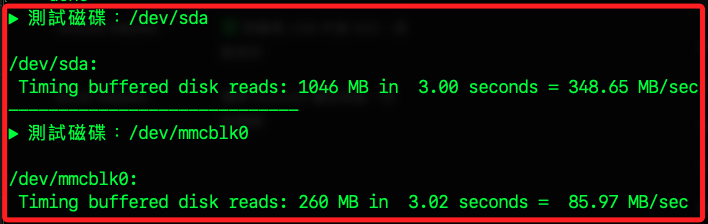

# 測速

_以下示範 `hdparm`_

<br>

## 說明

1. 安裝 `hdparm` 進行速度測試。

    ```bash
    sudo apt update && sudo apt install hdparm -y
    ```

<br>

2. 自動取得第一個非系統磁碟（/dev/sda）

    ```bash
    DEVICE=$(lsblk -ndo NAME,TYPE | awk '$2=="disk"{print "/dev/"$1; exit}')
    ```

<br>

3. 輸出查看

    ```bash
    echo "選定測試磁碟為：$DEVICE"
    ```

<br>

4. 執行 hdparm 測速

    ```bash
    sudo hdparm -t $DEVICE
    ```

<br>

5. 假如還有其他磁區，一次查詢所有磁碟裝置效能。

    ```bash
    for DEV in $(lsblk -ndo NAME,TYPE | awk '$2=="disk"{print "/dev/"$1}'); do
    echo "▶ 測試磁碟：$DEV"
    sudo hdparm -t $DEV
    echo "-----------------------------"
    done
    ```

    

<br>

___

_END_