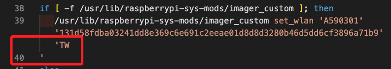
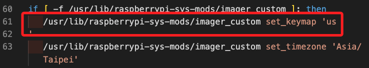
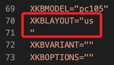
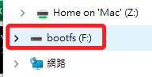
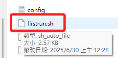

# 燒錄錯誤紀錄

_這是系統的 Bug，Windows 系統燒錄 SD 卡之後，無法正確連線 WiFi；記錄於 2025/06_

<br>

## 問題描述

_經查發現以下三處出現斷行，導致開機後設定出錯_

<br>

1. 第一。

    ```bash
    if [ -f /usr/lib/raspberrypi-sys-mods/imager_custom ]; then
    /usr/lib/raspberrypi-sys-mods/imager_custom set_wlan 'A590301' '131d58fdba03241dd8e369c6e691c2eeae01d8d8d3280b46d5dd6cf3896a71b9' 'TW
    '
    ```

    


<br>

1. 第二。

    ```bash
    if [ -f /usr/lib/raspberrypi-sys-mods/imager_custom ]; then
    /usr/lib/raspberrypi-sys-mods/imager_custom set_keymap 'us
    '
    ```

    

<br>

3. 第三。

    ```bash
    XKBLAYOUT="us
    "
    ```

    

<br>

## 操作

1. 燒錄完成後，先依據指示退出卡片並隨即插回電腦，在檔案總管中會看到一個 `bootfs` 磁區，這就是 SD 卡片中可讀的區域。

    

<br>

2. 其中有一個腳本 `firstrun.sh`，點擊後使用 `VSCode` 或筆記本開啟；特別注意，SD 卡片一但插入樹莓派開機後這個腳本就會因執行而被自動移除，所以要在啟動前才能進行編輯。

    

<br>

3. 將前述三個錯誤斷行處修正，就是取消斷行。

    ```bash
    # 第一處
    if [ -f /usr/lib/raspberrypi-sys-mods/imager_custom ]; then
    /usr/lib/raspberrypi-sys-mods/imager_custom set_wlan 'A590301' '131d58fdba03241dd8e369c6e691c2eeae01d8d8d3280b46d5dd6cf3896a71b9' 'TW'
    # 其餘略 ...

    # 第二處
    if [ -f /usr/lib/raspberrypi-sys-mods/imager_custom ]; then
    /usr/lib/raspberrypi-sys-mods/imager_custom set_keymap 'us'
    # 其餘略 ...

    # 第三處
    XKBLAYOUT="us"
    # 其餘略 ...
    ```

<br>

4. 以上完成後步驟，在插入樹莓派開機，就可以正確連線了。

<br>

___

_END_