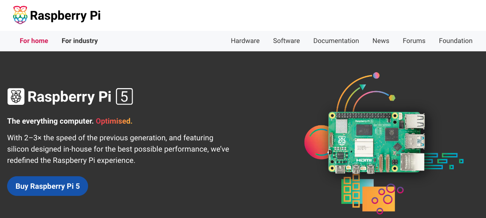
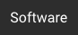
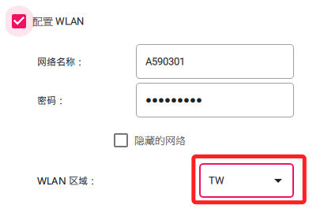

# 系統燒錄

_`MacOS` 與 `Windows` 系統的操作流程是一樣的_

 

## 工具與版本建議

1. 建議使用 `Raspberry Pi Imager` 作為燒錄工具；選擇對應的作業系統進行工具下載。

   

 

2. 樹莓派系統建議使用官方推薦的版本；第一次安裝會自動下載到本地，再次安裝則會讀取緩存。

   

 

## 安裝 ＆ 燒錄步驟

1. 前往 [樹莓派官網](https://www.raspberrypi.com/)。

   

 

2. 點選頁籤 [Software](https://www.raspberrypi.com/software/)。

   

 

3. 依據使用的作業系統，下載並安裝官方燒錄程式 `Raspberry Pi Imager`。

   

 

4. 安裝完成後，開啟桌面應用。

   

 

5. 先點擊 `選擇設備` 選擇開發板型號，如 `RASPBERRY PI 5`。

   

 

6. 接著點擊 `選擇操作系統`，在 `樹莓派 5 或 4` 上建議安裝官方推薦的 `64-BIT` 版本，`樹莓派 3` 可選擇 `32-BIT` 系統。

   

 

7. 假如要安裝的版本不在選單內，可點擊 `Raspberry Pi OS（other）` 進入下一層選單。

   

 

## 手動安裝

_也可以 [手動下載鏡像檔](https://www.raspberrypi.com/software/operating-systems/)；特別注意，這個步驟僅作為說明、參考用，無需實作_

 

1. 回到頁籤 [Software](https://www.raspberrypi.com/software/)，滾動到下方並點選 `See all download options` 。

   

 

2. 並選擇要下載的鏡像版本。

   

 

3. 在所選的鏡像檔案點擊 `Download` 進行下載。

   

 

4. 回到燒錄器中，滑動到下方點擊 `Use custom`，中文頁面顯示 `使用自定義鏡像`，接著便可在下載資料夾中選取自行下載的鏡像檔進行燒錄作業。

   

 

## 繼續安裝步驟

_特別注意，不同作業系統或不同語系設定的顯示內容可能不同，不做贅述_

 

1. 點擊 `選擇儲存設備`，就是選擇插入的 SD 卡。

   

 

2. 點擊右下角的 `下一步`。

   

 

3. 點擊 `編輯設置`。

   

 

4. 若是初次使用，中將兩個選項會是反白的，否則可點擊用以清除當前已足存的設置。

   

 

## 設定 `通用` 頁籤

_務必確認所有設定項目都有完成，否則無法在無頭模式下完成連線_

 

1. 勾選 `設置主機名稱`，就是 `Hostname`，這將用於第一次的連線，請務必牢記；另外，主機名稱是包含尾綴 `.local` 的，連線時不要遺漏。

   

 

2. 勾選 `設置用戶名稱及密碼` 並輸入兩個欄位，務必牢記自訂的內容；特別注意，包含 `使用者密碼` 與 `WiFi 密碼` 在初次輸入時可以看到原始密碼，再次查看時會發現被展開為長密碼，這是因為系統使用了雜湊演算將密碼進行加密；僅看似不同、不影響實際設定值。

   

 

3. 若是多人共用的設備，建議將 `Username` 設置為 `pi` ，這樣之後可以共用這個帳號作為共用的頂級管理帳號。

   

 

4. 勾選 `配置 WLAN` 並設定好 WiFi，這樣在初次啟動時會自動連線路由器，如此便可使用無頭模式進行連線。

   

 

5. 勾選 `WLAN 區域` 並設置為 `TW`，若自行輸入請注意要使用大寫；特別說明，樹莓派的 WiFi 驅動會依據所選區域載入符合地區的頻段與功率設定，_若未選取_，可能導致設置系統啟動後未能正確將 WiFi 開啟而無法完成連線。

   

 

6. 勾選 `本地化設置`，`時區` 使用預設的 `Asia/Taipei` 即可，鍵盤佈局設置為 `us`，這裡要使用小寫。

   

 

## 服務與可選設置

_切換到 `服務` 頁籤_

 

1. 勾選 `開啟 SSH`，並確認 `使用密碼登錄` 已被自動選取。

   

 

2. 在 `可選配置` 頁籤中，可勾選 `提示音` 並取消 `啟用遙測`；`遙測` 這應該是資訊蒐集的選項。

   

 

3. 完成後點擊下方的 `保存`。

   

 

## 開始燒錄

1. 確認設置正確後，點擊 `確認`；特別注意，按鈕顯示的文字可能會依語系或版本不同而不同，在此不做贅述。

   

 

2. 再次跳出警告視窗提示卡片中的資料將被刪除，點擊 `確認` 便會開始燒錄；初次燒錄需要下載較為耗時。

   

 

3. 特別注意，_當前的燒錄器 `v1.9.4` 存在 Bug_，若是多次燒錄時，在寫入階段就會進入校驗，導致燒錄程序疑似卡死，可將整個應用關閉重啟來排除；另外，這可能僅是 UI 介面的 BUG，燒錄程序有可能在背景中正確運行，繼續等待後還是可以完成；總之，基於穩健原則，還是重啟應用較爲妥當。

   

 

4. 正確進行燒錄會顯示進度，右側顯示的是 `取消寫入`；這個過程需要一點時間，燒錄完畢後，系統會依據設定 `進行驗證`。

   

 

5. 完成後將卡片取出，先將樹莓派電源拔除，接著將卡片插入樹莓派，再重新插上電源進行開機；特別注意，務必正確將卡片插入樹莓派後再連接電源開機

   

 

___

_END：以上完成樹莓派系統記憶卡燒錄_
