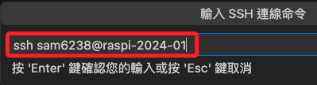
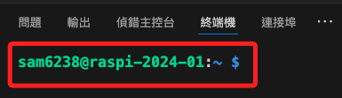
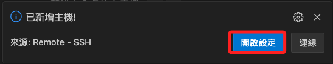
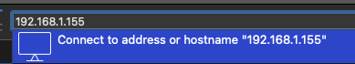
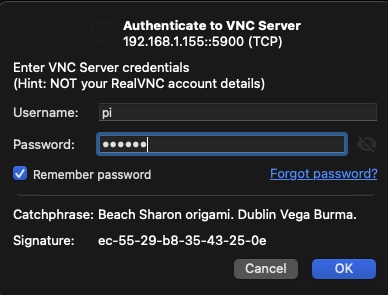
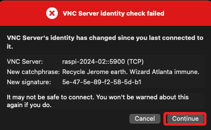

# 第一次啟動

<br>

## 特別注意

1. 在前一個步驟燒錄記憶卡時，務必記得開啟 `SSH`，並牢記設置的密碼。

<br>

2. 接下來先在 `終端機` 使用 `SSH` 指令連線樹莓派，並執行設定指令將樹莓派的 `VNC` 開啟。

<br>

3. 接著下載並安裝 VSCode，後續亦將使用 VSCode 連線樹莓派進行相關開發。

<br>

4. 完成以上步驟後，可下載安裝 VNC，並用以連線到樹莓派的桌面。

<br>

## 使用終端機連線

_第一次啟動後，先使用 `終端機` 或 `CMD` 進行連線_

<br>

1. 在終端機使用 SSH 連線指令進行連線；務必替換指令中的 `<使用者帳號>` 與 `<主機名稱-或-IP>` 不包含箭頭括號 `<>`，例如 `ssh pi@raspi`。

    ```bash
    ssh <使用者帳號>＠<主機名稱-或-IP>
    ```

<br>

2. 第一次使用 SSH 連線到遠端設備時，系統會提示是否信任該主機，輸入 `yes` 可繼續連線；此後再次連線時，系統不會再出現提示，因為本機已將該遠端設備的資訊儲存在 `~/.ssh/known_hosts` 檔案中。

    

<br>

3. 接著按指示 `輸入密碼`。

    

<br>

4. 完成連線，終端機命令行的提示字元就是由 `使用者名稱`、`主機名稱`、`目前目錄` 以及提示符號 `$` 或 `#` 組成，在這看到的是 `$` 代表一般用戶，若以 root 用戶連線則會顯示 `#`。

    

<br>

5. 退出連線；終端機返回本地電腦路徑。

    ```bash
    exit
    ```

    

<br>

## 關於 `mDNS` 解析

_在區域網路內，無需中央 DNS 伺服器就能根據主機名稱找到裝置 IP 的技術_

<br>

1. 在燒錄系統時，`.local` 結尾的主機名稱就是 `mDNS` 的識別標記，如此便可不用查詢 IP 位址，裝置會在區網中廣播自己的名稱與 IP，其他裝置就能辨識並連線；也就是只要在支援 mDNS 的網路中，區域網路將可自動解析主機名稱。

<br>

2. 若不加入 `.local`，則需手動設定本地 DNS 或 hosts 檔案才可正確解析主機名稱，通常在 `/etc/hosts` 文件中。

<br>

## 樹莓派設定

_開啟 VNC（`Virtual Network Computing`），常稱之為 `遠端桌面` 或 `虛擬網路控制`、`虛擬往復計算`_

<br>

1. 在樹莓派中執行以下指令進入系統設定；特別注意，需以管理員（`root`）權限運行指令，就是以 `sudo` 指令暫時取得 `root` 權限，而執行者本身不一定是超級使用者。

    ```bash
    sudo raspi-config
    ```

    

<br>

2. 使用 `上下鍵` + `ENTER` 進行選取 `Interface`。

    

<br>

3. 接著選取 `VNC`。

    

<br>

4. 以 `TAB` 鍵選取 `YES` 並按下 `ENTER`。

    

<br>

5. 接著選擇 `FINISH` 完成設定。

    

<br>

_到這裡為止已經開啟 VNC 並可透過 VNC 遠端連線到樹莓派的桌面，但以下會先進行 VSCode 的 SSH 連線_

<br>

## 讀出文字

_補充說明樹莓派系統如何讀出指定字串；若使用 MacOS 可直接運行 `say` 指令，至於 Win 系統則需用 PowerShell 搭配內建語音引擎朗讀文字_

<br>

1. 安裝工具。

    ```bash
    sudo apt install espeak -y
    ```

<br>

2. 查詢 USB 裝置。

    ```bash
    aplay -l
    ```

<br>

3. 調整音量。

    ```bash
    alsamixer
    ```

<br>

4. 讀出指定字串如 `sudo`，以下字串不加引號或使用單雙引號皆可。

    ```bash
    espeak "sudo"
    ```

<br>

5. 在 Win 系統可運行以下指令。

    ```bash
    Add-Type –AssemblyName System.Speech
    $speak = New-Object System.Speech.Synthesis.SpeechSynthesizer
    $speak.Speak("sudo")
    ```

<br>

6. 若想簡化指令或讓指令變得更直觀、符合個人習慣，可透過編輯 `~/.bashrc`，使用 `alias` 將 `espeak` 指定給另一個指令。

    ```bash
    nano ~/.bashrc
    ```

<br>

7. 在文件最上方加入以下設定值即可。

    ```bash
    alias say-espeak
    ```

<br>

8. 儲存、退出後，立即套用設定。

    ```bash
    source ~/.zshrc
    ```

<br>

## VSCode 遠端連線

_先連線 [官網](https://code.visualstudio.com/download) 下載安裝_

<br>

1. 透過 VSCode 的 `遠端總管` 進行連線。

    

<br>

2. 添加連線。

    

<br>

3. 使用 SSH 連線及主機名稱。

    ```bash
    ssh 使用者名稱@主機名稱
    ```

    

<br>

4. 選擇保存 SSH 配置的位置，建議儲存在個人文件中。

    

<br>

5. 點擊 VSCode 右下角彈出視窗中的 `Connect` 按鈕進行連線。

    

<br>

6. 依畫面指示輸入密碼。

    

<br>

7. 連線進行中，右下角會顯示當前工作狀態等訊息。

    

<br>

8. 完成連線時，下方會顯示如同終端機連線一樣的畫面。

    

<br>

9. 建立連線時若點擊 `開啟設定 Open Config` 而不是 `連線 Connect`。

    

<br>

10. 重新點擊 `遠端總管`，接著點擊刷新的圖標，然後點擊所設定的連線。 

    

<br>

## VNC 連線

_使用 RealVNC Viewer_

<br>

1. 前往 [官網](https://www.realvnc.com/en/connect/download/viewer/) ，選取對應的作業系統後下載，並在本機進行安裝。

    

<br>

2. 啟動 VNC Viewer。

    

<br>

3. 在上方對話框中輸入 `主機名稱` 進行連線，特別注意，這裡輸入的不是 SSH 指令。

    

<br>

3. 使用 IP 也可以，若要使用 IP，可先在樹莓派執行指令 `ifconfig` 進行查詢。

    

<br>

4. 輸入 `帳號`、`密碼`，並選擇 `記住密碼`，然後點擊 `OK`。

    

<br>

5. 初次連線會出現紅框警告，點擊 `繼續 Continue` 即可。

    

<br>

## 樹莓派基本指令

_這裡僅是示範，後續將會進一步說明_

<br>

1. 關機。

    ```bash
    sudo shutdown now
    ```

<br>

2. 重新啟動。

    ```bash
    sudo reboot now
    ```
<br>

## 補充說明多人 VNC 連線

1. 可多人同時透過 VNC 連線進入同一台樹莓派主機，且會看到多個滑鼠指標，但這些滑鼠指標會同步控制。

<br>

2. `樹莓派 3` 應可以正常顯示，`樹莓派 4` 可能會出現 `Cannot currently show the desktop` 的錯誤，隨著版本的變化與更新，相關錯誤訊息會有所不同。

<br>

## 補充說明

_關於 `known_hosts`，該文件用於存放已信任主機的公鑰，防止中間人攻擊_

<br>

1. 當第一次透過 SSH 連線樹莓派主機時，樹莓會送出它的 SSH 公鑰到正進行連線的客戶端設備，這就是是第一次在文件中出現的內容；同時間客戶端會提示是否信任這台樹莓派主機，也就是輸入 `yes` 但尚未輸入密碼的那個時間點。

    

<br>

2. 輸入密碼之後，除了原本以 `ssh-ed25519` 加密的公鑰外，還會添加一組傳統的 `RSA` 金鑰，以及一組使用 `Elliptic Curve DSA（橢圓曲線演算法）` 產生的公鑰，`nistp256` 是採用 NIST 曲線 P-256 的演算法，體積介於 RSA 和 Ed25519 之間。

<br>

3. 未來若主機的公鑰改變，SSH 會警告 `WARNING: REMOTE HOST IDENTIFICATION HAS CHANGED！`；公鑰會在多種情況下產生變化，例如重灌系統。

<br>

4. 由此可知樹莓派的 SSH 伺服器預設啟用多種 HostKey 演算法，客戶端會向主機詢問所有支援的金鑰類型並記錄。

<br>

5. 在本地電腦中刪除指定遠端主機的 Host Key，這裡以 `raspi-2025-blue.local` 為例。

    ```bash
    ssh-keygen -R raspi-2025-blue.local
    ```

<br>

___

_END：以上完成第一次啟動_