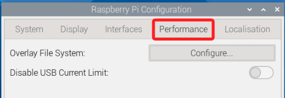
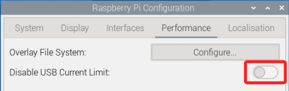

# 系統效能設置

_在 Raspberry Pi Configuration 的 Performance 頁籤_

<br>

## 說明

1. 切換到 `Performance` 頁籤，會看到兩個選項 `Disable USB Current Limit` 及 `Overlay File System`。

    

<br>

## Disable USB Current Limit

_禁用 USB 電流限制；特別注意，仍需配合足額的電源供應器_

<br>

1. 在大多數樹莓派裝置上，USB 埠的總輸出電流預設被軟體限制在 `600 mA`，可藉此避免過載時導致系統供電不穩，預設是關閉的。

    

<br>

2. 開啟後，系統會在 `/boot/firmware/config.txt` 中的 `[all]` 區塊自動加入以下設定，將 USB 埠的電流上限提升到 `1.2 A`；關閉後並重啟後會自動刪除，也可手動進行註解。

    ```bash
    [all]
    usb_max_current_enable=1
    ```

<br>

3. 若電源供應器的功效不足，開啟後容易出現電壓下降，這在螢幕右上角會出現閃電符號，運作上會造成重開機；當要同時驅動多個大功率 USB 裝置時可以考慮開啟，一般使用情境不必開啟。

<br>

## Overlay File System

2. 這是利用 Linux 的 OverlayFS 機制，將根檔案系統 (`/`) 以唯讀方式作為底層 `lower layer`，並在記憶體或指定目錄建立一個上層 `upper layer` 作為可寫區；寫入操作只作用於上層，不會修改底層 SD 卡上的檔案，系統重啟時捨棄上層時，系統自動還原到底層原始狀態，可藉此保護檔案系統完整性、延長 SD 卡壽命。

<br>

3. 點擊進入後有兩個選項，第一個是 `Use Overlay`，啟用後根檔案系統便進入 `唯讀 + 可丟棄上層` 模式，所有變更都寫在上層，重開機後自動還原。

<br>

4. 另一個是 `Write-protect Boot Partition` 寫入保護啟動分割區，開啟後會將第一個 FAT 分割區 `/boot` 掛載為唯讀，可避免意外改寫或破壞開機檔案，這個分區存放開機固件及設定檔，如 `config.txt`、`kernel.img` 等。

<br>

5. 特別注意，`/boot` 看似在 `/` 底下，實際上是另一個獨立的 FAT 分割區，並非 rootfs 的一部分，Use Overlay 只保護第 `rootfs`，不會影響 `/boot`，若要同時對根檔案系統與啟動分割區都做唯讀保護，需同時啟用 `Use Overlay` 與 `Write-protect Boot Partition`。

<br>

___

_END_