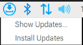
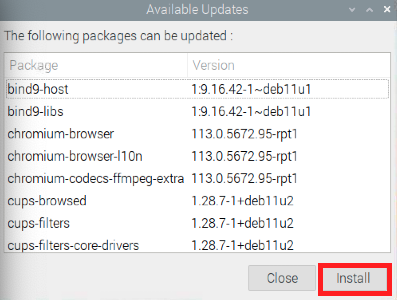

# 更新樹莓派

_透過 APT 進行套件管理與系統升級，適用於一般應用或服務更新、安全更新、修補 Bug；關於 `進階更新` 請參考 `03_Linux 指令` 中的 `3_安裝與更新`。_

<br>

## 在桌面進行更新

_第一次安裝完系統後需要進行系統更新，可透過視窗界面或終端機指令進行_

<br>

1. 進入樹莓派後會看到右上角的 `更新` 圖標。

   

<br>

2. 點擊進入會看到兩個選項。

   
   
<br>

3. 點擊 `Show` 並然後點擊 `Install`，這個過程會需要一點時間。

   

<br>

## 在終端機手動更新

_運行以下指令手動更新，要注意執行的先後順序_

<br>

1. 更新本機套件清單：這個指令用於更新本地的套件倉庫來源（repo），執行後會從設置的儲存庫中取得可用的套件包和版本訊息，但只會更新套件列表，不會進行套件安裝，用意是確保有最新的套件資訊。特別注意，這些套件包括系統工具、庫和應用程序。

   ```
   sudo apt update
   ```

<br>

2. 進行更新：根據索引列表更新系統中的所有套件到最新版本，也就是會升級所有已經安裝的套件，這個指令不會移除或是安裝新的軟體。

   ```
   sudo apt upgrade -y
   ```

<br>

3. 移除不再使用的相依套件與垃圾文件：使用參數 `-y` 表示自動同意後續的操作，若要手動確認，可移除參數。

   ```
   sudo apt autoremove -y
   ```

<br>

4. 串接以上指令。

   ```bash
   sudo apt update && sudo apt upgrade -y && sudo apt autoremove -y
   ```

<br>

5. 更新完成可依需要重新啟動，若提示 `必須重新啟動` 則依提示操作。

   ```bash
   sudo reboot now
   ```

<br>

## 全面升級

_與 `apt upgrade` 略有不同_

<br>

1. 使用以下指令取代 `apt upgrade`，原指令僅升級現有套件，但不會移除或安裝新套件。若需新相依套件，會跳過更新；以下指令則會升級所有套件，必要時會移除舊套件並安裝新相依套件，相較之下更為全面，用於完整系統升級時較合適。

   ```bash
   apt full-upgrade
   ```

<br>

___

_END：重啟後可在桌面查看更新圖示是否都不再顯示_