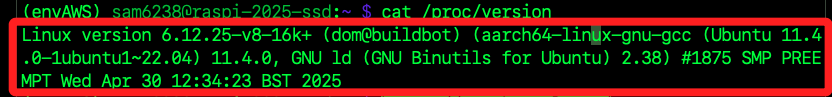

## 更新內核

1. 如果需要更新內核或韌體；特別注意，`rpi-update` 會下載最新的實驗性韌體，在生產環境使用需有相當把握才進行。

    ```bash
    sudo rpi-update -y
    ```

<br>

2. 檢查系統和韌體版本；其中 `PRETTY_NAME` 是對外展示的完整名稱，包含版本號資訊，而 `NAME` 則僅顯示系統名稱。

    ```bash
    cat /etc/os-release
    ```

<br>

3. 查看 Linux 內核版本。

    ```bash
    uname -a
    ```

    

<br>

4. 查詢內核版本細節。

    ```bash
    cat /proc/version
    ```

    

<br>

___

_END_