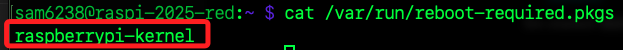

# 更新樹莓派

_透過 APT 進行套件管理與系統升級，適用於一般應用或服務更新、安全更新、修補 Bug；關於 `進階更新` 請參考 `03_Linux 指令` 中的 `3_安裝與更新`。_

<br>

## 在桌面進行更新

_第一次安裝完系統後需要進行系統更新，可透過視窗界面或終端機指令進行_

<br>

1. 進入樹莓派後會看到右上角的 `更新` 圖標。

   

<br>

2. 點擊進入會看到兩個選項。

   
   
<br>

3. 點擊 `Show` 並然後點擊 `Install`，這個過程會需要一點時間。

   

<br>

## 在終端機手動更新

_運行以下指令手動更新，要注意執行的先後順序_

<br>

1. 更新本機套件清單：這個指令用於更新本地的套件倉庫來源（repo），執行後會從設置的儲存庫中取得可用的套件包和版本訊息，但只會更新套件列表，不會進行套件安裝，用意是確保有最新的套件資訊。特別注意，這些套件包括系統工具、庫和應用程序。

   ```
   sudo apt update
   ```

<br>

2. 進行更新：根據索引列表更新系統中的所有套件到最新版本，也就是會升級所有已經安裝的套件，這個指令不會移除或是安裝新的軟體。

   ```
   sudo apt upgrade -y
   ```

<br>

3. 移除不再使用的相依套件與垃圾文件：使用參數 `-y` 表示自動同意後續的操作，若要手動確認，可移除參數。

   ```
   sudo apt autoremove -y
   ```

<br>

4. 可使用 `&` 符號串接指令。

   ```bash
   sudo apt update && sudo apt upgrade -y && sudo apt autoremove -y
   ```

<br>

5. 更新完成後，若提示 `必須重新啟動` 則依提示操作。

   ```bash
   sudo reboot now
   ```

<br>

## 關於重新啟動

1. 系統在升級過程中若涉及 `kernel`、`glibc`、`systemd` 等關鍵元件，會自動建立 `/var/run/reboot-required` 標記檔案，另外還會建立一個 `/var/run/reboot-required.pkgs` 檔案，後者之內具體包含觸發重新開機要求的套件清單。

   ```bash
   ls /var/run/reboot-required*
   ```

<br>

2. 可使用以下安裝進行測試，這是樹莓派專屬的 Linux 核心套件，更新時會觸發系統建議重開機以套用新核心。

   ```bash
   sudo apt install --reinstall raspberrypi-kernel
   ```

<br>

3. 進行查詢就會看到如下內容。

   ```bash
   cat /var/run/reboot-required.pkgs
   ```

   

<br>

4. 特別注意，若是使用 SSH 或 VNC 連線進行的更新，並不會看到重啟的提示，除非是在樹莓派使用外接顯示器並登入本地桌面環境時才會看到提示；這是因為只有本地桌面會完整啟動通知系統如 `lxsession`、`libnotify`、`notify-osd` 等，並在偵測到 `/var/run/reboot-required` 存在時彈出視覺提示；而 SSH 與 VNC 通常屬於非完整的使用者登入會話，缺乏觸發這些桌面通知的條件與環境變數，因此不會顯示重啟提示。

<br>

## 全面升級

_與 `apt upgrade` 略有不同_

<br>

1. 使用以下指令取代 `apt upgrade`，原指令僅升級現有套件，但不會移除或安裝新套件。若需新相依套件，會跳過更新；以下指令則會升級所有套件，必要時會移除舊套件並安裝新相依套件，相較之下更為全面，用於完整系統升級時較合適。

   ```bash
   apt full-upgrade
   ```

<br>

___

_END：重啟後可在桌面查看更新圖示是否都不再顯示_