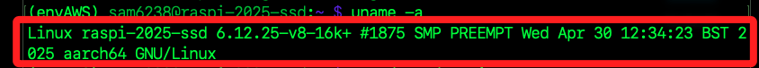
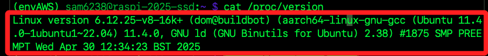

# 更新開發版

_包括更新 Linux 的核心（`kernel`）、開機程式（`Bootloader`）與韌體（`firmware`）；這是直接從 Raspberry Pi GitHub 倉庫拉下最新測試版，適用於開發與測試階段，不是穩定發行版的一部分。_

<br>

## 查詢

1. 檢查系統和韌體版本；其中 `PRETTY_NAME` 是對外展示的完整名稱，包含版本號資訊，而 `NAME` 則僅顯示系統名稱。

    ```bash
    cat /etc/os-release
    ```

<br>

2. 查看 Linux 內核版本。

    ```bash
    uname -a
    ```

    

<br>

3. 查詢內核版本細節。

    ```bash
    cat /proc/version
    ```

    

<br>

## 更新

1. 更新內核及韌體；特別注意，`rpi-update` 會下載最新的實驗性韌體，在生產環境使用需有相當把握才進行。

    ```bash
    sudo rpi-update -y
    ```

<br>

## 核心與韌體

1. 核心（`Kernel`）是作業系統的一部分，負責管理硬體與軟體之間的橋樑。執行於系統記憶體（RAM），主要功能包括程序管理、記憶體分配、裝置驅動與系統呼叫處理。

<br>

2. 韌體（`Firmware`）是嵌入硬體中的程式碼，用來控制硬體的基本運作。儲存在 Flash 或 ROM 中，常用於驅動 Wi-Fi 模組、GPU、BIOS、SSD 等硬體元件。

<br>

___

_END_