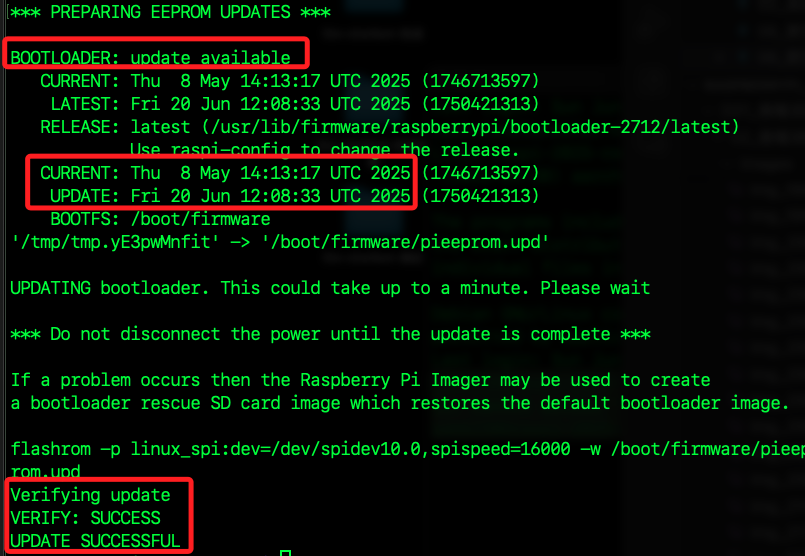

# 更新 EEPROM

_更新樹莓派的 `EEPROM` 韌體，也就是將最新版的 bootloader 韌體寫入板載 EEPROM，屬於底層硬體開機晶片的程式碼；該代碼影響開機行為與硬體初始化，與 `rpi-update` 更新 `kernel/firmware` 的層級不同。_

<br>

## 說明

1. EEPROM 是 `電可擦寫可編程唯讀記憶體`，這是一種小型儲存芯片，用於儲存引導加載程式和系統設置等重要訊息。通過更新 EEPROM，可以修復引導相關的問題，增加新的功能或改善硬體相容性。

<br>

2. `引導程式（bootloader）` 是一段代碼，主要作用是在系統啟動過程中初始化硬體並加載操作系統。

<br>

3. 樹莓派的 `引導程式` 儲存在 `EEPROM` 中，所以更新 `EEPROM` 實際上就是更新這段引導程式碼，等效於修復舊版引導程式問題或添加新的功能。

<br>

## 查詢

_刷新之前，先對當前 EEPROM 設置進行查詢_

<br>

1. 查詢當前樹莓派的引導程式版本。

    ```bash
    vcgencmd bootloader_version
    ```

    

<br>

2. 查詢當前樹莓派的引導程式配置設定。

    ```bash
    vcgencmd bootloader_config
    ```

    

<br>

3. 若沒有單獨的可更新引導程式 EEPROM，會回傳 `unknown`。

    

<br>

## 更新

1. 更新指令，由輸出可知有一個新的 EEPROM 引導程式更新可用，以下範例中，`BOOTLOADER` 顯示 `up to date` 表示開機韌體已是最新版本，無需更新；`CURRENT` 是當前版本日期，`LATEST` 是可用的最新版本日期，`RELEASE` 表示目前使用的韌體通道是 `latest`，可透過指令 `raspi-config` 切換為 `stable` 或 `beta` 等版本。

    ```bash
    sudo rpi-eeprom-update -a
    ```

    

<br>

2. 使用以下指令清理更新暫存資料，適合在更新失敗後執行以重設狀態。

    ```bash
    sudo rpi-eeprom-update -r
    ```

<br>

3. 特別注意，`樹莓派五` 與先前樹莓派版本的 EEPROM 更新機制不同；新機型可以直接在線更新 EEPROM，使用 flashrom 立即寫入，不再等待重開機，完成時會直接提示 `UPDATE SUCCESSFUL`；早期機型運行 `rpi-eeprom-update` 只會準備更新檔`pieeprom.upd`，更新動作會在下次開機時由 bootloader 執行，且會顯示`Copying recovery.bin`。

<br>

4. 承上，在這樣的情況下，更新時會將更新文件 (`pieeprom.upd`) 複製到資料夾 `/boot/firmware` 中，並且也做了備份 `recovery.bin`，所以透過上述指令可取消此更新。

    ```bash
    *** PREPARING EEPROM UPDATES ***
    BOOTLOADER: update available
        CURRENT: Thu 29 Apr 16:11:25 UTC 2021 (1619712685)
            LATEST: Mon 15 Apr 13:12:14 UTC 2024 (1713186734)
        RELEASE:
            default (/lib/firmware/raspberrypi/bootloader-2711/default)
            Use raspi-config to change the release.

        VL805_FW: Using bootloader EEPROM
            VL805: up to date
        CURRENT: 000138a1
            LATEST: 000138a1
        CURRENT: Thu 29 Apr 16:11:25 UTC 2021 (1619712685)
            UPDATE: Mon 15 Apr 13:12:14 UTC 2024 (1713186734)
            BOOTFS: /boot/firmware
    '/tmp/tmp.O4oXzboYdz' -> '/boot/firmware/pieeprom.upd'
    Copying recovery.bin to /boot/firmware for EEPROM update

    EEPROM updates pending. Please reboot to apply the update.
    To cancel a pending update run "sudo rpi-eeprom-update -r".
    ```

<br>

5. 若有提示重啟系統則運行以下指令。

    ```bash
    sudo reboot now
    ```

<br>

___

_END_