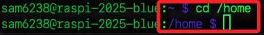
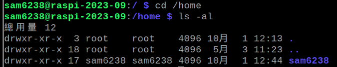
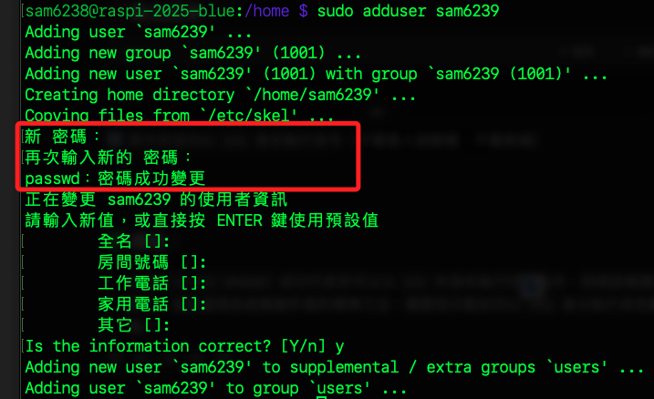
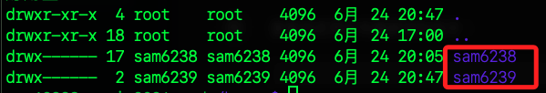
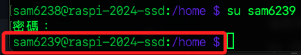
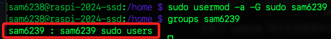
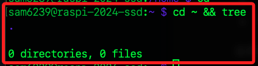

# 用戶管理

_使用者的新增與各項設定_

<br>

## 關於家目錄

_`家目錄` 與 `/home` 所指是不同的資料夾_

<br>

1. 在 Linux 系統中，`家目錄（Home Directory）` 是指每個使用者的個人目錄，如使用者 `sam` 的 `家目錄` 是 `/home/sam`，也可使用波浪號 `~` 表示。

<br>

2. 目錄 `/home` 是 `家目錄的上層目錄`，其中包含所有使用者的家目錄。

<br>

## 建立並加入 sudo

1. 切換到 `家目錄` 的 `上層目錄`。
    
    ```bash
    cd /home
    ```

    

<br>

2. 列出所有檔案，也就是查看當前有哪些用戶的家目錄；以下的範例結果中顯示當前僅有一個用戶家目錄 `/sam6238`。

    ```bash
    ls -al
    ```

    

<br>

3. 使用指令 `adduser` 建立、添加用戶，這裡示範命名為 `sam6239`；輸入兩次密碼後，其餘設定都按下 `ENTER`，最後輸入 `y` 即可。

    ```bash
    sudo adduser <自訂使用者名稱>
    # 假如建立的是 `sam6239`
    sudo adduser sam6239
    ```

    

<br>

4. 在當前的作業系統中，建立使用者時會自動將其加入群組 `users` 中，這是一個基礎的群組，讓所有使用者可共享基本的資源與權限。

    

<br>

5. 可在目錄 `/home` 查看新添加的使用者家目錄已經存在。

    ```bash
    ls -al
    ```

    

<br>

6. 透過指令 `groups` 可查詢指定使用者所屬群組，群組的成員將擁有相應的權限；在輸出的訊息中，其中第一個 `sam6239` 是使用者名稱，第二個同名群組代表該用戶的 `專屬主群組`，而 `users` 則是 `普通使用者群組`；由此可知，添加新的用戶後，該新用戶並不隸屬於任何特定群組，也就是不具備其他的權限。
    
    ```bash
    groups <使用者名稱>
    # 本範例
    groups sam6239
    ```

    

<br>

## 切換使用者

1. 使用指令 `su` 可切換使用者。

    ```bash
    su <使用者名稱>
    ```

<br>

2. 命令行的前綴會標示新的使用者帳號。

    ```bash
    su sam6239
    ```

    

<br>

3. 將指定的使用者 sam6239 加入 root 群組。
    
    ```bash
    sudo usermod -a -G sudo sam6239
    ```

    

<br>

## 參數說明

_說明前述指令的參數_

<br>

1. `sudo`：Super User Do。

<br>

2. `usermod`：`mod` 就是 `modify` 的縮寫，該指令就是用以修改帳戶設定。

<br>

3. `-a`：就是 `add` 的縮寫，表示將用戶添加到指定群組。

<br>

4. `-G`：，`-G` 代表的是一個或多個列表，與 `-a` 共用時表示將使用者加入 `-G` 後面的列表。

<br>

5. `sam6239`：這個指令要將目標帳號放在最後，在此就是 `sam6239`。

<br>

## 觀察與驗證

1. 確認所在群組。

    ```bash
    groups <使用者名稱>
    ```

<br>

2. 在舊版系統中，切換帳號時會出現提示。

    ```bash
    su <使用者名稱>
    ```

    

<br>

3. 切換到新用戶的家目錄中，可透過指令 `ls` 或 `tree` 查看新用戶 `sam6239` 的家目錄，可發現裡面空無一物。

    ```bash
    cd ~ && tree
    ```

    

<br>

## 系統建立者的初始群組

_透過指令 `groups` 可查看預設使用者在系統建立時的所屬群組，以下逐項簡介_


<br>

1. adm：系統管理員組，允許查看許多系統日誌文件。

<br>

2. dialout：授予撥號設備的訪問權限，通常用於串行端口和調製解調器。

<br>

3. cdrom：允許訪問 CD-ROM 驅動器。

<br>

4. sudo：允許成員使用 `sudo` 命令，以超級用戶權限執行命令。

<br>

5. audio：允許訪問音頻設備。

<br>

6. video：允許訪問視頻設備。

<br>

7. plugdev：允許訪問可插拔設備（如 USB 設備）。

<br>

8. games：允許訪問某些遊戲資源和文件。

<br>

9. users：一般用戶組，通常用於一般權限的用戶。

<br>

10. input：允許訪問輸入設備（如鍵盤和鼠標）。

<br>

11. render：授予渲染設備的訪問權限，通常與圖形渲染相關。

<br>

12. netdev：允許成員管理網路設備。

<br>

13. lpadmin：允許成員管理輸出機和相關資源。

<br>

14. gpio：允許訪問和控制 GPIO（通用輸入輸出）接口。

<br>

15. i2c：允許訪問 I2C 界面，用於控制 I2C 設備。

<br>

16. spi：允許訪問 SPI 界面，用於控制 SPI 設備。

<br>

## 新用戶的初始群組

_僅有與自己用戶名稱同名的專屬群組及 `users`_

<br>

1. 在 Linux 系統（如樹莓派）上建立一個新的帳戶時，系統會根據 `/etc/skel` 目錄中的模板來建立新用戶的家目錄。

<br>

2. `/etc/skel` 目錄通常包含了一些基礎的配置文件和目錄結構。

<br>

3. 若要在建立用戶的時候，給每一個新用戶固定的初始好環境，可以編輯該檔案

<br>

___

_END：請進入下一小節繼續_