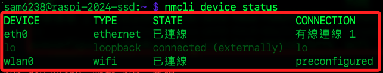
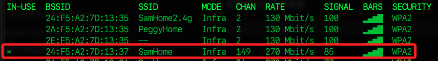
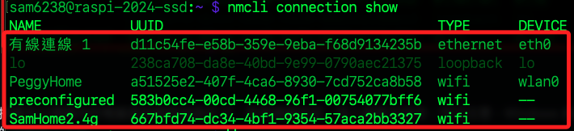
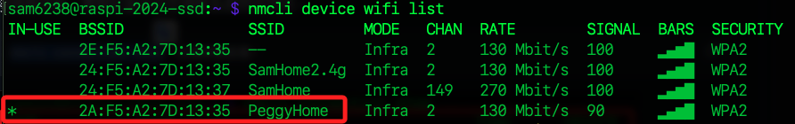
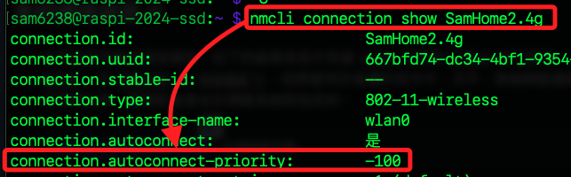

# 管理 WIFI 連線

_新版作業系統 `bookworm` 的網路管理已改用 `NetworkManager`，雖仍可在 `wpa_supplicant.conf` 文件中進行設定，但為了避免可能的設定衝突，建議不要這樣做。_

<br>

## 舊版設定說明

_適用 `Bullseye` 以前的作業系統，使用新版 `Bookworm` 可略過_

<br>

1. 編輯設定文件。

    ```bash
    sudo nano /etc/wpa_supplicant/wpa_supplicant.conf
    ```

<br>

2. 預設的內容是燒錄 SD 卡的時候所設定的 WIFI。

    

<br>

3. 設定使用 JSON 格式。

    ```bash
    network={
        ssid="<SSID 名稱>"
        psk=<密碼>
    }
    ```

<br>

4. 可寫入多個 WiFi 連線資訊。

    

<br>

## 新版設定說明

_查看並建立連線，是用新版作業系統 `Bookworm`_

<br>

1. 查看連線狀態，結果包含 `有線` 與 `無線` 網路，其中 `preconfigured` 表示燒錄時預設的 WIFI 別名。

    ```bash
    nmcli device status
    ```

    

<br>

2. 查看可連線的 WIFI 清單，其中 `當前連線` 會加註星號 `*`。

    ```bash
    nmcli device wifi list
    ```

    

<br>

2. 添加 Wi-Fi 連接；特別注意，這個操作需要 `sudo` 權限。

    ```bash
    sudo nmcli dev wifi connect <SSID 名稱>  password <連線密碼>
    ```

    

<br>

3. 查看連線資訊，結果包含已被設定過的多個 WIFI 連線，排序不代表優先級別。

    ```bash
    nmcli connection show
    ```

    

<br>

4. 最後被設定的 WIFI 會自動成為當前連線，其中 `RATE` 表示連線的優先級別，值越大、優先級越高。

    ```bash
    nmcli device wifi list
    ```

    

<br>

5. 可使用參數 `autoconnect-priority` 設定優先級別。

    ```bash
    sudo nmcli connection modify <SSID 名稱> connection.autoconnect-priority <優先級別>
    ```

<br>

6. 同樣使用 `show` 指令指定 `SSID` 可查看指定參數的設定值，其中包含優先級別資訊。

    ```bash
    nmcli connection show <SSID 名稱>
    ```

    

<br>

___

_END_