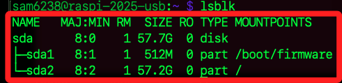
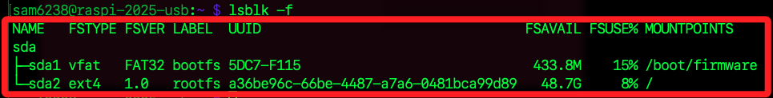

# 製作 USB 啟動碟

_使用 USB 外接裝置作為系統碟_

<br>

## 說明

_燒錄步驟與 `SD 卡` 相同不再贅述，完成後插入樹莓派進行啟動，透過設定開啟 `VNC` 並連線樹莓派桌面；特別注意，這裡提及開啟 `VNC` 是因為需要使用桌面終端機工具。_

<br>

1. 查詢目前分割區；當前示範使用的是 `64G` 行動碟。

    ```bash
    lsblk
    ```

    _結果_

    

<br>

2. 可添加參數 `-f` 觀察分區格式，其中 `sda` 是指整顆磁碟的裝置名稱，`sda1`、`sda2` 則是該磁碟上的兩個分割區名稱，這是 Linux 系統的裝置命名方式，由核心根據偵測到的裝置順序自動分配；其中 `sda1` 容量 `512MB`，格式為 `FAT32`，這是用於存放開機韌體和引導檔案；第二個分區 `sda2` 使用儲存裝置的剩餘容量 `57.2GB`，格式為 `ext4`，這是作為根檔案系統（root filesystem）。

    

<br>

## 一鍵拓展

_若根分割區 `sda2` 在某些狀況下並未自動擴展至整個磁碟的可用空間_

<br>

1. 使用 raspi-config 工具。

    ```bash
    sudo raspi-config
    ```

<br>

2. 在選單中選擇，這會將根分割區擴展至磁碟的最大可用空間。

    ```bash
    Advanced Options → Expand Filesystem
    ```

<br>

<br>

___

_END_
