# 製作 USB 外接碟

_將燒錄好樹莓派系統的 USB 行動碟插入現有系統中，可藉此建立包含多個分區的樹莓派系統碟_

<br>

## 簡介

_僅說明，無需操作_

<br>

1. 針對等於或高於 `樹莓派四` 規格的硬體，可支援使用 `USB 儲存裝置` 作為系統啟動碟，低於該型號的樹莓派只能從 `microSD 卡` 進行啟動。

<br>

2. 使用外部儲存設備作為主要的儲存和引導裝置可得到更快的讀寫速度和更大的儲存空間，實現這個功能前必須更新樹莓派的 `EEPROM`。

<br>

3. 特別注意，透過官方燒錄軟件製作系統碟時，預設只會使用 `5G` 的儲存裝置空間；如下圖所示，這是將燒錄好的 `64G SD 卡` 插入另一台運作中的樹莓派所查詢的結果。

    

<br>

4. 延續上一點，在官方文件有提到，初次啟動樹莓派系統時會自動將根分區擴展到整個 SD 卡或USB 磁碟的可用空間，這是為了確保用戶可以使用整個儲存設備的可用空間，且不需要手動進行設置；經實測，若先進行手動調整分區大小，再將 USB 插入作為系統碟，這個自動擴展機制不會生效，基於這樣的設計，可將燒錄好的記憶卡或 USB 儲存裝置使用分區工具如 `gparted` 進行手動調整分區，再將其作為系統碟使用，這樣後續在進行 A/B 機制設定時將較為方便。

<br>

5. 若只是要使用 USB 儲存設備作為啟動碟，僅需燒錄完成後插入使用即可，無須另做任何設定；以下的操作是在運行中的樹莓派系統中，對另一個儲存裝置進行分區設定的過程，而不是單純使用外部儲存裝置作為開機系統。

<br>

## 操作說明

_按步驟說明操作_

<br>

1. 使用 `官方燒錄軟件`，分別對 SD 卡及 USB 行動碟進行系統燒錄；若在之前步驟已完成 SD 卡系統燒錄，可僅針對 USB 行動碟進行燒錄。

<br>

2. 完成後，先將 SD 卡插入樹莓派進行啟動，運行以下指令查看當前分區資訊；特別說明，在 Linux 系統中，出現像 `mmcblk0`、`mmcblk0p1`、`mmcblk0p2` 這樣的命名方式，是因為這些裝置是透過 `MMC（MultiMediaCard）` 或 `SD 卡控制器` 所連接的儲存裝置，與傳統的 `SCSI/USB` 裝置被命名為 `/dev/sda` 是不同的。

    ```bash
    lsblk
    ```

    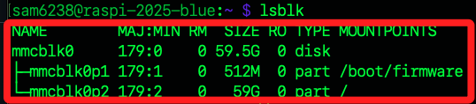

<br>

3. 接著將 USB 行動碟插入樹莓派，再次運行以下指令查詢當前詞曲資訊，其中 `sda` 就是新插入的 USB 碟，同時有兩個分區 `sda1`、`sda2`。


    ```bash
    lsblk
    ```

      

<br>

## 分配分區

_安裝圖形化界面工具 GParted 用以分配分區_

<br>

1. 按標準程序，在安裝工具之前先更新運作中的樹莓派系統。

    ```bash
    sudo apt update && sudo apt full-upgrade -y && sudo apt autoremove -y
    ```

<br>

2. 在樹莓派中安裝工具 `GParted` 來管理分區。

    ```bash
    sudo apt install gparted -y
    ```

<br>

3. 同時安裝分處理區格式等附屬工具。

    ```bash
    sudo apt install dosfstools mtools -y
    ```

<br>

## 啟動工具

_這是一個圖形化界面工具，所以要進入樹莓派開啟終端機操作，相關 VNC 設定步驟不再贅述_

<br>

1. 啟動 `GParted`，預設會選取啟動碟 SD 卡，並顯示裝置的分區資訊。

    ```bash
    sudo gparted
    ```

    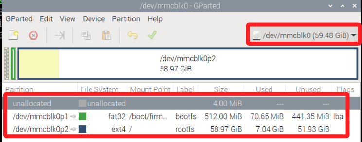

<br>

2. 在右上角選單中切換為 USB 的 `/dev/sda`，可看到在新的外部裝置上有兩個分區，及一個 `未配置（unallocated）` 空間；這兩個分區是燒錄完成時生成的，`bootfs` 是引導分區、`rootfs` 是系統文件分區。

    

<br>

3. 先對系統文件分區 `sda2` 進行容量修改，在該分區上點右鍵，然後點擊 `調整大小/移動（Resize/Move）`。

    

<br>

4. 接著在 `新的大小（New size）` 欄位中手動輸入分區大小如代表 `10G` 的 `10000`，輸入完成按下 `ENTER` 使其生效。

    

<br>

5. 然後點擊右下角的 `調整大小（Resize）`，若未生效時，`調整大小` 按鍵會反白無法點擊。

    

<br>

6. 點擊工具欄上的綠色 `打勾` 圖標按鈕進行套用並執行變更。

    

<br>

7. 在彈出視窗中再次點擊 `套用（Apply）` 完成設定。

    

<br>

8. 完成時可展開 `詳細資訊（Details）` 查看所進行的變更；接著可點擊 `Close` 關閉視窗。

    

<br>

## 新增分區

_以上是拓展現有系統資料分區大小，接下來是使用未分配空間添加新分區_

<br>

1. 在 `未配置（unallocated）` 項目上點擊右鍵後選取 `新增（New）`。

    

<br>

2. 再建立一個 10G 的分區然後點擊右下角 `Add`。

    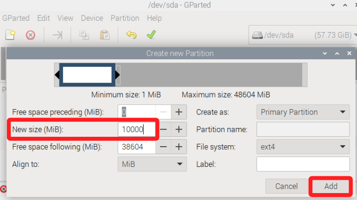

<br>

3. 點擊上方打勾圖標，然後在彈窗中點擊 `Apply`，完成後點擊 `Close` 關閉彈窗；特別注意，這個分區的大小並不重要，因為在之後的步驟中，樹莓派預設會將剩餘空間全部指派給這個最後建立的分區，因為要觀察這個流程，建議不要把剩餘空間一次分配。

    

<br>

4. 完成後預設的格式為 `ext4`，若要改用其他格式可點擊右鍵進行選取。

    

<br>

5. 完成以上操作將顯示如下。

    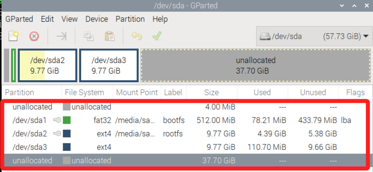

<br>

## 查看 

1. 查看磁碟資訊，可觀察到新添加的分區並未掛載。

    ```bash
    lsblk
    ```

    

<br>

2. 查詢已掛載分區，其中確實沒有新添加的分區。

    ```bash
    df -h
    ```

    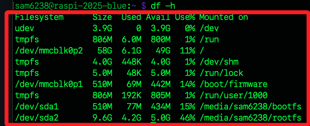

<br>

3. 接著斷電並拔出 SD 卡，僅保留 `USB 行動碟` 並重新開機；或運行以下指令進行關機後進行同樣操作。

    ```bash
    sudo shutdown now
    ```

<br>

4. 使用 SSH 進行連線，接著查詢分區資訊；可看到三個分區皆已掛載；其中 `/media/sam6238/` 之後所接續的是 Linux 系統用來唯一標識分割區的識別碼。

    ```bahs
    lsblk
    ```

    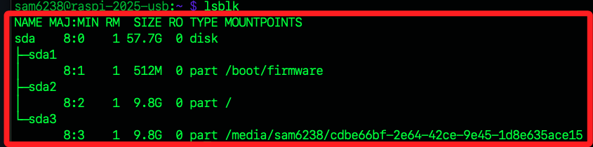

<br>

## 修改載點名稱

1. 首先卸載分區。

    ```bash
    sudo umount /media/sam6238/<複製完整的唯一識別碼>
    ```

    

<br>

2. 運行以下指令，確認各分區的 `PARTUUID`；記錄這個 UUID，這在後續步驟會使用到。

    ```bash
    sudo blkid
    ```

    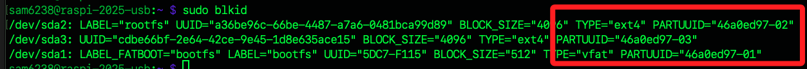

<br>

3. 使用 `e2label` 命令來更改分區的標籤，例如要 `sda3` 將標籤更改為 `data`。

    ```bash
    sudo e2label /dev/sda3 data
    ```

    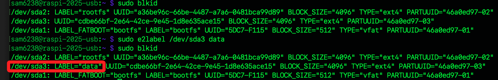

<br>

4. 編輯 `/etc/fstab` 文件，將原有的長標籤名稱更改為新的標籤名稱。

    ```bash
    sudo nano /etc/fstab
    ```

<br>

5. 編輯如下，其中掛載點尚未建立。

    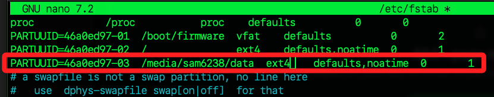

<br>

6. 先檢查掛載目錄是否存在。

    ```bash
    ls /media/sam6238/data
    ```

    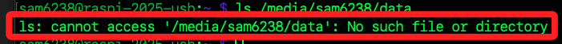

<br>

7. 建立新的掛載目錄。

    ```bash
    sudo mkdir -p /media/sam6238/data
    ```

<br>

8. 重新掛載所有文件系統；若順利完成會顯示如下訊息。

    ```bash
    sudo mount -a
    ```

    

<br>

9. 複製提示的指令並執行，並輸入密碼。

    ```bash
    systemctl daemon-reload
    ```

    

<br>

## 確認掛載

1. 查詢。

    ```bash
    lsblk
    ```

    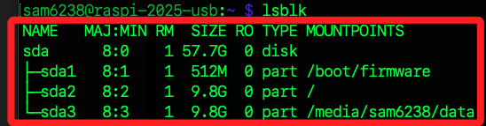

<br>

2. 查詢已掛載分區。

    ```bash
    df -h
    ```

    

<br>

## 關於分區目錄

1. 如果在系統中建立了一個目錄，但未在 `/etc/fstab` 中指定掛載點，這個目錄仍然是可用的，但它會作為一個普通的空目錄存在於文件系統中，可以用來存放文件和資料夾，它不會自動掛載任何設備或分區，也就是說這個目錄並不會在開機時自動掛載任何設備或分區，必須手動掛載或者在需要時動態掛載。

<br>

2. 當更新 `/etc/fstab` 並運行 `sudo mount -a` 或者重啟系統後，新分區會才會掛載到這個目錄。

<br>

## 建立別名

_為自動生成的長路徑設置一個快捷命令來快速切換到該路徑_

<br>

1. 編輯 `~/.bashrc` 配置文件，是 `用戶級別` 的配置文件，用於配置 `Bash shell` 環境。

    ```bash
    nano ~/.bashrc
    ```

<br>

2. 在文件中添加以下指令建立一個別名，添加的位置並無規範，能集中便於查看或編輯即可。

    ```bash
    alias cddata='cd /media/sam6238/data'
    ```

3. 也可以建立一個環境變數來指向該路徑。

    ```bash
    export mydata='/media/sam6238/data'
    ```

<br>

4. 完成後要進行設置的刷新讓其生效。

    ```bash
    source ~/.bashrc
    ```

<br>

5. 完成以上步驟，透過以下兩個指令皆可將工作目錄切換到指定路徑中；特別注意，使用 `cd` 命令時，環境變數必須加上 `$` 才能正確引用，若僅執行 `cd mydata` 時， `mydata` 會被視為一個普通目錄名稱，而不是引用環境變數。

    ```bash
    # 透過環境參數切換目錄
    cd $mydata
    # 透過指令別名切換目錄
    cddata
    ```

<br>

## 建立符號鏈接

_不想使用 `$` 引用環境變數，也可透過符號鏈接來實現_

<br>

1. 在 `家目錄 (~)` 中建立一個名為 `mydata` 的 `符號鏈接`。

    ```bash
    ln -s /media/sam6238/data ~/mydata
    ```

<br>

2. 建立後可進行查看。

    ```bash
    ls -l ~
    ```

    

<br>

3. 這樣便可透過任何地方進行切換到家目錄中的鏈接符號中，但實際會指向該分區根目錄。

    ```bash
    cd ~/mydata
    ```

<br>

___

_END_
