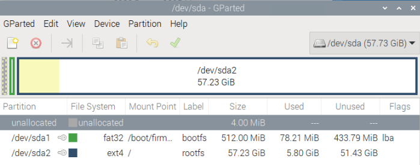
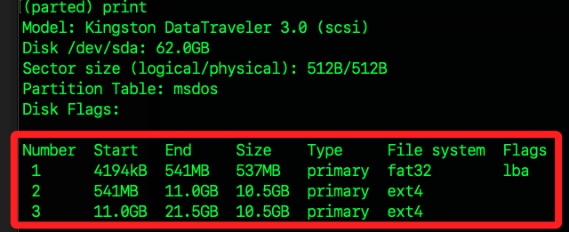

# 管理分區

<br>

## 使用命令列工具

_parted_

<br>

1. 啟動 parted 工具，啟動後，會提示 `parted` 表示當前是在 GNU Parted 工具的互動式操作模式內。

    ```bash
    sudo parted /dev/sda
    ```

    

<br>

2. 查看當前分割區資訊

    ```bash
    print
    ```

    

<br>

## 刪除分區

1. 退出 parted。

    ```bash
    quit
    ```

<br>

2. 強制卸載要刪除的分區。

    ```bash
    sudo umount -l /dev/sda3
    ```

<br>

3. 再次啟動。

    ```bash
    sudo parted /dev/sda
    ```

<br>

4. 查看。

    ```bash
    print
    ```

<br>

___

_END_
