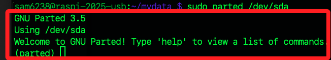

# 管理分區

_因為無法安全調整自身的根分區，所以只有一張 SD 卡時，僅適用於部分查詢功能，若要進行蟲分配等操作，必須外接其他儲存裝置_

<br>

## 使用命令列工具

_parted_

<br>

1. 啟動 parted 工具，啟動後，會提示 `parted` 表示當前是在 GNU Parted 工具的互動式操作模式內。

    ```bash
    sudo parted /dev/sda
    ```

    

<br>

2. 查看當前分割區資訊。

    ```bash
    print
    ```

    

<br>

## 刪除分區

1. 退出 parted。

    ```bash
    quit
    ```

<br>

2. 強制卸載要刪除的分區。

    ```bash
    sudo umount -l /dev/sda3
    ```

<br>

3. 再次啟動。

    ```bash
    sudo parted /dev/sda
    ```

<br>

4. 查看。

    ```bash
    print
    ```

<br>

## 修改

1. 註解已卸載磁區的設定。

    ```bash
    sudo nano etc/fstab
    ```

<br>

2. 若忘記卸載導致無法啟動時，先插入原本的 SD 卡，重啟後切換到 USB 碟。

    ```bash
    cd /media/sam6238/rootfs
    ```

<br>

3. 編輯 /etc/fstab

    ```bash
    sudo nano etc/fstab
    ```

<br>

___

_END_
