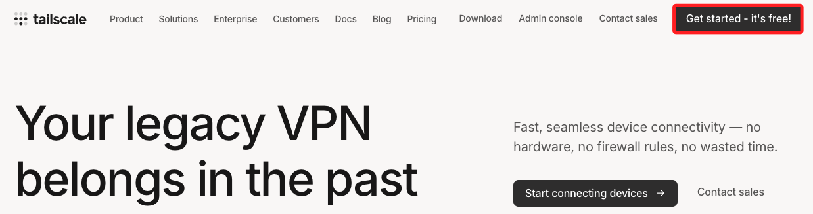
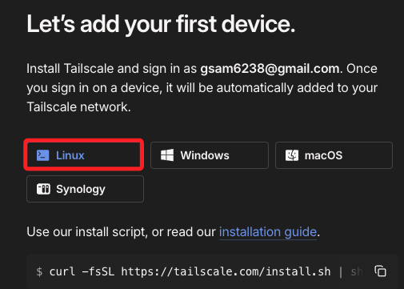
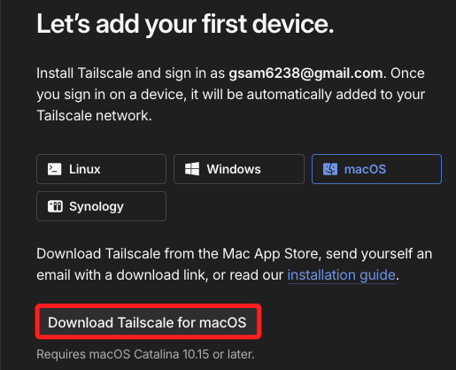
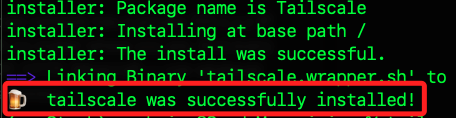
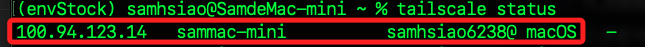
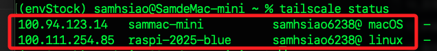
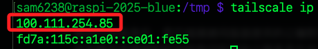
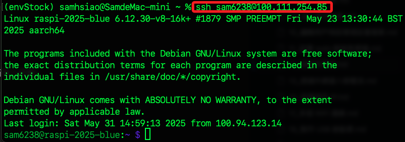
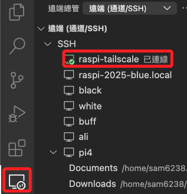

# 使用 Tailscale

_以下說明如何使用 Tailscale 讓電腦與樹莓派建立 `虛擬私人網路（VPN）`，並藉以在 VSCode 中使用 Remote-SSH 功能穩定連線_

<br>

## 建立 Tailscale 帳號

1. 前往 [tailscale 官網](https://tailscale.com)，點擊右上角 `Get started` 開始使用服務。

    

<br>

2. 若是初次使用需進行帳號註冊的入，可使用 Google 帳號或官方提供的任何方式建立帳號。

    

<br>

3. 需填寫相關資料，任意填寫即可；點擊 `Next` 繼續。

    

<br>

4. 在接下來的步驟中，樹莓派將依據 `Linux` 選項的指令進行安裝。

    

<br>

5. 本機則依據作業系統，下載對應的桌面應用，或使用終端機指令進行安裝，這在後續步驟中說明。

    

<br>

## 在電腦安裝 Tailscale

_使用終端機指令安裝_

<br>

1. MacOS 可使用 brew 進行安裝。

    ```bash
    brew install --cask tailscale
    ```

    

<br>

2. 開啟 Tailscale 圖形介面完成登入，登入後會在背景運行。

    ```bash
    open -a Tailscale
    ```

<br>

3. 啟動虛擬網路並加入 Tailscale 網路，如此設備便可被其他裝置存取；只要登入相同帳號的設備都將加入同一個 Tailscale 網路。

    ```bash
    tailscale up
    ```

<br>

4. 查看狀態。

    ```bash
    tailscale status
    ```

    

<br>

5. 斷開本設備。

    ```bash
    sudo tailscale down
    ```

<br>

## 在樹莓派上安裝 Tailscale

1. 安裝。

    ```bash
    curl -fsSL https://tailscale.com/install.sh | sh
    ```

<br>

2. 啟用服務，第一次執行會出現登入網址，在電腦瀏覽器打開並授權該 Raspberry Pi 裝置加入網路。

    ```bash
    sudo tailscale up
    ```

<br>

3. 可查看。

    

<br>

4. 取得樹莓派的 Tailscale IP。

    ```bash
    tailscale ip
    ```

    

<br>

5. 透過 SSH 連線。

    

<br>

## 使用 VSCode 

_設定 Remote-SSH_

<br>

1. 編輯 `~/.ssh/config`。

    ```ssh
    Host raspi-tailscale
        HostName 100.111.254.85
        User sam6238
    ```

<br>

2. 可透過終端機連線測試。

    ```bash
    ssh raspi-tailscale
    ```

<br>

3. 透過 VSCode 遠端連線也可完成。

    

<br>

___

_END_