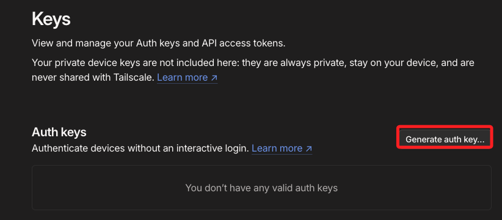
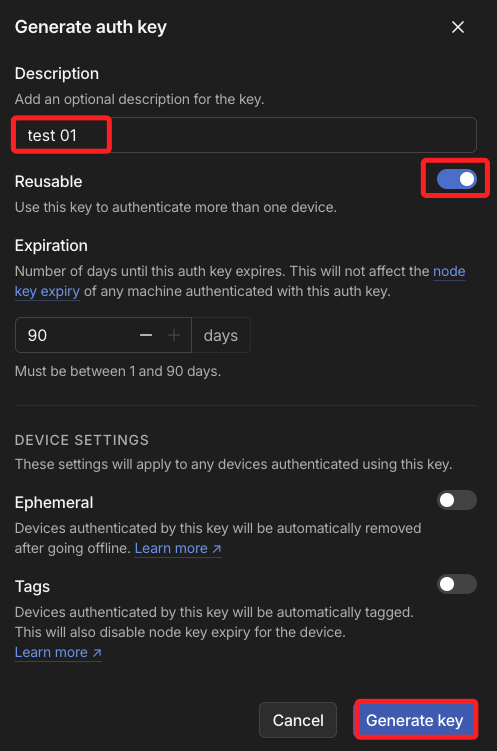
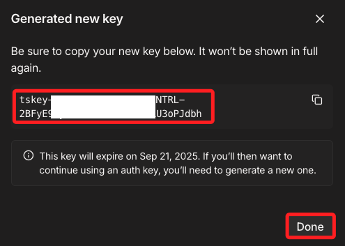
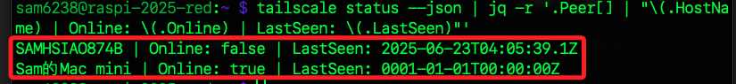
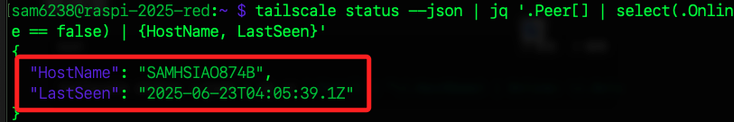
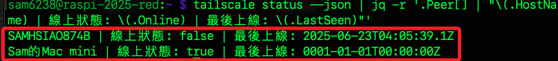

# API

_免費帳戶無法使用官方 REST API，但可透過 CLI 工具搭配 shell 腳本與 `jq`，模擬部分 API 功能並實作日常管理_

<br>

## 功能總覽

_免費帳戶_

<br>

1. 裝置狀態查詢：透過 `tailscale status --json` 取得所有節點線上狀態與 IP。

<br>

2. 節點存活檢查：比對裝置是否已離線，過濾出需移除的節點。

<br>

3. 節點手動登出：透過 CLI 執行 `tailscale logout`，實現節點登出。

<br>

## 商用功能

_免費帳戶無法操作_

<br>

1. 裝置刪除 / ACL 更新 / MagicDNS 設定變更。

<br>

2. REST API (`/api/v2/`) 呼叫功能。

<br>

## 常見自動化應用場景

_免費帳戶_

<br>

1. 定期掃描與分析離線設備，找出已長期未使用節點。

<br>

2. 批次登出節點，搭配管理後台手動點擊 `Expire` 達成清除。

<br>

3. 設備連線圖分析，可透過 `tailscale status --json` 解析節點關係與狀態。

<br>

4. 結合定時排程（cron） 自動分析狀態並提醒使用者。

<br>

5. 使用 auth key 自動登入裝置（適用於無人值守設備）。

<br>

## 非互動式登入

_首先要產生 `auth key`，特別注意這並非是 `API key`；非互動式操作適用於自動化操作的無人值守（headless）模式，也就是不用開啟瀏覽器_

<br>

1. 開啟 [Auth Key 頁面](https://login.tailscale.com/admin/settings/keys)，點選 `Generate auth key...`。

    

<br>

2. 任意命名，然後開啟 `Reusable`，接著點擊右下角 `Generate key`。

    

<br>

3. 複製金鑰後點擊 `Done` 關閉視窗，這個金鑰之後無法再次查看。

    

<br>

4. 在樹莓派中開啟終端機，輸入 Key 到變數中。

    ```bash
    AUTH_KEY=<填入複製的-KEY>
    ```

<br>

5. 自動登入 Tailnet。

    ```bash
    sudo tailscale up --authkey $AUTH_KEY
    ```

<br>

6. 使用 CLI 取得節點狀態並存入 JSON 文件中。

    ```bash
    tailscale status --json > devices.json
    ```

<br>

## 搭配 `jq`

1. 執行以下指令安裝。

    ```bash
    sudo apt update
    sudo apt install -y jq
    ```

<br>

2. 搭配 `jq` 進行查詢，格式化顯示整份 JSON，尚未進行任何篩選。

    ```bash
    tailscale status --json | jq
    ```

<br>

3. 列出所有裝置的 Hostname + 線上狀態 + 最後上線時間。

    ```bash
    tailscale status --json | jq -r '.Peer[] | "\(.HostName) | Online: \(.Online) | LastSeen: \(.LastSeen)"'
    ```

    

<br>

5. 過濾離線裝置清單；以物件方式輸出。

    ```bash
    tailscale status --json | jq '.Peer[] | select(.Online == false) | {HostName, LastSeen}'
    ```

    

<br>

6. 換一個格式化方式；以字串方式輸出。

    ```bash
    tailscale status --json | jq -r '.Peer[] | select(.Online == false) | "\(.HostName) | LastSeen: \(.LastSeen)"'
    ```

<br>

7. 可修改表頭為中文顯示。

    ```bash
    tailscale status --json | jq -r '.Peer[] | "\(.HostName) | 線上狀態: \(.Online) | 最後上線: \(.LastSeen)"'
    ```

    

<br>

___

_END_

