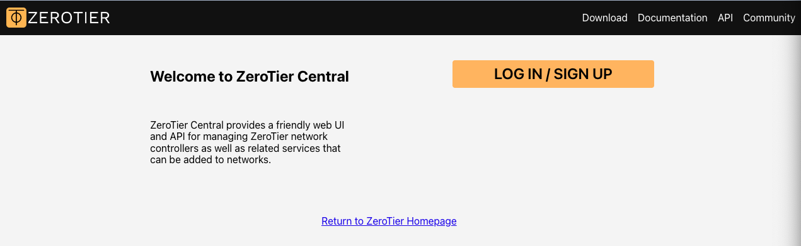
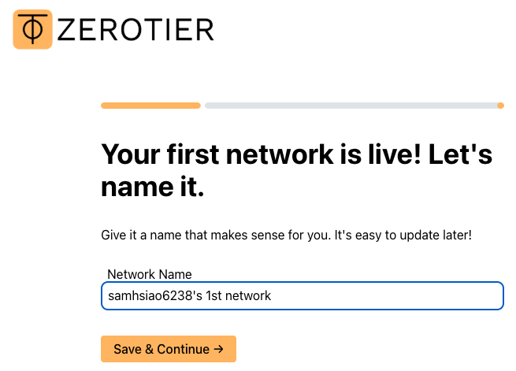
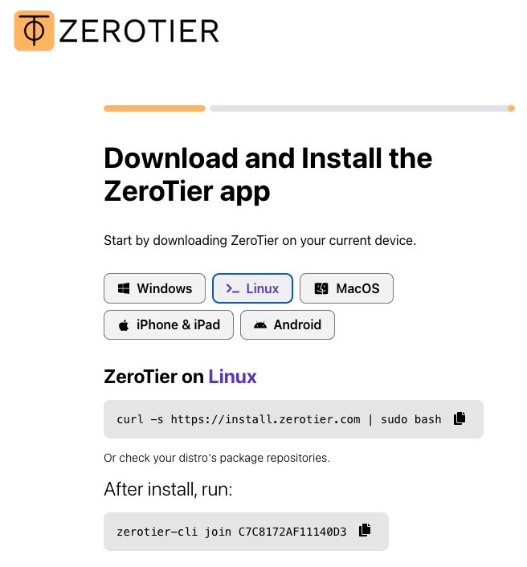
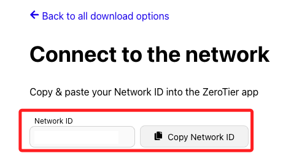
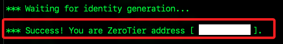
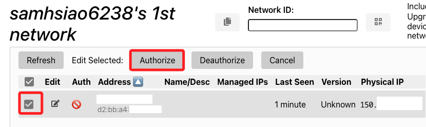
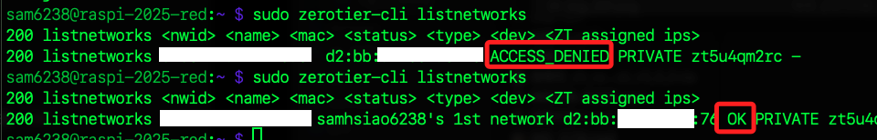
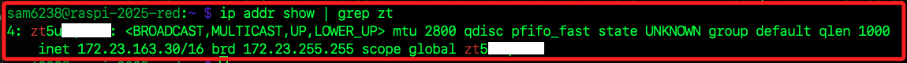
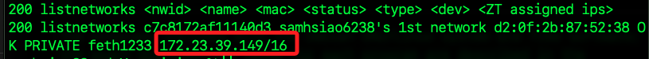

# ZeroTier

_在樹莓派上安裝並設定 ZeroTier，這是一個基於 WireGuard 核心的服務_

<br>

## 建立帳號與網路

1. 訪問 [ZeroTier Central](https://my.zerotier.com) 註冊或登入；可使用 Google 帳號快速登入。

    

<br>

2. 首次使用會自動建立網路，使用預設名稱即可。

    

<br>

3. 依據不同作業系統選擇接下來要安裝的方式；包含在電腦使用的桌面應用。

    

<br>

4. 記下 `Network ID`，這是一組 16 位十六進位字串，Network ID 將用於所有裝置加入同一個網路。

    

<br>

## 在樹莓派上安裝

1. 依據官網指示，執行以下安裝腳本，此腳本會自動加入 ZeroTier 軟體倉庫並安裝相依套件。

    ```bash
    curl -s https://install.zerotier.com | sudo bash
    ```

    

<br>

2. 加入 ZeroTier 網路，成功向網路註冊會顯示 `200 join OK`

    ```bash
    sudo zerotier-cli join <貼上-NetworkID>
    ```

<br>

3. 此時使用指令確認狀態，會得到 `ACCESS_DENIED` 的回應，這是因為所建立的是 PRIVATE 網路，必須在控制台中手動授權該節點，否則不會拿到 IP 也無法通訊。

    ```bash
    sudo zerotier-cli listnetworks
    ```

<br>

4. 在控制台進行授權。

    

<br>

5. 再次查看就會顯示 `OK`。

    

<br>

## 檢查虛擬網路介面

1. 授權完成後，在樹莓派上查看虛擬網路介面

    ```bash
    ip addr show | grep zt
    ```

<br>

2. 通常名稱是 `zt<短ID>`，`inet` 即是此節點在 ZeroTier 網路中的 IP。

    

<br>

## 點對點連線測試

1. 使用另一台設備加入同一 Network 並進行授權。

<br>

2. 可嘗試透過 `ping` 指令測試與樹莓派的連線，若能正常回應，即代表點對點通道已建立。

    ```bash
    ping <樹莓派-IP>
    ``` 

<br>

3. 安裝桌面應用後，也可直接運行終端機指令，最後顯示的就是本機取得的 IP。

    ```bash
    sudo zerotier-cli listnetworks
    ```

    

<br>

___

_END_