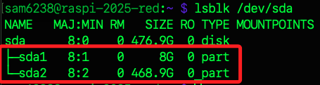

# 交換空間

_`Swap Space` 是作業系統在實體記憶體不足時，用於將暫時不活躍的頁面資料移至儲存裝置的區域，以模擬 `延伸記憶體` 功能；依據配置方式可分為 `Swap Partition` 與 `Swap File`，主要應用於 Linux 與類 Unix 系統，其概念相當於 Windows 系統的 `虛擬記憶體`，但實作機制上略有差異_

<br>

## Swap Partition

_交換分區_

<br>

1. 交換分區是一個獨立的磁碟分區，專門用來作為交換空間使用，通常在安裝 Linux 系統時會建立交換分區，並在 `/etc/fstab` 文件中指定；可透過觀察內容來理解，可知當前預設沒有使用 `Swap 分區`，而是使用 `Swap 檔案`，位置在 `/var/swap` 或 `/swapfile`，且受 `dphys-swapfile` 管理。

    ```bash
    cat /etc/fstab
    ```

    

<br>

2. 系統會透過 `mkswap` 指令格式化該分區為交換用途，並以 `swapon` 指令啟用；開機後可由 `fstab` 自動掛載。

<br>

3. 相較於交換檔案，交換分區的效能可能略優，因其對應的是實體磁區而非檔案系統管理的區塊。

<br>

4. 交換分區的大小固定且不易動態調整，一旦建立需透過分區工具重新配置才能變更容量，彈性較低。

<br>

5. 在伺服器、嵌入式系統或強調效能與穩定性的部署中，仍常見使用交換分區作為主要交換機制。

<br>

## 建立交換分區

_在樹莓派手動建立交換分區並進行測試，需外接儲存裝置_

1. 確認磁碟狀態

```bash
lsblk -f
sudo fdisk -l
```

2. 建立新分割區

```bash
sudo fdisk /dev/sda
```

3. 然後依序輸入下列指令，完成後會自動退出 `fdisk`，並更新分割表

```bash
g           # 建立新的 GPT 分割表，會清空原資料
n           # 建立交換分區
1           # 分區號碼 1，系統會自動選取
ENTER       # 起始位置，直接按 Enter 使用預設
+8G         # 分區大小為 8GB

t           # 變更分區類型
1           # 選擇分區 1
19          # 選擇 Linux swap 類型（code 19）

n           # 建立第二分區（資料分區）
2           # 分區號碼 2
ENTER       # 預設起始位置（緊接在 swap 後）
ENTER       # 預設結束位置（使用全部剩餘空間）

w           # 把分區變更寫入磁碟並退出
```

4. 硬重新啟動以確保新分割表正確載入

```bash
sudo reboot
```

5. 確認兩個新分區存在；若前面步驟正確，輸出中會看到 8G swap `/dev/sda1` 與資料區 `/dev/sda2`

```bash
lsblk /dev/sda
```


6. 格式化交換分區

```bash
sudo mkswap /dev/sda1
```

7. 啟用交換分區；沒有任何輸出

```bash
sudo swapon /dev/sda1
```

8. 確認是否成功啟用；啟用了兩個 swap 來源，一個是原本系統的檔案型交換空間 `/var/swap`，另一個是自行新建立的分區型交換空間 `/dev/sda1`。

```bash
sudo swapon --show
free -h
```

9. 格式化資料分區（ext4）

```bash
sudo mkfs.ext4 /dev/sda2
```

10. 建立掛載點並掛載

```bash
sudo mkdir -p /mnt/ssd
sudo mount /dev/sda2 /mnt/ssd
```

11. 安裝 stress 測試工具

```bash
sudo apt update
sudo apt install stress
```

12. 壓力測試，若記憶體為 8GB 的樹莓派可運行以下指令，運秀因為系統記憶體不足時將使用 swap，一旦系統將資料頁面寫入 Swap 空間，即便記憶體充足，這些頁面通常不會立即移回 RAM。

```bash
stress --vm 4 --vm-bytes 1800M --timeout 60s
```


13. 觀察 swap 使用情況；特別注意，Linux 的 Swap 不會自動釋放已載入的資料，

```bash
watch -n 1 free -h
```

14. 安裝工具

```bash
sudo apt install smem -y
```

15. 查看哪些程式還在使用 Swap

```bash
sudo smem -rs swap
```

16. 強制釋放 swap，這會停用所有交換區，再重新啟用，有助於清除未再使用的 Swap 區資料。

```bash
sudo swapoff -a
sudo swapon /dev/sda1
```

## 開機自動啟用 swap

1. 查詢 UUID

```bash
sudo blkid
```

2. 加入 `/etc/fstab`，將 `UUID=...` 替換為 `/dev/sda1` 的實際 UUID

```bash
UUID=xxxx-xxxx none swap sw 0 0
```


## Swapfile

_交換文件_

<br>

1. 交換文件是一個普通的文件，它位於已掛載的文件系統中，用於擴展物理記憶體，並被配置為交換空間。交換文件的優勢是可以在不重新分區的情況下動態調整交換空間的大小。

<br>

2. 交換文件的配置是通過命令行工具來完成的，例如 `mkswap` 和 `swapon`，而配置完成後，可在 `/etc/fstab` 文件中添加條目來確保重啟後會自動啟用交換文件。

<br>

## 建立交換文件

1. 編輯設定。

    ```bash
    sudo fallocate -l 1G /swapfile
    ```

<br>

2. 或使用 `dd` 命令建立交換文件。

    ```bash
    sudo dd if=/dev/zero of=/swapfile bs=1M count=1024
    ```

<br>

3. 設置正確的權限。

    ```bash
    sudo chmod 600 /swapfile
    ```

<br>

4. 標記交換空間。

    ```bash
    sudo mkswap /swapfile
    ```

<br>

5. 啟用交換文件。

    ```bash
    sudo swapon /swapfile
    ```

<br>

6. 確保開機自動啟用交換文件，在 `/etc/fstab` 文件中添加以下設置。

    ```bash
    /swapfile none swap sw 0 0
    ```

<br>

___

_END_
