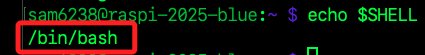
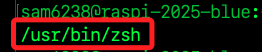
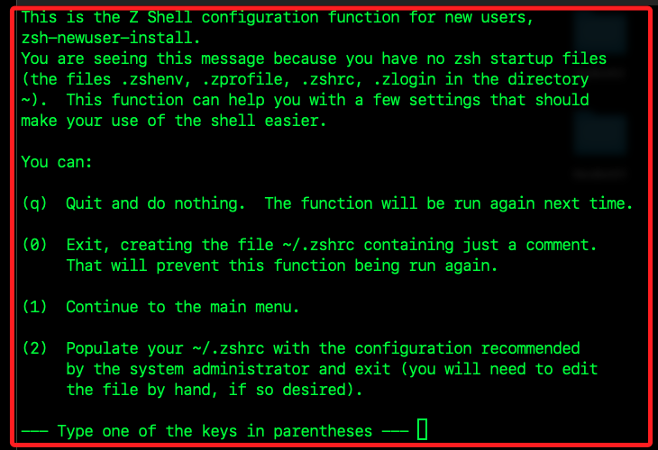
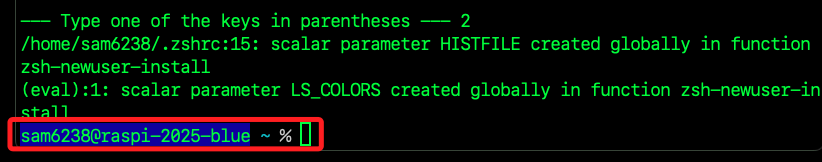

# 基本觀念

_在 Linux 系統中，使用者可透過 Shell 執行文字指令與作業系統互動，而樹莓派作業系統是基於 Linux 核心，互動式預設 Shell 通常是 Bash，但有些系統腳本可能使用 dash 等較輕量的 Shell；另外，使用者也可安裝其他 Shell，如 zsh 或 fish；Shell 在 Windows 系統中可類比為 CMD 或 PowerShell，是一種命令列介面，用來解讀指令並傳送給作業系統執行。_

<br>

## `Shell`

_接下來的操作會使用終端機進行；特別說明，作業系統中的 `終端機（Terminal）` 並不是 `Shell`，而是用來啟動與操作 `Shell` 的介面工具，`Shell` 可視為終端機使用的解譯器；在實務上，打開終端機時會啟動一個 `Shell` 程式，在多數基於 `Linux` 為核心的系統中預設為 `Bash`，所以在終端機下達的 `Shell` 指令也可稱為 `Bash` 指令，`Shell` 接收到指令後會進行解析並轉交給系統執行。_

<br>

1. 查看當前用的是哪個 `Shell`。

    ```bash
    echo $SHELL
    ```

    

<br>

3. 列出系統已經安裝的 `Shell`；其中 sh 通常是連結到 dash 或 bash，而 rbash 是指限制型 bash；另外，zsh 是一種功能強大的 Shell，在 MacOS 中預設使用 zsh。

    ```bash
    cat /etc/shells
    ```

<br>

## 安裝其他 `Shell`

_以 `zsh` 為例_

<br>

1. 安裝。

    ```bash
    sudo apt update
    sudo apt install zsh -y
    ```

<br>

2. 透過查詢路徑確認 `zsh` 安裝成功。

    ```bash
    which zsh
    ```

    

<br>

3. 再次查詢 `Shell` 清單。

    ```bash
    cat /etc/shells
    ```

<br>

## 切換預設 `Shell`

1. 改為 `zsh`，完成後需要重啟終端機或再次登出入；`chsh` 就是 change shell 的縮寫。

    ```bash
    chsh -s /usr/bin/zsh
    ```

<br>

2. 顯示如下訊息，這來自於 `Zsh` 首次啟動時的初始化精靈 `zsh-newuser-install`，協助用戶建立初始設定檔 `~/.zshrc`。

    

<br>

3. 可輸入 `2`，自動建立一份預設的 `.zshrc` 設定檔，根據系統管理員建議內容；後續可手動編輯。

    

<br>

4. 再次查看。

    ```bash
    echo $SHELL
    ```

<br>

5. 若想切換回到 `bash`。

    ```bash
    bash
    ```

<br>

6. 永久切換回 `bash`；完成後需重啟或登出入再查詢。

    ```bash
    chsh -s /bin/bash
    ```

<br>

## 終端機 `Terminal`

_終端機是一個介面，讓使用者輸入文字指令並與電腦互動，它本身只是個輸入與顯示的工具，常見終端機程式如下。_

<br>

## Bash

_Bash 是 Shell 程式，是一種指令解譯器_

<br>

1. 解讀終端機輸入的指令。

<br>

2. 查找是否為內建指令、alias、function 或外部程式。

<br>

3. 將指令傳送給 Linux 核心執行。

<br>

___

_END_