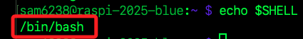
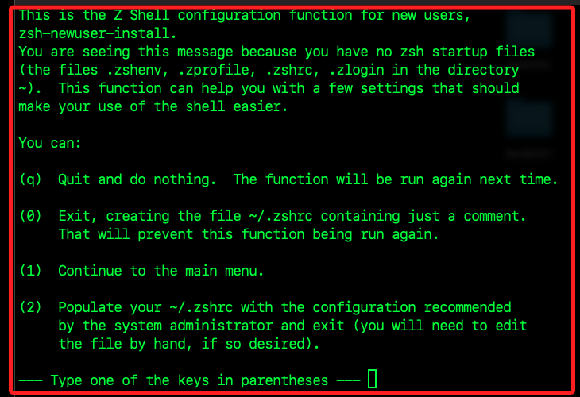

# Linux 指令

_在 `Linux` 系統中可透過 `Shell` 執行文字命令，而樹莓派是基於 `Linux` 核心的作業系統，預設的 `Shell` 是 `Bash`，也可自行安裝其他 `Shell` 如 `zsh`、`fish`、`dash`；如同在 `Windows` 系統使用的是自有的指令解譯環境 `CMD` 或 `PowerShell`；而 `Shell` 是一種命令列介面，用來解讀使用者輸入的指令並傳送給作業系統執行。_

<br>

## 基本說明

1. `Linux` 系統中的 `終端機（Terminal）` 並不是 `Shell`，而是用來啟動與操作 `Shell` 的介面工具，`Shell` 則是終端機使用的解譯器；在實務上，打開終端機時會啟動一個 `Shell` 程式，在多數 `Linux` 系統中預設為 `Bash`，所以在終端機下達的 `Shell` 指令也可稱為 `Bash` 指令，接著 `Shell` 會解析指令並轉交給 `Linux` 系統執行。

<br>

2. 查看當前用的是哪個 `Shell`。

    ```bash
    echo $SHELL
    ```

    

<br>

3. 列出系統已經安裝的 `Shell`。

    ```bash
    cat /etc/shells
    ```

<br>

4. 安裝並啟用 `zsh`。

    ```bash
    sudo apt update
    sudo apt install zsh -y
    ```

<br>

5. 確認 `zsh` 安裝成功。

    ```bash
    which zsh
    ```

<br>

1. 再次查詢允許登入 `Shell` 清單。

    ```bash
    cat /etc/shells
    ```

<br>

## 切換預設 `Shell`

1. 改為 `zsh`，完成後需要重啟終端機或再次登出入。

    ```bash
    chsh -s /usr/bin/zsh
    ```

<br>

2. 顯示如下訊息，這來自於 `Zsh` 首次啟動時的初始化精靈 `zsh-newuser-install`，協助用戶建立初始設定檔 `~/.zshrc`。

    

<br>

3. 可輸入 `2`，自動建立一份預設的 `.zshrc` 設定檔，根據系統管理員建議內容；後續可手動編輯。

    

<br>

4. 再次查看。

    ```bash
    echo $SHELL
    ```

<br>

5. 若想切換回到 `bash`。

    ```bash
    bash
    ```

<br>

6. 永久切換回 `bash`；完成後需重啟或登出入再查詢。

    ```bash
    chsh -s /bin/bash
    ```

<br>

## 終端機

_終端機是一個介面，讓使用者輸入文字指令並與電腦互動，它本身只是個輸入與顯示的工具，常見終端機程式如下。_

<br>

## Bash

_Bash 是 Shell 程式，是一種指令解譯器_

<br>

1. 解讀終端機輸入的指令。

<br>

2. 查找是否為內建指令、alias、function 或外部程式。

<br>

3. 將指令傳送給 Linux 核心執行。

<br>

___

_END_