# 建立密鑰

_以下示範建立 `.pem` 金鑰並指定給樹莓派作為 SSH 連線驗證使用_

<br>

## PEM 格式密鑰

_`PEM` 格式密鑰是以 `Base64` 編碼並附帶標頭與結尾的純文字金鑰檔案，也就是 `OpenSSL` 所採用的標準金鑰格式，常用於 SSH 與 TLS 加密認證。_

<br>

1. 使用 `ssh-keygen` 指令生成密鑰；使用參數 `-m` 指定格式為 `PEM`；透過 `-t rsa` 指定金鑰類型為 `RSA`；透過 `-b` 指定密鑰長度為 `2048 bits`；最後，透過 `-f` 指定輸出的檔案名稱，這裡存放在系統預設的路徑 `~/.ssh` 中。

    ```bash
    ssh-keygen -t rsa -b 2048 -m PEM -f ~/.ssh/raspi_key.pem
    ```

    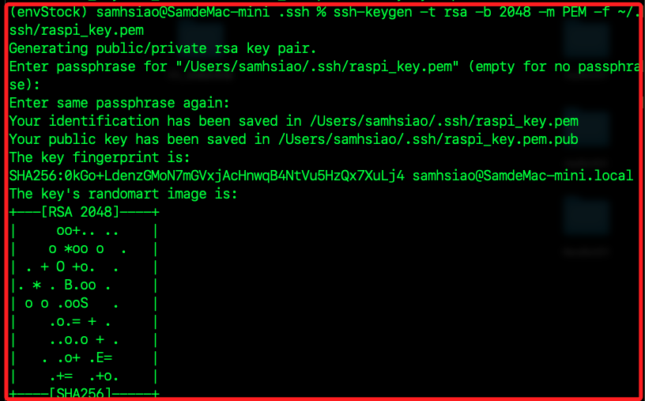

<br>

2. 運行指令後會在指定路徑中生成一組非對稱密鑰，包含私鑰（`raspi_key.pem`）與公鑰（`raspi_key.pem.pub`） 各一個；其中私鑰預設權限為 `600` 表示僅擁有者可讀寫，另外公鑰設置為 `644`，允許他人讀取。

    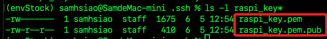

<br>

3. 使用指令 `ssh-copy-id` 將生成的 `公鑰` 寫入樹莓派的 `~/.ssh/authorized_keys` 文件中，運行後會提示輸入密碼；如此便可建立免密碼登入機制。

    ```bash
    ssh-copy-id -i ~/.ssh/raspi_key.pem.pub <使用者帳號>@<主機名稱.local>
    ```

    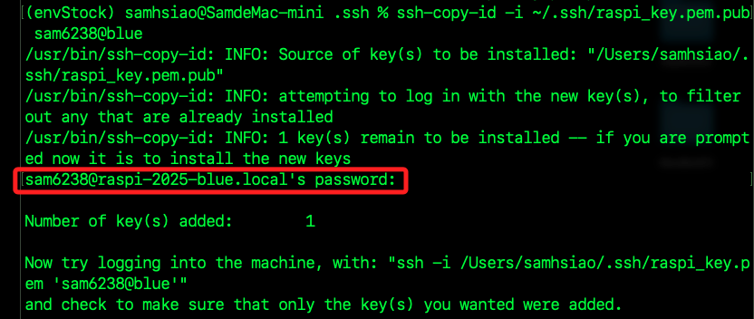

<br>

4. 指定要使用的私鑰進行連線樹莓派。

    ```bash
    ssh -i ~/.ssh/raspi_key.pem <使用者帳號>@<主機名稱.local>
    ```

    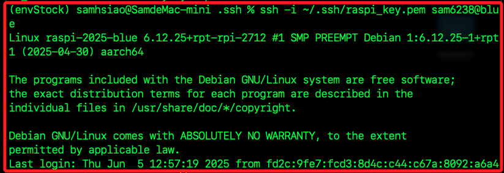

<br>

5. 特別注意，雖然已經將公鑰複製到樹莓派，仍需使用 `-i` 指定私鑰，這是因為 `SSH` 預設只會尋找以下路徑與名稱的金鑰。

    ```bash
    ~/.ssh/id_rsa
    ~/.ssh/id_ecdsa
    ~/.ssh/id_ed25519
    ```

    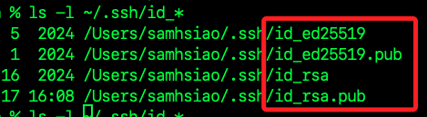

<br>

## 賦予私鑰權限

1. 為安全考量，應將私鑰檔權限設為 `400`；`OpenSSH` 預設會拒絕使用權限過寬的私鑰檔，若未設定可能導致連線失敗。

    ```bash
    chmod 400 ~/.ssh/raspi_key.pem
    ```

<br>

2. 取消確設定文件 `/etc/ssh/sshd_config` 中預設為註解的 `PubkeyAuthentication` 設定，維持預設值為 `yes`，表示允許公鑰登入。

    ```bash
    code /etc/ssh/sshd_config
    ```

    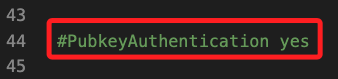

<br>

## 自動化

_接下來是較為進階的設定指引，將示範在本地的 MacOS 電腦中建立自動化工作腳本，運行腳本可整合前述的工作，自動完成建立密鑰文件並寫入樹莓派設定文件的工作_

<br>

1. 使用 VSCode 在本機的 `~/Documents` 資料夾中建立腳本檔 `setup_raspi_ssh.sh`。

    ```bash
    cd ~/Documents
    code setup_raspi_ssh.sh
    ```

<br>

2. 編輯內容如下；編輯後記得儲存。

    ```bash
    #!/bin/bash

    # 輸入必要參數
    read -p "請輸入樹莓派 IP 位址: " RASPI_IP
    read -p "請輸入樹莓派使用者名稱（預設 pi）: " RASPI_USER
    RASPI_USER=${RASPI_USER:-pi}
    KEY_PATH=~/Desktop/raspi_key.pem

    echo "👉 開始產生 PEM 金鑰..."
    ssh-keygen -t rsa -b 2048 -m PEM -f "$KEY_PATH" -N ""

    echo "👉 傳送公鑰至樹莓派..."
    ssh-copy-id -i "$KEY_PATH.pub" "$RASPI_USER@$RASPI_IP"

    echo "👉 設定私鑰權限..."
    chmod 400 "$KEY_PATH"

    echo "✅ 設定完成，可使用以下指令登入："
    echo "ssh -i $KEY_PATH $RASPI_USER@$RASPI_IP"
    ```

<br>

3. 返回終端機中，賦予 `執行` 權限。

    ```bash
    chmod +x setup_raspi_ssh.sh
    ```

<br>

4. 執行腳本，會在終端機中提示輸入 IP、使用者名稱以及樹莓派連線密碼。

    ```bash
    ./setup_raspi_ssh.sh
    ```

<br>

5. 完成後會建立密鑰，並提供連線指令，可複製後在終端機中運行。

    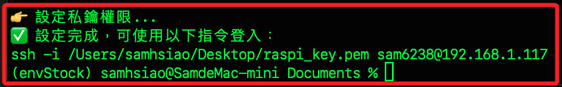

<br>

## 建立對話框

_優化前一個步驟，結合 `AppleScript` 改寫為帶有 `GUI` 輸入對話框的 `Shell Script`_

<br>

1. 在相同資料夾中建立新的腳本 `setup_raspi_ssh_gui.sh`。

    ```bash
    cd ~/Documents
    code setup_raspi_ssh_gui.sh
    ```

<br>

2. 確保已安裝 expect；關於逾時的規定，因為 macOS 執行 AppleScript 對話框的逾時預設為約 60 秒，而 osascript 無法取消逾時限制，所以用 osascript 執行時加上 || exit 1 搭配 if 判斷確保輸入存在，來強制中止整個腳本；未設置時，會在逾時之後自動進入下一個步驟，這樣設計並不合理

    ```bash
    brew install expect
    ```

<br>

3. 寫入以下內容並儲存。

    ```bash
    #!/bin/bash

    # GUI 輸入：IP 位址
    RASPI_IP=$(osascript -e 'try
        set userInput to display dialog "請輸入樹莓派 IP 位址：" default answer "" with title "SSH 設定 - IP 位址" buttons {"確定"} default button "確定"
        text returned of userInput
    on error
        display dialog "❌ 未輸入 IP 或操作逾時，腳本已終止。" buttons {"OK"} with title "作業中止"
        return
    end try') || exit 1

    if [ -z "$RASPI_IP" ]; then
        osascript -e 'display dialog "❌ IP 位址不可為空。" buttons {"OK"} with title "輸入錯誤"'
        exit 1
    fi

    # GUI 輸入：使用者名稱
    RASPI_USER=$(osascript -e 'try
        set userInput to display dialog "請輸入樹莓派使用者名稱（預設為 pi）：" default answer "pi" with title "SSH 設定 - 使用者名稱" buttons {"確定"} default button "確定"
        text returned of userInput
    on error
        display dialog "❌ 未輸入使用者名稱或操作逾時，腳本已終止。" buttons {"OK"} with title "作業中止"
        return
    end try') || exit 1

    if [ -z "$RASPI_USER" ]; then
        osascript -e 'display dialog "❌ 使用者名稱不可為空。" buttons {"OK"} with title "輸入錯誤"'
        exit 1
    fi

    # GUI 輸入：密碼
    RASPI_PASS=$(osascript -e 'try
        set pwInput to display dialog "請輸入樹莓派使用者密碼：" default answer "" with hidden answer with title "SSH 設定 - 密碼輸入" buttons {"確定"} default button "確定"
        text returned of pwInput
    on error
        display dialog "❌ 未輸入密碼或操作逾時，腳本已終止。" buttons {"OK"} with title "作業中止"
        return
    end try') || exit 1

    if [ -z "$RASPI_PASS" ]; then
        osascript -e 'display dialog "❌ 密碼不可為空。" buttons {"OK"} with title "輸入錯誤"'
        exit 1
    fi

    # 金鑰位置
    KEY_PATH=~/.ssh/raspi_key.pem

    # 若金鑰已存在，詢問是否覆蓋
    if [ -f "$KEY_PATH" ]; then
        OVERWRITE=$(osascript -e 'display dialog "檢測到金鑰已存在。\n是否要覆蓋 raspi_key.pem？" buttons {"否", "是"} default button "否"' -e 'button returned of result')
        if [ "$OVERWRITE" = "是" ]; then
            rm -f "$KEY_PATH" "$KEY_PATH.pub"
        else
            osascript -e 'display dialog "已取消金鑰建立程序。" buttons {"OK"} default button 1 with title "作業中止"'
            exit 1
        fi
    fi

    # 建立 PEM 金鑰
    ssh-keygen -t rsa -b 2048 -m PEM -f "$KEY_PATH" -N ""

    # 使用 expect 自動上傳公鑰並輸入密碼
    expect <<EOF
    set timeout 10
    spawn ssh-copy-id -i "$KEY_PATH.pub" "$RASPI_USER@$RASPI_IP"
    expect {
        "(yes/no)?" {
            send "yes\r"
            exp_continue
        }
        "password:" {
            send "$RASPI_PASS\r"
        }
    }
    expect eof
    EOF

    # 修改私鑰權限
    chmod 400 "$KEY_PATH"

    # 複製登入指令到剪貼簿
    LOGIN_CMD="ssh -i ~/.ssh/raspi_key.pem $RASPI_USER@$RASPI_IP"
    echo "$LOGIN_CMD" | pbcopy

    # 顯示 GUI 完成提示
    osascript -e 'display dialog "✅ 設定完成！\n\nSSH 登入指令已複製到剪貼簿：\n\n'"$LOGIN_CMD"'\n\n請至終端機貼上使用。" buttons {"完成"} default button 1 with title "SSH 設定完成"'
    ```

<br>

4. 回到終端機中修改文件權限。

    ```bash
    chmod +x setup_raspi_ssh_gui.sh
    ```

<br>

5. 在終端機執行腳本。

    ```bash
    ./setup_raspi_ssh_gui.sh
    ```

    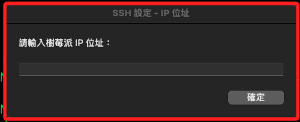

<br>

6. 完成時會顯示指令。

    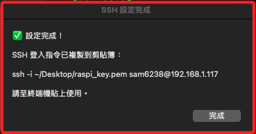

<br>

## 建立桌面捷徑

_進一步優化前步驟完成的自動化工作，接下來建立 `Automator .app` 桌面應用_

<br>

1. 進入終端機，使用指令建立 `Automator` 用的 `.workflow AppleScript` 執行器；以下指令不會打開終端機，而是在背景運行。

    ```bash
    APP_NAME="Setup Raspi SSH"
    APP_PATH=~/Desktop/"$APP_NAME.app"
    SCRIPT_PATH=~/Documents/setup_raspi_ssh_gui.sh

    osacompile -e "do shell script \"chmod +x '$SCRIPT_PATH'; bash '$SCRIPT_PATH'\"" -o "$APP_PATH"
    ```

<br>

2. 完成時顯示如下訊息，代表 osacompile 成功建立或覆蓋了應用程式 Setup Raspi SSH.app，並將它放在桌面，這是一個可以直接執行的 .app 圖形介面啟動器

    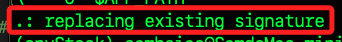

<br>

3. 接著點擊桌面應用啟動。

    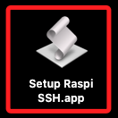

<br>

4. 成功運行會顯示如下。

    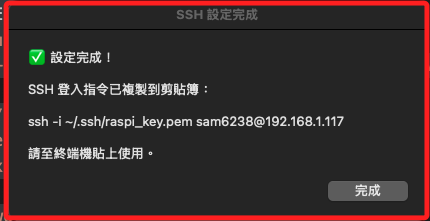

<br>

___

_END_