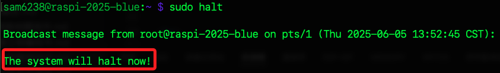
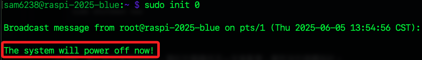
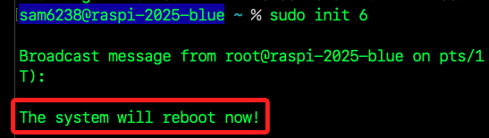
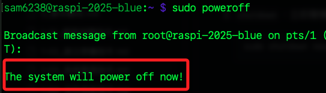
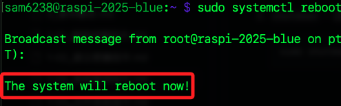
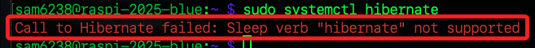

# 系統管理指令

_啟動與關機等操作_

<br>

## 系統管理類指令

1. `reboot`：重啟啟動。

    ```bash
    sudo reboot now
    ```

<br>

2. `shutdown`：立即關機；特別注意，不同的 Linux 對於關機的指令有不同參數，在樹莓派中使用預設即可。

    ```bash
    sudo shutdown now
    ```

<br>

3. halt：停止所有處理器操作，類似於關機但不一定會斷電，需取決於硬體設計；樹莓派則等同於關機。

    ```bash
    sudo halt
    ```

    

<br>

4. init：切換系統執行層級，例如關機使用 `init 0`。

    ```bash
    sudo init 0
    ```

    


<br>

5. 同上，若要重啟使用 `init 6`。

    ```bash
    sudo init 6
    ```

    

<br>

## 電源管理類指令

1. `poweroff`：完全關機並斷電，與 `shutdown -h now` 效果相同。

    ```bash
    sudo poweroff
    ```

    .

<br>

2. `systemctl poweroff`：使用 `systemd` 框架下的關機指令，效果與 `poweroff` 類似。

    ```bash
    sudo systemctl poweroff
    ```

<br>

3. `systemctl reboot`：使用 `systemd` 的重啟指令。

    ```bash
    sudo systemctl reboot
    ```

<br>

4. `systemctl suspend`：進入睡眠狀態，也就是待機或節電模式；視硬體支援情況而定。

    ```bash
    sudo systemctl suspend
    ```

    

<br>

5. `systemctl hibernate`：進入休眠狀態，將記憶體內容寫入磁碟再關機；樹莓派並不支援。

    ```bash
    sudo systemctl hibernate
    ```

    

<br>

___

_END_