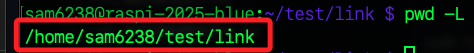
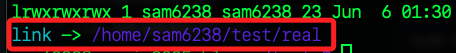

# 文件系統指令

<br>

## 說明

1. `ls`：列出目錄檔案；`-l` 會以詳細清單格式列出檔案資訊，`al` 則會包含以 `.` 開頭的隱藏檔案。

    ```bash
    # 列出檔案目錄
    ls
    
    # 詳細清單
    ls -l

    # 包含隱藏檔案
    ls -al
    ```

<br>

2. `pwd`：顯示當前路徑；。

    ```bash
    pwd
    ```

<br>

3. `cd`：切換到指定目錄。

    ```bash
    # 切換到家目錄
    cd ~
    ```

<br>

4. `touch`：建立檔案。

    ```bash
    touch test.txt
    ```

<br>

5. `nano`：編輯檔案。

    ```bash
    nano test.txt
    ```

<br>

6. `cat`：串連或顯示文件內容、建立文件等。

    ```bash
    # 串連檔案內容
    cat file1.txt file2.txt > combined.txt
    # 顯示檔案內容
    cat test.txt
    # 建立文件
    cat > newfile.txt
    # 在文件末尾追加內容
    cat >> filename.txt
    ```

<br>

7. `mv`：移動檔案。

    ```bash
    mv test.txt test1.txt
    ```

<br>

8. `cp`：複製檔案。

    ```bash
    cp test1.txt test2.txt
    ```

<br>

9. `mkdir`：建立目錄。

    ```bash
    mkdir test
    ```

<br>

10. `rm`：刪除檔案或目錄。

    ```bash
    # r 遞迴、f 強制
    # 這會強制刪除整個目錄或檔案
    rm -rf <檔案或目錄>
    ```

<br>

11. `rmdir`：刪除目錄。

    ```bash
    rmdir <目錄>
    ```

<br>

12. `scp`：透過 SSH 複製檔案到遠端伺服器。

    ```bash
    scp <本地檔案> <使用者名稱>@<主機名稱或 IP>:<遠端檔案名稱>
    ```

<br>

13. `find`：在文件系統中搜索和定位文件和目錄。

    ```bash
    # 從根目錄 `/` 開始搜索指定文件
    # 也就是遍歷系統中所有的目錄和子目錄
    find / -name test.txt
    ```

<br>

14. `grep`：在指定檔案中搜索指定的文字。

    ```bash
    grep "test" filename.txt
    ```

<br>

15. `less`：用於分頁查看大檔案的內容，允許用戶在檔案中上下滾動、搜索特定內容，以及方便地查看檔案的部分內容，而不需要一次性讀取整個檔案。

    ```bash
    less largefile.txt
    ```

<br>

16. `more`：用於分頁查看大檔案的內容，類似於 less，但功能稍微簡單一些，允許用戶從檔案的開頭開始查看，並按一頁一頁的方式顯示內容。

    ```bash
    # `空格鍵`  下一頁
    # `Enter`  下一行
    # `q`      退出
    more largefile.txt
    ```

<br>

17. `tree`：顯示當前資料夾。

    ```bash
    # `-L` 參數可限制顯示的目錄層級深度為 `1`
    tree -L 1
    ```

<br>

## 符號連結

_`Symbolic Link` 就是一個捷徑或別名；在 Linux 系統中，可使用 `ln -s` 建立 `符號連結`，讓一個路徑指向另一個目錄或檔案；其主要用意是位一個檔案或目錄建立另一個 `別名路徑`，讓使用者或程式可以透過該路徑間接存取實際位置的內容，在 `Python` 開發環境中，可透過符號連結讓 `python` 指向不同版本的執行檔，也可以讓不同使用者透過連結共用一個實體檔案以達成跨目錄共享。_

<br>

1. 建立一個實體目錄，並切換至其上層目錄以進行後續操作。

    ```bash
    # 建立
    mkdir -p ~/test/real
    cd ~/test
    ```

<br>

2. 建立符號連結；以下命令會建立 `~/test/link`，指向 `~/test/real`。

    ```bash
    ln -s ~/test/real link
    ```

<br>

3. 進入符號連結所指向的目錄。

    ```bash
    cd link
    ```

<br>

4. 顯示 `邏輯路徑（保留符號連結）`，也就是顯示使用者實際輸入的連結名稱，而不解析實際位置。

    ```bash
    pwd -L
    ```

    

<br>

5. 顯示 `實體路徑（解析符號連結）`，會顯示最終實際所處的目錄位置。

    ```bash
    pwd -P
    ```

    

<br>

6. 由結果可知，`-L` 顯示的是使用者 _透過符號_ 連結進入的 `邏輯路徑`；`-P` 則會解析連結並顯示 `實體路徑`；另外，與 `硬連結（hard link）` 不同，符號連結可跨檔案系統，並能指向目錄；若原始檔案被刪除，符號連結會失效。

<br>

7. 若要查看符號連結所指向的目標，可以使用 `ls -l` 查看連結資訊。

    ```bash
    cd ~/test
    ls -l link
    ```

    

<br>

8. 可使用 `rm` 刪除符號連結，這只會刪除連結本身，不會刪除實際目錄或檔案。

    ```bash
    rm link
    ```

<br>

9. 當所指向的目標不存在時符號連結無效，稱為 `斷開的符號連結（broken symlinks）`；可使用以下指令尋找當前目錄下所有 `已斷開的符號連結`。

    ```bash
    find . -xtype l
    ```

<br>

10. 使用 `readlink` 查看符號連結實際指向的路徑。

    ```bash
    readlink link
    ```

<br>

11. 列出所有符號連結。

    ```bash
    find . -type l
    ```

<br>

## 硬連結

_在 Linux 的檔案系統中，每個檔案是由一個 `inode（儲存資料與中繼資訊）` 與一或多個 `檔名` 連結起來的，當使用 `ln` 建立一個硬連結時，系統會為該 `inode` 建立另一個名稱，這個新名稱與原始檔案名稱平等；這兩個名稱指向同一個 `inode`，所以資料是一份，共享儲存空間。_

<br>

1. 不要加入參數 `-s` 就表示建立硬連結。

    ```bash
    ln test.txt test_hardlink.txt
    ```

<br>

2. 當刪除原始檔案，但先前已建立硬連結，只要硬連結還存在，資料就會繼續存在磁碟中，依舊可以完整存取，只有當 `inode` 的所有名稱都被刪除時，資料才會真正從磁碟中被釋放；查詢檔案清單的指令`ls -l` 所顯示的第 2 欄就是 link 數量。

    ```bash
    ls -l
    ```

<br>

3. 特別注意，每個目錄至少會有兩個硬連結，第一個連結是指向自己的 `.`，第二個連結來自父目錄中的 `Documents/.`；同理，若目錄下還有子目錄，那 link count 就是 `2 + 子目錄數`，因為每個子目錄中都有一個 `..（父目錄）` 回指自己。

<br>

## 其他指令

1. stat：顯示檔案或目錄的詳細狀態資訊。

    ```bash
    touch test.txt
    stat test.txt
    ```

<br>

2. 取得指定路徑中的檔案名稱。

    ```bash
    basename /home/user/test.txt
    ```

<br>

3. 取得指令路徑中的目錄結構。

    ```bash
    dirname /home/user/test.txt
    ```

<br>

4. 顯示目前資料夾大小。

    ```bash
    du -sh .
    ```

<br>

5. 顯示所有檔案與子目錄的使用量。

    ```bash
    du -ah .
    ```

<br>

6. 顯示檔案系統磁碟使用情況。

    ```bash
    df -h
    ```

<br>

7. 檢查檔案的類型。

    ```bash
    file test.txt
    ```

<br>

___

_END_