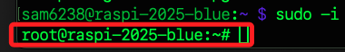

# 權限管理指令

_用來控制 Linux 系統中檔案與目錄的 `讀、寫、執行` 權限，以及設定或變更檔案 `擁有者` 與 `群組`。_

<br>

## `sudo`

1. 以 `root` 權限執行指令；`root` 就是 Linux 系統中的最高權限帳戶，擁有對系統所有檔案與指令的完全控制權限。

    ```bash
    # 以 root 權限執行更新
    sudo apt update
    ```

<br>

2. 若要在系統中以 `完整管理權限` 執行操作，可透過指令進入 `root shell`，在此之後所執行的操作都將以 `root` 權限執行。

    ```bash
    sudo -i
    ```

<br>

3. 切換為 root 身份後，命令行的提示符號會顯示目前身分與權限，原本一般使用者的提示符號為 `$`，超級使用者的提示符號是井字號 `#`；該設計主要目的是便於識別。

    

<br>

## `chmod`

_更改檔案權限；表示方式有 `符號法` 與 `數字法`，兩者等效_

<br>

1. chmod 的完整語法是。

    ```bash
    chmod [who][operator][permissions] 檔案或目錄
    ```

<br>

2. `u+r`：給 `u 用戶` `+ 增加` `r 讀取` 權限。

    ```bash
    chmod u+r file.txt
    ```

<br>

3. `g-w`：對 `g 群組` `- 移除` `w 寫入` 權限。

    ```bash
    chmod g-w file.txt
    ```

<br>

4. `a+x`：給 `a 所有人` `+ 增加` `x 執行` 權限。

    ```bash
    chmod a+x file.txt
    ```

<br>

5. `755`：也可使用數字表示法，格式為三位數字，依序為 `使用者、群組、其他人`，每個數字是三種權限 設定權限對應值的加總；如下範例中，`7` 代表具有 `讀寫執行`、`5` 代表具有 `讀取和執行`。

    ```bash
    chmod 755 file.txt
    ```

<br>

6. `chmod` 權限操作的 _對象、動作、權限種類_ 對照如下；特別注意，這些符號並非參數，屬於模式字元。

    ```bash
    u：用戶 `user`，檔案擁有者

    g：群組 `group`，擁有該檔案群組的用戶

    o：其他人 `other`，不屬於擁有者或群組的用戶

    a：所有人 `all`，包含 u、g、o 三者

    r：讀取權限 `read`，可查看檔案內容，或列出目錄內容

    w：寫入權限 `write`，可修改檔案或在目錄內建立、刪除檔案

    x：執行權限 `execute`，可執行檔案，或進入目錄

    +：增加權限

    -：移除權限

    =：設為指定權限並覆蓋原有設定
    ```

<br>

7. 權限對應表中，三個欄位分別代表 `user`、`group`、`others`；每欄位的權限種以 `r = 4`、`w = 2`、`x = 1` 夾總表示；例如 `7=4+2+1`、`5=4+1`。

    ```bash
    chmod 755
    ```

<br>

## `chown`

_注意使用者或群組需存在系統中，否則會失敗_

<br>

1. 更改檔案擁有者，語法結構如下。

    ```bash
    # <帳號>：新文件擁有者的使用者名稱
    # <群組>：新文件群組的名稱
    # <檔案>：要更改擁有者和群組的目標文件或目錄
    chown <帳號>:<群組> <檔案>
    ```

<br>

2. 將 `file.txt` 的擁有者改為 `user1`，群組改為 `group1`。

    ```bash
    chown user1:group1 file.txt
    ```

<br>

3. 僅有一個參數時，表示僅指定新的使用者，並保留原本群組設定值；以下指令會將 `file.txt` 的擁有者改為 `user1`，群組保持不變。

    ```bash
    chown user1 file.txt
    ```

<br>

4. 承上，若僅要變更群組而保留使用，可使用以下表達方式，者將 `file.txt` 的群組改為 `group1`，擁有者保持不變。

    ```bash
    chown :group1 file.txt
    ```

<br>

5. 使用參數 `-R` 表達遞歸處理，針對指定目錄 `directory` 及其所有子文件和子目錄，將擁有者和群組改為 `user1:group1`。

    ```bash
    chown -R user1:group1 directory/
    ```

<br>

## `chgrp`

_僅修改群組時，除可使用 `chown :<群組>` 這樣的表達，也可使用指令 `chgrp` 進行操作_

<br>

1. 修改檔案或目錄的群組。

    ```bash
    chgrp group1 file.txt
    ```

<br>

2. 同時修改多個檔案的群組。

    ```bash
    chgrp group1 file1.txt file2.txt
    ```

<br>

3. 遞迴修改整個資料夾及其子項目的群組。

    ```bash
    chgrp -R group1 folder_name/
    ```

<br>

## `umask`

_權限遮罩值 `user file-creation mode mask`，用來控制新建立的檔案與目錄的預設權限；系統會以預設最大權限（檔案為 `666`、目錄為 `777`）減去 `umask` 值來決定實際賦予的權限。_

<br>

1. 顯示目前的 `umask` 設定值，通常為四位八進位數；第一位為特殊位元（SetUID、SetGID、Sticky bit），大多為 0 且現今多忽略；後三位則依序對應使用者（user）、群組（group）、其他人（others）的遮罩設定。

    ```bash
    umask
    ```

<br>

2. 修改 `umask` 值僅會影響當前的 `shell session`，例如 `umask 0002` 表示保留使用者完整權限，讓群組也能寫入，但限制其他人不能寫入，實際建立檔案的權限會是 `664`（rw-rw-r--），而目錄權限則為 `775`（rwxrwxr-x）。

<br>

3. 若希望 umask 設定永久生效，可將其寫入個人用戶的啟動設定檔，例如 `~/.bashrc`、`~/.bash_profile` 或 `~/.profile` 中，新增一行 `umask 0022` 即可，這代表檔案預設權限為 644，目錄為 755。

<br>

4. 常見的 umask 值包含 `0022` 表示建立檔案為 644、目錄為 755，此為預設值，適合一般用途並防止群組與其他人寫入；`0002` 表示建立檔案為 664、目錄為 775，適用於多人開發的情境；`0077` 表示建立檔案為 600、目錄為 700，僅限使用者本人使用，提升安全性。

<br>

5. 由於 umask 是透過減法方式控制權限，若預設權限本身就不具備某項權限（如檔案預設無執行權限），則即使 umask 未遮蔽該權限也不會自動啟用，這是 umask 控制的基本邏輯之一。

<br>

## `stat`

_`stat` 是 `statistics` 的縮寫，用於顯示檔案或目錄的詳細屬性資訊，包括權限、連結數、擁有者、檔案大小、時間戳記等。_

<br>

1. 顯示指定檔案或目錄的完整屬性資訊，包括 `inode` 編號、權限模式、硬連結數、擁有者與群組、以 byte 為單位的大小、最近的存取（Access）、修改（Modify）與變更（Change）時間，以及區塊數與磁碟配置情況等。

    ```bash
    stat file.txt
    ```

<br>

2. 可搭配萬用字元或目錄使用，例如檢查目前目錄中所有 `.txt` 檔案的狀態。

    ```bash
    stat *.txt
    ```

<br>

3. 可結合 `-c`（或 `--format`）自訂輸出格式，僅顯示特定資訊，例如顯示大小與權限。

    ```bash
    stat -c "%s bytes, %A" file.txt
    ```

<br>

4. `stat` 與 `ls -l` 的差異在於 `ls -l` 側重於清單顯示與排序，`stat` 則提供更底層的檔案系統資訊，包含時間戳（Access/Modify/Change）與 inode 等系統層級細節；`Access` 是存取時間，`Modify` 是檔案內容最後一次被修改的時間，`Change` 檔案屬性變更的時間，例如使用 chmod、chown 更改權限或擁有者時會更新，但不代表內容有修改。

<br>

___

_END_