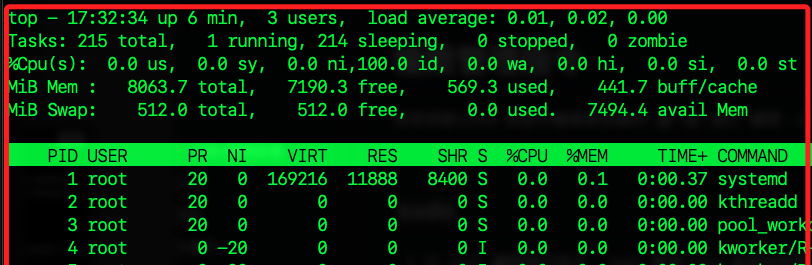
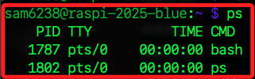
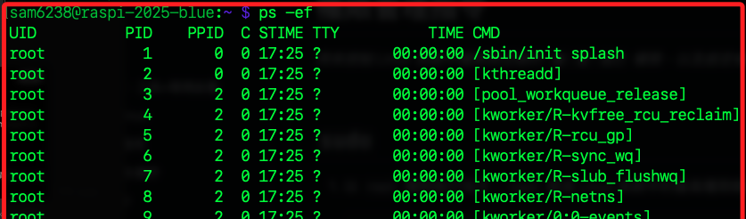
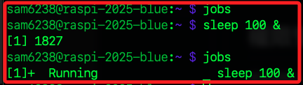
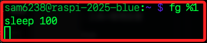
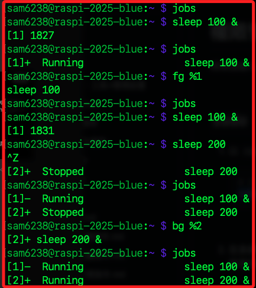
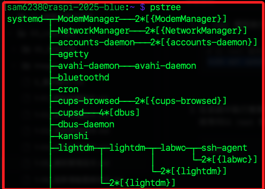
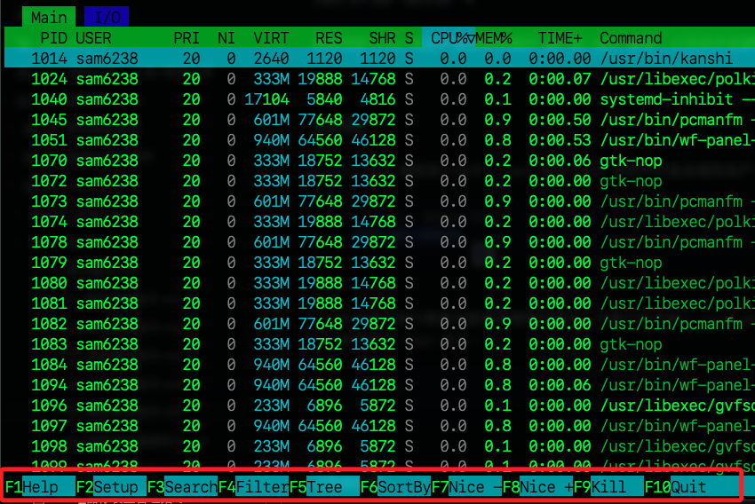

# 進程管理指令

_`進程（Process）` 是系統執行中的程式個體，擁有自己的記憶體空間與執行狀態；進程管理指令就是用於查看、控制與管理進程，包含啟動、終止、前景背景切換、資源監控等操作_

<br>

## 說明

1. `top`：動態顯示系統的進程狀況與資源使用，如 CPU、記憶體等；可使用 `q` 離開、`k` 終止進程（輸入 PID）。

    ```bash
    top
    ```

    

<br>

2. `ps`：列出靜態進程資訊，僅列出當前終端與 shell 的進程。

    ```bash
    ps
    ```

    

<br>

3. `ps -ef`：顯示所有進程的詳細資訊，`-e`：列出所有使用者的進程、`-f`：顯示完整欄位（UID、PID、PPID、CMD 等）。

    ```bash
    ps -ef
    ```

    

<br>

4. `kill`：透過 PID 終止進程（Process ID）；`-9` 強制終止（SIGKILL），可搭配 `ps` 或 `top` 查找 PID

    ```bash
    kill -9 <PID>
    ```

<br>

5. `jobs`：顯示當前 shell 的背景工作列表；若空無一物表示目前當前 `shell session` 中沒有任何背景工作，可輸入測試指令 `sleep 100 &` 後再次查詢，`sleep 100` 會讓系統暫停 100 秒，`&` 則表示在背景執行，如此便不會阻塞當前終端機，允許繼續輸入其他指令。

    ```bash
    jobs
    ```

    

<br>

6. `fg`：將背景作業拉回前景繼續執行，`%1` 表示第 1 個背景任務，可從 `jobs` 查得；若延續前面一個操作，則會將 `sleep 100` 拉回前景並阻塞進程直到 `100 秒` 結束。

    ```bash
    fg %1
    ```

    

<br>

7. `bg`：將暫停中的工作轉為背景繼續執行；所謂的暫停，是指一個前景進程被暫時中止，但尚未結束、也未在背景執行，之後可選擇繼續運行；暫停當前進程的方式可透過 `Ctrl+Z` 達成。

    ```bash
    bg %1
    ```

    

<br>

8. `&`：將程式啟動後直接放入背景執行。

    ```bash
    long_task.sh &
    ```

<br>

9. 顯示階層式結構，H 為 hierarchy。

    ```bash
    ps -ejH
    ```

<br>

10. 顯示圖像化樹狀結構進程，顧名思義就是 `ps` 結合 `tree` 的功能；這個指令有高階的用法，不過僅適用於部分較進階的 Linux 系統中，樹莓派系統並不支援，顧不贅述。

    ```bash
    pstree
    ```

    

<br>

11. `htop`：這是一個互動式進程管理工具，視覺化且易用，可用方向鍵選擇功能。

    ```bash
    htop
    ```

    

<br>

___

_END_