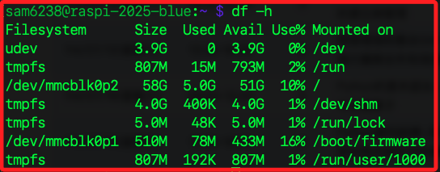
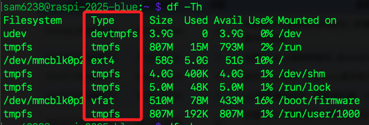
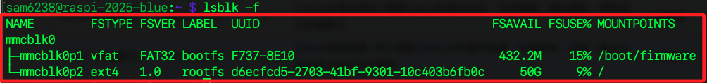

# 儲存裝置管理指令

_儲存空間查詢與掛載_

<br>

## 磁碟空間查詢

<br>

### `df`

1. `diskfree`，用於顯示 `磁碟空間` 使用狀況，參數 `-h` 表示以人類可讀格式顯示磁碟使用情況；其中 `Mounted on`	是該分割區對應的資料夾，也就分區掛載的位置。

    ```bash
    df -h
    ```

    

<br>

2. 顯示磁碟空間同時列出檔案系統格式類型。

    ```bash
    df -Th
    ```

    

<br>

### `du`

1. `disk usage`，用於顯示目錄或檔案的大小；`-s` 就是 summary，只顯示總計，不列出子目錄的使用量；`-h` 與前向說明相同不再贅述。

    ```bash
    du -sh <目錄或檔案名稱>
    ```

<br>

## 裝置與分割區查詢

<br>

### `lsblk`

1. 列出所有區塊裝置，如硬碟、分割區、SD 卡；`-f` 顯示檔案系統資訊，如掛載點與 UUID。

    ```bash
    lsblk -f
    ```

    

<br>

### `blkid`

1. 查詢所有儲存裝置的 UUID、檔案系統類型等識別資訊；查詢結果經常用於設定永久掛載點，例如寫入 `/etc/fstab` 時指定裝置的 `UUID` 或 `PARTUUID`，如此便可避免因裝置名稱如 `/dev/sda1` 變動導致掛載錯誤。

    ```bash
    sudo blkid
    ```

<br>

## 掛載狀態與關聯查詢

<br>

### `mount`

1. 列出目前所有掛載的裝置與對應目錄；`column -t` 將輸出內容以空白為欄位分隔，並對齊成表格形式。

    ```bash
    mount | column -t
    ```

<br>

### `findmnt`

1. 以階層結構顯示掛載點，為 `mount` 的進階版。

    ```bash
    findmnt
    ```

<br>

___

_END_