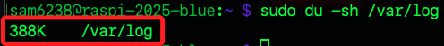
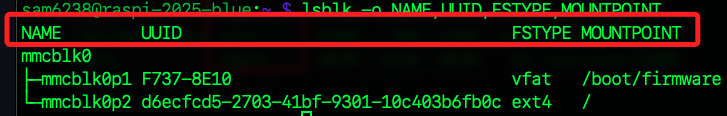
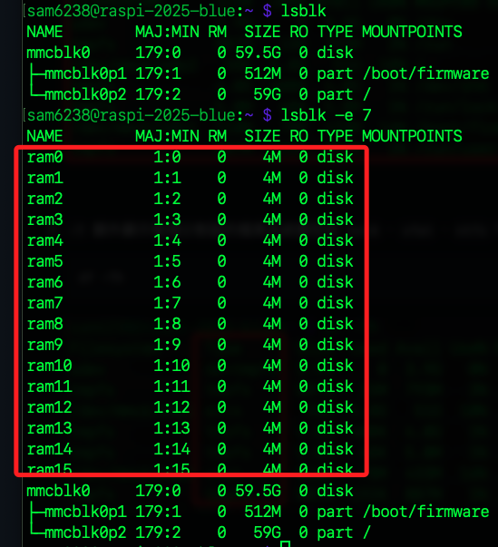
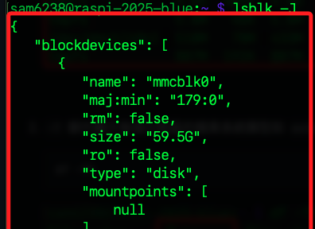
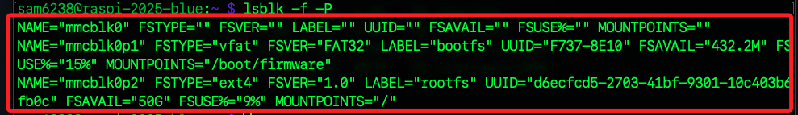

# 儲存裝置管理指令

_儲存空間查詢與掛載_

<br>

## 磁碟空間查詢

<br>

### `df`

_`diskfree`，常用於快速查看根目錄 `/`、開機分區如 `/boot` 及交換空間 `swap` 是否已滿_

<br>

1. 用於顯示 `磁碟空間` 使用狀況，參數 `-h` 表示以人類可讀格式顯示磁碟使用情況；其中 `Mounted on`	是該分割區對應的資料夾，也就分區掛載的位置。

    ```bash
    df -h
    ```

    

<br>

2. 使用參數 `-T` 可額外顯示每個分割區的檔案系統類型，如 `ext4`、`vfat`、`ntfs` 等。

    ```bash
    df -Th
    ```

    

<br>

### `du`

_`disk usage`，適用於找出大型目錄如 `log`、`cache` 或異常佔用空間的檔案_

<br>

1. 顯示目錄或檔案的大小；`-s` 就是 `summary`，只顯示總計、不列出子目錄的使用量；`-h` 與前向說明相同不再贅述。

    ```bash
    du -sh <目錄或檔案名稱>
    ```

<br>

2. 如下指令可查看系統記錄檔目錄 `/var/log` 所佔空間；特別注意，該日誌檔案是 `root` 專屬，所以必須以 `sudo` 進行訪問。

    ```bash
    sudo du -sh /var/log
    ```

    

<br>

## 裝置與分割區查詢

<br>

### `lsblk`

_能快速辨識 SD 卡、USB、SATA 裝置與其掛載情況，常搭配 mount、umount 使用；若需查看是否掛載於特定目錄，可比對 MOUNTPOINT 欄位是否為 `/mnt/usb` 等。_

<br>

1. 列出所有區塊裝置，如硬碟、分割區、SD 卡；`-f` 顯示檔案系統資訊，如掛載點與 UUID。

    ```bash
    lsblk -f
    ```

    

<br>

2. 使用 `-o` 自訂輸出欄位，例如顯示裝置名稱、UUID、檔案系統類型、掛載點。

    ```bash
    lsblk -o NAME,UUID,FSTYPE,MOUNTPOINT
    ```

    

<br>

3. 參數 `-e 7` 可用來排除 `loop` 裝置，`major` 編號為 `7`，有助於在使用 `Snap` 等環境中清除大量雜訊裝置；但若系統中無 `loop` 裝置，此參數反而可能無效甚至顯示更多像 `ramdisk` 的項目。

    ```bash
    lsblk -e 7
    ```

    

<br>

4. 若需列出裝置大小與掛載資訊但不顯示檔案系統細節，可用簡單版本，便可快速判斷 `/dev/sdX` 是否正確掛載。

    ```bash
    lsblk
    ```

<br>

5. 顯示 `JSON` 格式。

    ```bash
    lsblk -J
    ```

    

<br>

6. 若搭配 `-P` 參數，則會將每個欄位輸出為 `key="value"` 的形式，適合配合 `grep` 或 `awk` 分析。

    ```bash
    lsblk -f -P
    ```

    

<br>

### `blkid`

_避免掛載錯誤的最佳做法是使用 `UUID` 而非 `/dev/sdX` 這類裝置名，因為裝置名稱會變動但 `UUID` 固定_

<br>

1. 查詢所有儲存裝置的 UUID、檔案系統類型等識別資訊；查詢結果經常用於設定永久掛載點，例如寫入 `/etc/fstab` 時指定裝置的 `UUID` 或 `PARTUUID`，如此便可避免因裝置名稱如 `/dev/sda1` 變動導致掛載錯誤。

    ```bash
    sudo blkid
    ```

<br>

2. 若需在開機時自動掛載外接裝置，可將裝置資訊寫入 `/etc/fstab`，建議使用 `UUID=` 方式指定裝置；`defaults` 表示使用預設掛載參數，`noauto` 表示開機時不自動掛載，`user` 表示允許一般使用者掛載；最後有兩個數字 `00`，第一個 `0` 表示不使用 dump 備份，第二個 `0` 表示不啟用 fsck 開機檢查。

    ```bash
    UUID=AB12-34CD  /mnt/usb  vfat  defaults,noauto,user  0  0
    ```

<br>

3. 修改完 `/etc/fstab` 後可使用下列指令測試掛載是否成功，避免設定錯誤導致系統無法開機；若無錯誤訊息即代表設定正確。

    ```bash
    sudo mount -a
    ```

<br>

## 掛載狀態查詢

_快速檢視系統中所有已掛載裝置及其對應位置與格式_

<br>

### `mount`

_傳統指令，列出所有已掛載裝置、掛載點、檔案系統與掛載參數_

<br>

1. 示目前掛載狀態，資訊包括裝置名稱、掛載點、檔案系統類型與掛載選項。

    ```bash
    mount
    ```

<br>

2. 搭配 `column -t` 可將輸出結果排整齊。

    ```bash
    mount | column -t
    ```

<br>

3. 可用於手動掛載裝置；在以下範例中，需先建立 `/mnt/usb` 並具備權限，然後進行手動掛載。

    ```bash
    mount /dev/sdb1 /mnt/usb
    ```

<br>

4. 若要指定檔案系統類型如 `vfat`，可加入 `-t` 參數。

    ```bash
    sudo mount -t vfat /dev/sdb1 /mnt/usb
    ```

<br>

### `findmnt`

_現代化工具，能以階層結構方式呈現掛載點，視覺更清晰，也能用於查詢特定目錄_

<br>

1. 顯示系統中所有掛載點，以樹狀方式顯示掛載層級，為 `mount` 的進階版。

    ```bash
    findmnt
    ```

<br>

2. 查詢特定掛載目錄如 `/boot` 所對應的裝置與檔案系統。

    ```bash
    findmnt /boot
    ```

<br>

3. 顯示所有掛載點及其 UUID、LABEL、FSTYPE、使用百分比等詳細資訊。

    ```bash
    findmnt -o TARGET,UUID,FSTYPE,SIZE,USED,AVAIL
    ```

<br>

### `umount`

_用於安全地卸載已掛載的裝置，確保資料同步完成，避免資料遺失或檔案損毀_

<br>

1. 透過裝置名稱卸載。

    ```bash
    sudo umount /dev/sdb1
    ```

<br>

2. 透過掛載點名稱卸載。

    ```bash
    sudo umount /mnt/usb
    ```

<br>

3. 若裝置正在使用將無法卸載，系統會回報 `device is busy`；應先看是哪些程序正在使用該掛載點，加上 `-v` 可列出使用者與使用類型，若發現有佔用，可切換資料夾或結束對應程序，再重新卸載。

    ```bash
    fuser -v /mnt/usb
    ```

<br>

4. 延遲卸載 `lazy`，等待不再使用後自動卸載。

    ```bash
    sudo umount -l /mnt/usb
    ```

<br>
___

_END_