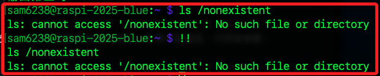
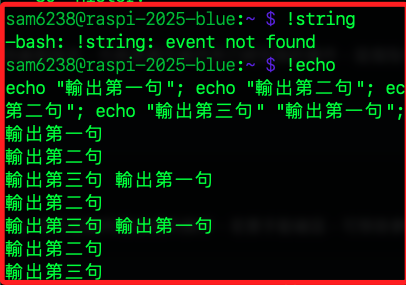

# 歷史展開機制

<br>

## 簡介

1. Bash 允許使用者透過特殊語法，把先前執行過的命令從歷史檔中 `提取` 再次執行。

<br>

2. 歷史檔預設存在使用者家目錄的 `~/.bash_history`，每次關閉 shell 或執行 `history -a` 時，當前 session 的命令會寫入此檔。

<br>

3. 每次開啟一個新的終端機，Bash 便會讀取 `~/.bash_history`，讓歷史展開的來源不只限於當前連線，而是整份歷史。

<br>

## 語法使用

1. 執行上一條命令 `!!`。

   

<br>

2. 查詢歷史編號。

   ```bash
   history
   ```

<br>

3. `!` 接上編號執行 history 編號為 n 的命令。

   ```bash
   !2
   ```

<br>

4. `!` 接上字串用以執行最後一條以該字串開頭的命令。

   

<br>

5. 搭配 `?` 執行最後一條包含指定字串片段的命令。

   ```bash
   !?string?
   ```

<br>

6. `^^` 快速取代，如 `^old^new` 表示將上一條命令第一個出現的 `old` 更改為 `new`。

   ```bash
   echo apple banana cherry
   ^banana^orange
   ```

<br>

## 開啟與關閉

1. 關閉歷史展開。

   ```bash
   set +H
   ```

<br>

2. 重新開啟歷史展開。

   ```bash
   set -H
   ```

<br>

## 檢視與清理歷史檔

1. 搜尋歷史中所有 echo。

   ```bash
   history | grep echo
   ```   

<br>

2. 清空當前 session 歷史。
   ```bash
   history -c
   ```

<br>

3. 清空整份歷史檔。

   ```bash
   > ~/.bash_history
   ```

<br>

___

_END_