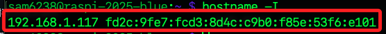

# 查看樹莓派資訊

<br>

1. 查詢 CPU 虛擬檔案的詳細內容；結果會列出每個 CPU 核心的屬性與系統硬體識別資訊；由查詢結果可知樹莓派五是四核心的處理器，`BogoMIPS` 是粗略估計 CPU 速度的指標，`Features` 表示該核心支援的 CPU 指令集，其他還包含 CPU implementer 表示 CPU 製造商代號、CPU architecture 表示處理器架構版本等。

    ```bash
    cat /proc/cpuinfo
    ```

    

<br>

2. 查詢記憶體資訊；結果顯示包含可用的總記憶體量 `MemTotal`、可用的未使用記憶體量 `MemFree`、可供新應用程序使用的記憶體量 `MemAvailable` 等。

    ```bash
    cat /proc/meminfo
    ```

<br>

3. 查詢作業系統版本，包含核心以及其他軟體與工具。

    ```bash
    cat /etc/os-release
    ```

    

<br>

4. 查詢 Kernal 版本：在基於 Linux 的系統中，`Kernel` 指的是操作系統架構的中心，是軟體和硬體之間的橋樑，負責管理系統的硬體資源，例如 `CPU`、`記憶體` 和 `儲存設備`，並提供一個軟體應用可以使用的 `系統服務層`；特別注意，這與刷新韌體不同，韌體是位於 `硬體層面`，用於控制硬體操作和性能。

    ```bash
    uname -a
    ```

<br>

5. 延續上一點，這裡補充更新樹莓派核心版本的指令，這會下載並安裝最新的 Linux 核心。

    ```bash
    sudo rpi-update
    ```

<br>

6. 顯示所有配置的網路接口的 IP 地址，會以 IP 方式呈現，不會看到 `hostname`。

    ```bash
    hostname -I
    ```

    

<br>

7. 查詢完整的 IP 資訊。

    ```bash
    ifconfig
    ```

<br>

8. 查詢 USB 裝置查詢，用於連接USB裝置如攝影機、麥克風、喇叭等裝置時。

    ```bash
    lsusb
    ```

<br>

9. 查詢 WiFi 連線狀況，顯示硬體狀態，這會列出所有可用的 WiFi 網路。

    ```bash
    iwconfig
    ```

<br>

10. 查詢 WiFi 硬體資訊，列出所有可用的 WiFi 網路。

    ```bash
    iwlist wlan0 scan
    ```

<br>

11. 查詢藍芽。

    ```bash
    hciconfig -a
    ```

<br>

12. 查詢攝影機設備；若樹莓派使用了 AI Kit 或安裝 libcamera 等套件時，輸出結果可能看到眾多 `/dev/video*`，這是因為相機驅動或 AI 模組建立了多種影像節點，各自對應不同的功能如原始影像、編碼格式、控制介面或硬體加速處理所致。

    ```bash
    ls /dev/video*
    ```

    

<br>

13. 查詢錄音設備。

    ```bash
    arecord -l
    ```

<br>

14. 查詢音訊裝置。

    ```bash
    aplay -l
    ```

<br>

___

_END_