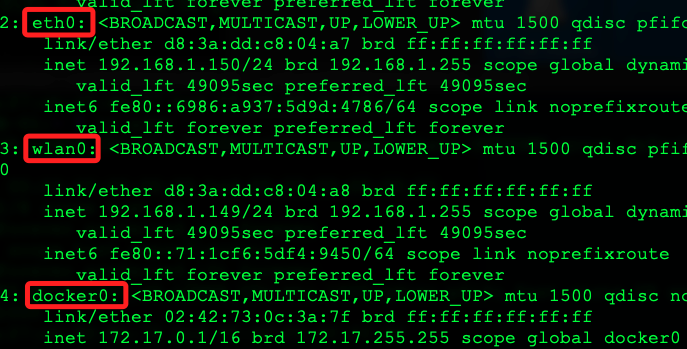

# 關於樹莓派的 IP

_樹莓派可能分配到多個 IP_

<br>

## 說明

1. 多重網路接口來自於有多個網路接口正在工作，例如 `以太網`、`Wi-Fi`及 `Docker` 虛擬網路接口等，若出現類似 `172.17.0.1`，這可能是 `Docker` 預設的橋接網路地址。

<br>

2. 檢查所有的網路接口狀態，其中 `wlan0` 是無線網路、`eth0` 是有線網路、`docker0` 是虛擬網路。

    ```bash
    ip addr
    ```

    

<br>

3. 查看 DHCP 配置，因為可為設備配置多個靜態 IP 地址；特別注意，這是 Bullseye 之前版本使用的配置文件。
    
    ```bash
    cat /etc/dhcpcd.conf
    ```

<br>

4. 如果安裝了 Docker，檢查 Docker 的網路配置；特別注意，假如沒安裝 Docker，會顯示 `-bash: docker: command not found`。

    ```bash
    docker network ls
    ```

    _輸出_

    ```bash
    NETWORK ID     NAME      DRIVER    SCOPE
    56c57dcedbf7   bridge    bridge    local
    eeff04fe9415   host      host      local
    b316d1253d17   none      null      local
    ```

<br>

5. 配置和顯示無線網卡參數的工具，通過適當的參數設置，可以控制無線網卡的多種功能，以適應不同的網路需求，這裡簡單介紹用來查詢時所顯示的資訊。

    ```bash
    iwconfig
    ```

    _輸出_

    ```bash
    # 環回接口，用於設備自身的通信
    lo        no wireless extensions.
    # 有線網卡接口
    eth0      no wireless extensions.
    # 無線網卡接口
    wlan0     IEEE 802.11  ESSID:"SamHome"  
            Mode:Managed  Frequency:5.745 GHz  Access Point: 24:F5:A2:7D:13:37   
            Bit Rate=24 Mb/s   Tx-Power=31 dBm   
            Retry short limit:7   RTS thr:off   Fragment thr:off
            Power Management:on
            Link Quality=66/70  Signal level=-44 dBm  
            Rx invalid nwid:0  Rx invalid crypt:0  Rx invalid frag:0
            Tx excessive retries:14  Invalid misc:0   Missed beacon:0
    # ocker 預設建立的橋接網路接口
    docker0   no wireless extensions.
    # 虛擬以太網接口，通常用於容器或虛擬機之間的通信
    veth0bbb98d  no wireless extensions.
    ```

<br>

___

_END_