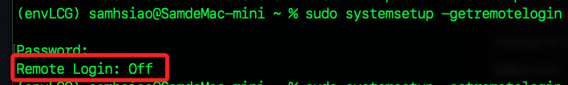
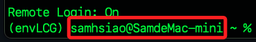

# 從樹莓派連線電腦

<br>

## 說明

_在 MacOS 中運行_

<br>

1. 查詢 SSH 連線服務狀態。

    ```bash
    sudo systemsetup -getremotelogin
    ```

    

<br>

2. 假如狀態是 `OFF` 表示尚未啟用 SSH 遠端登入服務。

    

<br>

3. 啟用 SSH 服務。

    ```bash
    sudo systemsetup -setremotelogin on
    ```

<br>

4. 確認 MacOS 本機的使用者名稱及主機名稱。

    

<br>

5. 在樹莓派終端機使用 SSH 連線指令。

    ```bash
    ssh samhsiao@SamdeMac-mini
    ```

    

<br>

___

_END_