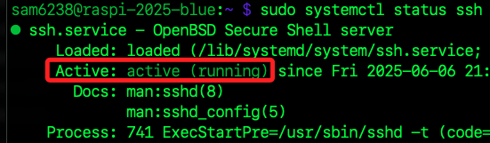
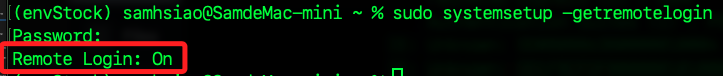
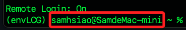
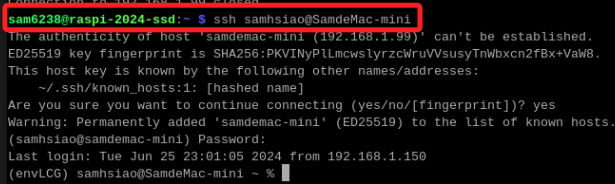

# 從樹莓派連線電腦

_從樹莓派連線其他樹莓派，或是連線其他基於 Linux 核心的設備_

<br>

## 說明

<br>

1. 查詢 SSH 連線服務狀態。

    ```bash
    sudo systemctl status ssh
    ```

    

<br>

2. 若是其他類型的設備可能需使用其他指令查詢，例如在 MacOS 中可使用以下指令查詢。

    ```bash
    sudo systemsetup -getremotelogin
    ```

    

<br>

3. 假如狀態是 `OFF` 表示尚未啟用 SSH 遠端登入服務。

    

<br>

4. 啟用 SSH 服務。

    ```bash
    sudo systemsetup -setremotelogin on
    ```

<br>

5. 確認 MacOS 本機的使用者名稱及主機名稱。

    

<br>

6. 在樹莓派終端機使用 SSH 連線指令。

    ```bash
    ssh samhsiao@SamdeMac-mini
    ```

    

<br>

___

_END_