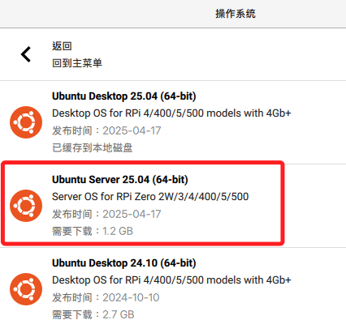
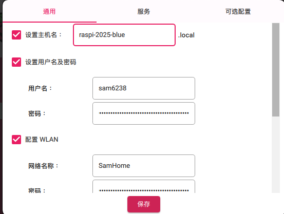

# Ubuntu 系統

_以下簡單介紹 Ubuntu 系統的燒錄以及使用_

<br>

## 燒錄

1. 同樣使用官方燒錄工具 `Imager`，選擇 `Unbuntu Server`。

    

<br>

2. 其餘配置與燒錄樹莓派系統時相同，包含主機名稱、開啟 SSH 服務等，不贅述。

    

<br>

3. 可查看 SD 卡，通常已掛載為 `/Volumes/system-boot`）

    ```bash
    ls /Volumes/system-boot
    ```

<br>

4. 在 MacOS 系統中，燒錄完成後可用 `Finder` 退出安全退出磁碟，或使用指令執行退出。

    ```bash
    diskutil unmount /Volumes/system-boot
    ```

<br>

