# Raspberry Pi Connect 

<br>

## 介紹

1. 這是官方在 2024/05/07 發佈的功能，使用 `WebRTC` 技術來建立安全的點對點連接；特別注意，官方服務不支援以標準 SSH 協定連線，因此無法直接用 `VSCode Remote - SSH` 連線。

    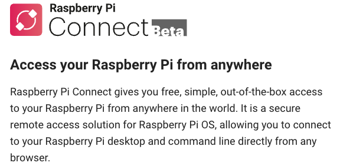

<br>

2. 硬體需求樹莓派 4、5 或 400；其他版本硬體進行安裝不會報錯，只是重啟後並不會看到服務啟動。

<br>

3. 系統至少需安裝 `Bookworm 64 位元` 以上版本。

<br>

4. 使用 Wayland 窗口服務器，在 Linux 中用以替代傳統的 X Window System（X11），負責管理應用程式視窗的顯示和輸入事件，設計更簡潔且效能更佳，提供更流暢的圖形輸出和更安全的顯示環境。

<br>

## 安裝步驟

1. 更新系統。

    ```bash
    sudo apt update && sudo apt upgrade -y
    ```

<br>

2. 安裝 `Raspberry Pi Connect`；新版系統已預裝，可直接在桌面 `Turn On` 應用。

    ```bash
    sudo apt install rpi-connect
    ```

<br>

3. 若是手動安裝，須重啟樹莓派讓服務啟動。

    ```bash
    sudo reboot
    ```

<br>

4. 重啟後透過 VNC 連線桌面，會在右上角看到一個新的圖標，點擊此圖標並選擇 [Sign in](https://connect.raspberrypi.com/sign-in)，建議在電腦上開啟。

    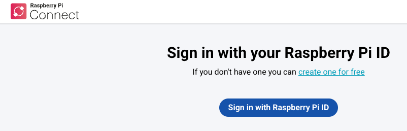

<br>

5. 初次使用先建立帳號。

    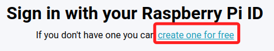

<br>

6. 需要驗證郵件。

    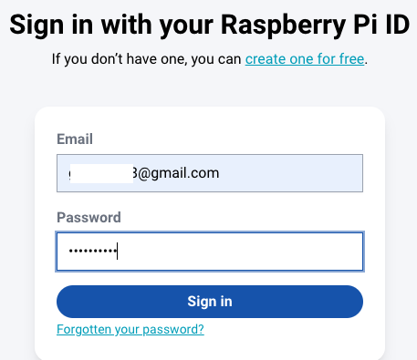

<br>

7. 完成後重新登入，並對設備命名。

    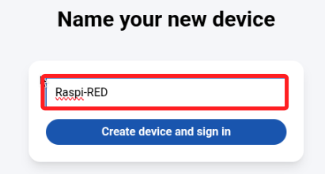

<br>

8. 登入完成會亮起顏色；特別注意，必須先在樹莓派完成登入，才能到其他設備上進行遠端連線。

    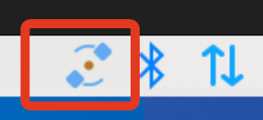

<br>

## 設置完成後的操作

_可在任意設備中的瀏覽器進行兩種連線方式訪問樹莓派_

<br>

1. 使用網頁瀏覽器訪問 [Raspberry Pi Connect](https://connect.raspberrypi.com/)，登入後系統會看到可連線設備及連線方式。

    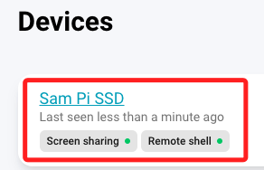

<br>

2. 點擊右側 `Connect via` 展開選單。

    

<br>

3. 依據官網說明，這個網路連線在一般情況下會是 `點對點` 的連接，建立連接後，無需通過伺服器進行流量傳輸；如果無法建立直接連接，流量會通過位於英國的 TURN 伺服器進行中繼。

<br>

## 使用 Screen sharing

1. 展開後點擊 `Screen sharing`。

    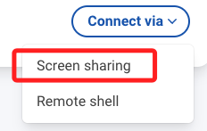

<br>

2. 會開啟樹莓派專用的遠端桌面。

    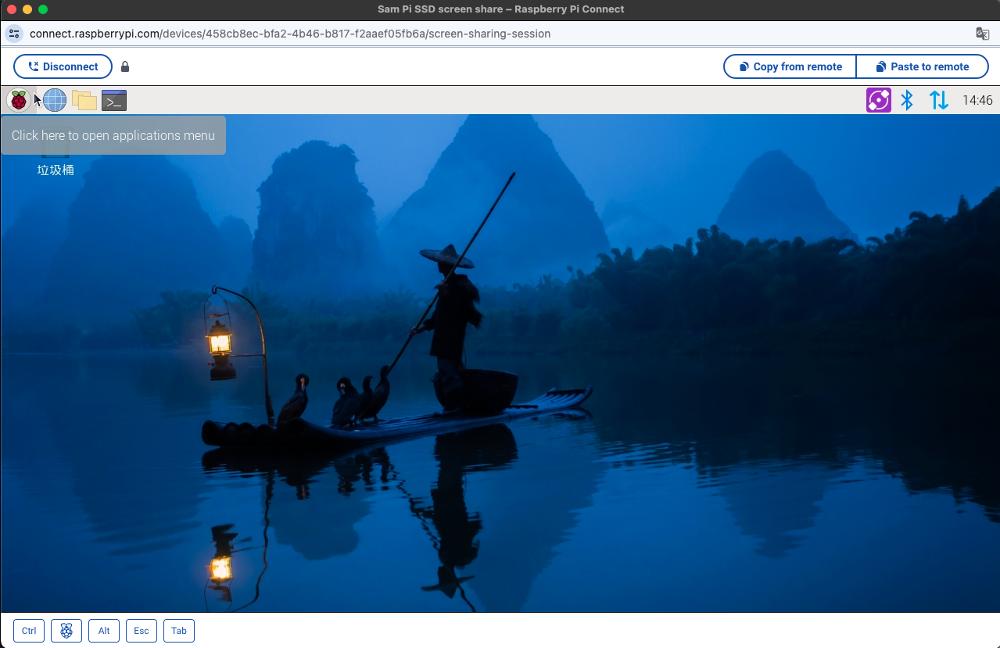

<br>

## 使用 `Remote shell`

1. 展開後點擊 `Remote shell`。

    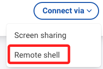

<br>

2. 會開啟樹莓派專用的桌面終端機。

    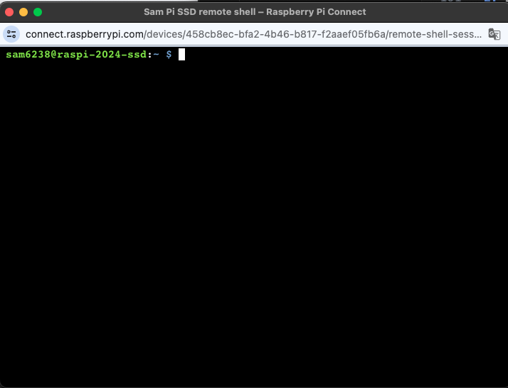

<br>

## 透過終端機建立設備

_不進入樹莓派桌面_

<br>

1. 若已經建立設備，可先進行刪除。

<br>

2. 在本機使用 SSH 連線樹莓派後，在終端機中輸入以下指令，畫面會輸出附帶授權碼的登入網址。

    ```bash
    rpi-connect signin
    ```

    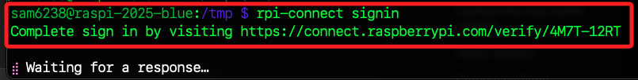

<br>

3. 複製該網址後，在本機中開啟瀏覽器進行訪問，便會看到設備的設定畫面。

    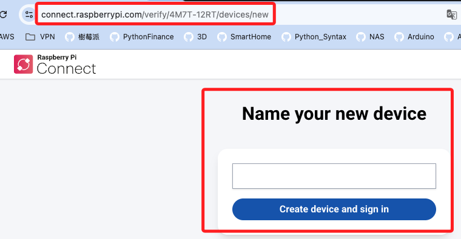

<br>

4. 輸入任意名稱後點擊登入。

    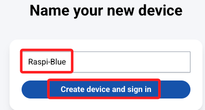

<br>

5. 畫面會顯示成功。

    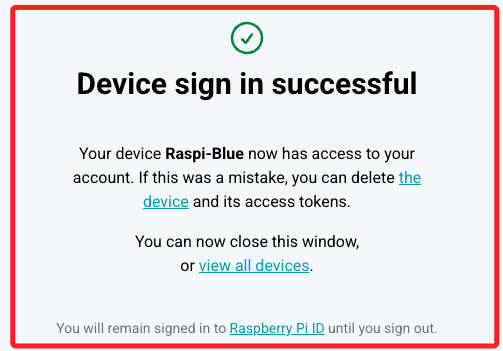

<br>

6. 終端機也會同步顯示登入成功訊息。

    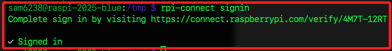

<br>

7. 點擊瀏覽器中的 `view all devices` 連結，便可看到該設備。

    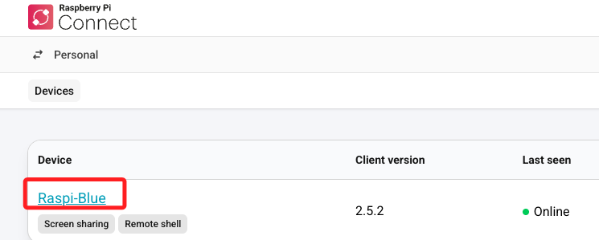

<br>

## 補充

_不能直接將 Raspberry Pi Connect 的 SSH 連線整合到 VSCode Remote-SSH 擴充中使用_

<br>

1. Raspberry Pi Connect 的 Remote Shell 是瀏覽器內嵌的 `WebShell`，是基於 WebRTC / Relay 的抽象連線，它並不開放真正的 SSH port（22），也不提供 SSH Host/IP 給 VSCode 使用。

<br>

___

_END_