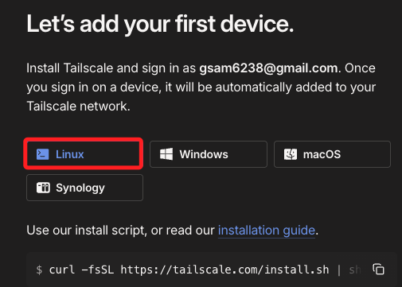
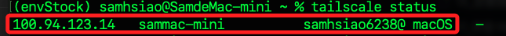
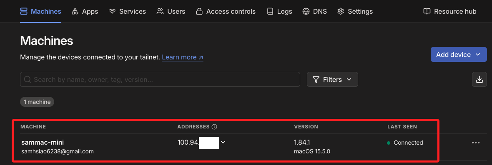
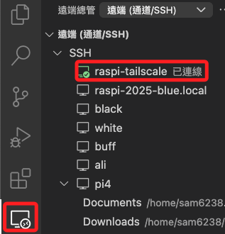

# 使用 Tailscale

_以下說明如何使用 Tailscale 讓電腦與樹莓派建立 `虛擬私人網路（VPN）`，並藉以在 VSCode 中使用 Remote-SSH 功能穩定連線_

<br>

## 簡介

1. `Tailscale` 是一種基於 `WireGuard VPN` 協議的零設定私有網路工具，可讓多台裝置透過安全加密的方式在不同網路間直接互聯，形成一種虛擬內網的架構。

<br>

2. 不需手動開放防火牆或設定 IP、跨平台支援，適合遠端 SSH、檔案分享、自架服務連線。

<br>

## 建立帳號

1. 前往 [tailscale 官網](https://tailscale.com)，點擊右上角 `Get started` 開始使用服務。

    

<br>

2. 若是初次使用需進行帳號註冊的入，可使用 Google 帳號或官方提供的任何方式建立帳號。

    

<br>

3. 需填寫相關資料，任意填寫即可；點擊 `Next` 繼續。

    

<br>

4. 在接下來的步驟中，樹莓派將依據 `Linux` 選項的指令進行安裝。

    

<br>

5. 本機則依據作業系統，下載對應的桌面應用，或使用終端機指令進行安裝，這在後續步驟中說明。

    

<br>

## 安裝在 MacOS

_使用終端機指令安裝；Windows 系統請跳至下一段說明_

<br>

1. MacOS 可使用 brew 進行安裝。

    ```bash
    brew install --cask tailscale
    ```

    

<br>

2. 透過查詢版本確認安裝成功。

    ```bash
    tailscale version
    ```

<br>

3. 開啟 Tailscale 圖形介面完成登入，登入後會在背景運行。

    ```bash
    open -a Tailscale
    ```

<br>

4. 啟動虛擬網路並加入 Tailscale 網路，如此設備便可被其他裝置存取；只要登入相同帳號的設備都將加入同一個 Tailscale 網路。

    ```bash
    tailscale up
    ```

<br>

5. 查看狀態。

    ```bash
    tailscale status
    ```

    

<br>

6. 在主控台中也可以看到設備狀態。

    

<br>

## 安裝在 Windows

_使用 Windows 套件管理器 `winget` 進行安裝_

<br>

1. 指令。

    ```bash
    winget install Tailscale.Tailscale
    ```

    

<br>

2. 接著就會彈出視窗工具。

    

<br>

3. 完成時會顯示如下。

    

<br>

## 安裝在樹莓派

1. 運行以下安裝指令。

    ```bash
    curl -fsSL https://tailscale.com/install.sh | sh
    ```

<br>

2. 啟用服務，第一次執行會出現登入網址，在電腦瀏覽器打開並授權該 Raspberry Pi 裝置加入網路。

    ```bash
    sudo tailscale up
    ```

<br>

3. 複製網址到瀏覽器訪問；可在任意設備的瀏覽器進行。

    

<br>

4. 點擊 `Connect`。

    

<br>

5. 網頁顯示成功。

    

<br>

6. 接著會自動轉到主控台。

    

<br>

7. 可查看虛擬區網狀態。

    ```bash
    tailscale status
    ```

    

<br>

5. 取得樹莓派的 Tailscale IP。

    ```bash
    tailscale ip
    ```

    

<br>

6. 透過 SSH 連線。

    

<br>

## 使用 VSCode 

_設定 Remote-SSH_

<br>

1. 編輯 `~/.ssh/config`。

    ```ssh
    Host raspi-tailscale
        HostName 100.111.254.85
        User sam6238
    ```

<br>

2. 可透過終端機連線測試。

    ```bash
    ssh raspi-tailscale
    ```

<br>

3. 透過 VSCode 遠端連線也可完成。

    

<br>

## 斷開或登出

1. 斷開本設備；僅停止 VPN 傳輸連線，但登入狀態與授權仍保留，裝置依然顯示於控制台中。

    ```bash
    sudo tailscale down
    ```

<br>

2. 登出設備；會移除本機授權與登入憑證，裝置將失去 `Tailscale` 使用權限，但在控制台仍會以 `Expired` 狀態顯示於一段時間。

    ```bash
    sudo tailscale logout
    ```

<br>

3. 若要完全刪除，需至 [控制台](https://login.tailscale.com/admin/machines) 手動移除該設備。

    

<br>

## 使用 API

_使用 API 自動化移除設備_

___

_END_