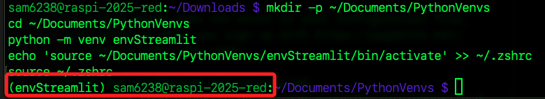
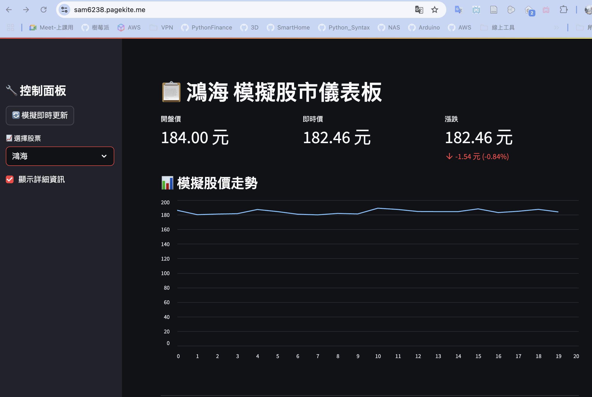

# PageKite + Streamlit

_進階使用_

<br>

## 準備工作

_基於 `PEP 668`，所以要使用虛擬環境_

<br>

1. 一鍵完成虛擬環境建立。

    ```bash
    mkdir -p ~/Documents/PythonVenvs
    cd ~/Documents/PythonVenvs
    python -m venv envStreamlit
    echo 'source ~/Documents/PythonVenvs/envStreamlit/bin/activate' >> ~/.zshrc
    source ~/.zshrc
    ```

    

<br>

2. 安裝套件。

    ```bash
    pip install streamlit
    ```

<br>

3. 建立並進入專案資料夾。

    ```bash
    mkdir -p ~/Documents/exStreamlit
    cd ~/Documents/exStreamlit
    touch app.py
    ```

<br>

4. 編輯腳本。

    ```bash
    nano app.py
    ```

<br>

5. 貼上以下代碼。

    ```python
    import streamlit as st
    import random
    import time

    st.set_page_config(
        page_title="📊 Streamlit 儀表板範例",
        layout="wide",
    )

    # 側邊欄設定
    with st.sidebar:
        st.title("🔧 控制面板")
        refresh = st.button("🔄 模擬即時更新")
        stock = st.selectbox(
            "📈 選擇股票",
            ["台積電", "鴻海", "聯發科", "大立光", "中華電信"]
        )
        show_details = st.checkbox("顯示詳細資訊", value=True)

    st.title(f"📋 {stock} 模擬股市儀表板")

    # 隨機模擬資料
    base_price = random.randint(100, 500)
    price_now = base_price + random.uniform(-10, 10)
    price_open = base_price
    price_change = price_now - price_open
    percent_change = (price_change / price_open) * 100

    # 顯示資訊
    col1, col2, col3 = st.columns(3)
    with col1:
        st.metric("開盤價", f"{price_open:.2f} 元")
    with col2:
        st.metric("即時價", f"{price_now:.2f} 元")
    with col3:
        color = "normal"
        delta_text = f"{price_change:+.2f} 元 ({percent_change:+.2f}%)"
        st.metric("漲跌", f"{price_now:.2f} 元", delta=delta_text)

    # 圖表模擬
    st.markdown("### 📊 模擬股價走勢")
    chart_data = {
        "價格": [round(price_open + random.uniform(-5, 5), 2) for _ in range(20)]
    }
    st.line_chart(chart_data)

    # 詳細資訊
    if show_details:
        st.markdown("---")
        st.subheader("📄 股票說明")
        st.info(
            f"{stock} 是台灣知名企業之一，相關說明僅供展示用途。"
        )

    st.markdown("---")
    st.caption("本頁面使用 Streamlit 建立，模擬展示股價介面。")
    ```

<br>

## 啟動服務

_同樣需要兩個終端機_

<br>

1. 執行 `app.py`，預設會在 `http://localhost:8501` 運行；特別說明，不建議使用 `80`，除了 `非 root` 無法監聽 `1024` 以下的低位元埠口外，還得額外設置路徑。

    ```bash
    streamlit run app.py
    ```

<br>

2. 啟動反向代理；參數 `--clean` 會清除 `--optdir` 目錄中之前自動建立的暫存檔。

    ```bash
    sudo pagekite.py --clean --optdir=/etc/pagekite.d 8501 sam6238.pagekite.me
    ```

<br>

3. 訪問。

    ```bash
    https://sam6238.pagekite.me
    ```

    

<br>

___

_END_