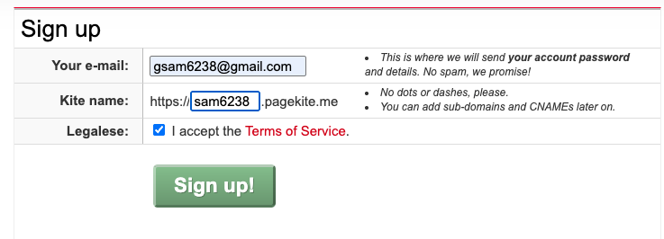
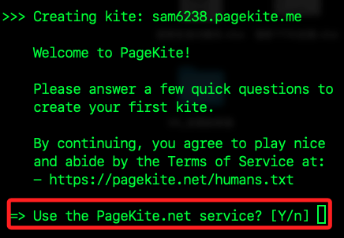
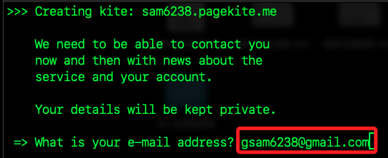
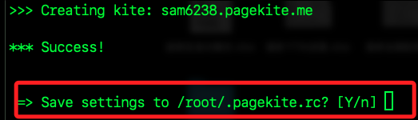
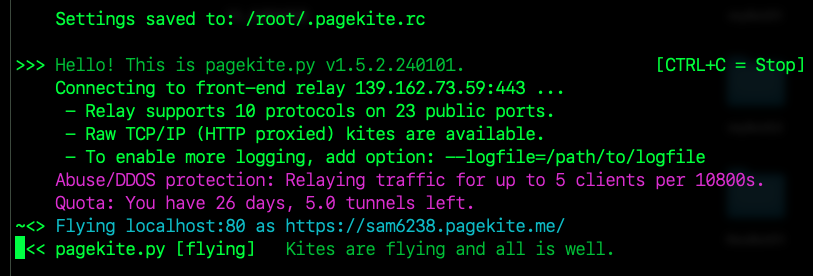
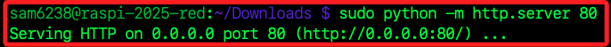
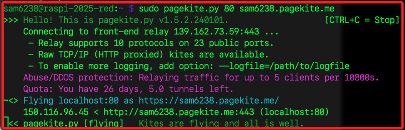
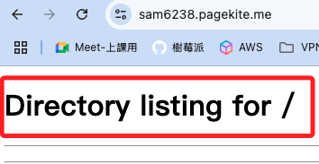
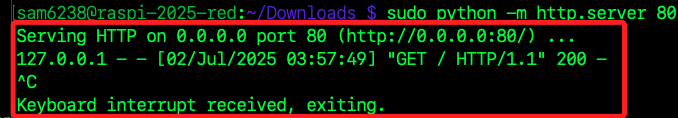
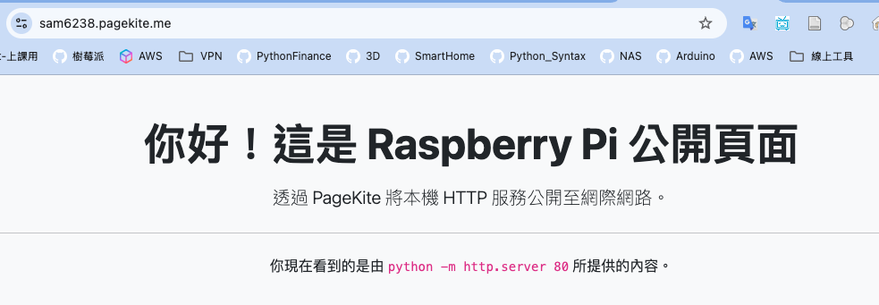

# Pagekite

_在樹莓派上使用 Pagekite 建立安全反向隧道，將本機服務公開至網路_

<br>

## 建立帳號與 Kite 名稱

1. 訪問 [Pagekite.net](https://pagekite.net/)；點擊右上角的 `Sign Up` 註冊帳號。

<br>

2. 輸入 `Email`，並為第一個 Kite 設定子域名稱，如 `sam6238.pagekite.me`，完成註冊後前往信箱點擊驗證連結。

    

<br>

## 在樹莓派安裝

_連線樹莓派實作_

<br>

1. 使用官方安裝腳本，取得最新版 `pagekite.py`，執行後會安裝到本機路徑 `/usr/local/bin` 中。

    ```bash
    cd ~/Downloads
    curl -s https://pagekite.net/pk/ | sudo bash
    ```

<br>

2. 第一次執行 `QuickStart` 要先註冊服務；替換以下命令中的 `<公網網址>`，然後在提示中輸入 `y`。

    ```bash
    sudo pagekite.py --signup <填入自定義的-Pagekites-公網網址>
    ```

    

<br>

3. 按提示輸入 Email。

    

<br>

4. 因為註冊過，所以提示輸入密碼 `log on`。

    

<br>

5. 成功後提示儲存配置到指定路徑 `/root/.pagekite.rc`，輸入 `y` 即可。

    

<br>

6. 完成後如下訊息。

    

<br>

## 實測

_需另外開啟一個終端機連線樹莓派_

<br>

1. 先查看設定。

    ```bash
    sudo cat /root/.pagekite.rc
    ```

<br>

2. 啟動 `HTTP Server` 提供內容。

    ```bash
    sudo python -m http.server 80
    ```

    

<br>

3. 因為已有 `.pagekite.rc` 設定檔，使用以下指令重啟隧道，並映射至本機 80 埠。

    ```bash
    sudo pagekite.py 80 sam6238.pagekite.me
    ```

    

<br>

4. 在外部網路打開網址，即可看到本機服務；因為當前伺服器中沒有 `index.html` 等預設首頁檔案，所以瀏覽器會直接顯示該目錄下的檔案清單。

    ```bash
    http://sam6238.pagekite.me
    ```

    

<br>

## 製作首頁

1. 關閉 `HTTP Server`。

    

<br>

2. 編輯首頁。

    ```bash
    nano index.html
    ```

<br>

3. 貼上後儲存退出。 

    ```html
    <!DOCTYPE html>
    <html lang="zh-Hant">
    <head>
    <meta charset="UTF-8">
    <meta name="viewport" content="width=device-width, initial-scale=1">
    <title>Raspberry Pi 公開頁面</title>
    <link href="https://cdn.jsdelivr.net/npm/bootstrap@5.3.3/dist/css/bootstrap.min.css" rel="stylesheet">
    </head>
    <body class="bg-light">

    <div class="container py-5">
        <div class="text-center">
        <h1 class="display-5 fw-bold">你好！這是 Raspberry Pi 公開頁面</h1>
        <p class="lead mt-3">透過 PageKite 將本機 HTTP 服務公開至網際網路。</p>
        <hr class="my-4">
        <p>你現在看到的是由 <code>python -m http.server 80</code> 所提供的內容。</p>
        </div>
    </div>

    </body>
    </html>
    ```

<br>

4. 再次啟動服務。

    ```bash
    sudo python -m http.server 80
    ```

<br>

5. 刷新網頁。

    

<br>

## 以套件方式安装

_特別注意，透過官方的安裝腳本只把 `pagekite.py` 拷貝到 `/usr/local/bin`，並沒有安裝 Debian 套件版，所以不會在 `/etc/pagekite.d/` 底下放任何範本或設定檔案_

<br>

1. 按 Debian 包方式安装。

    ```bash
    sudo apt update
    sudo apt install pagekite -y
    sudo systemctl enable pagekite
    sudo systemctl start pagekite
    ```

<br>

2. 複製設定文件到預設路徑；`10_account.rc` 用以儲存 Pagekite 帳號憑證。

    ```bash
    sudo mkdir -p /etc/pagekite.d
    sudo cp /root/.pagekite.rc /etc/pagekite.d/10_account.rc
    sudo chown root:root /etc/pagekite.d/10_account.rc
    ```

<br>

3. 編輯 `20_frontends.rc`，定義要用哪些 front-end relay、要把哪些本地埠映射到哪個 Kite 子域；特別注意，`Pagekite` 會依檔案名稱的字典序 `10_ → 20_ → 90_ ...` 逐一載入，這樣就能把 `帳號` 和 `服務映射` 拆成兩階段、分開維護。

    ```bash
    sudo nano /etc/pagekite.d/20_account.rc
    ```

<br>

4. 填入以下內容。

    ```bash
    # 使用官方預設 relay
    defaults

    # 將本機 HTTP(80) 對外公開
    service_on = 80 sam6238.pagekite.me

    # 同時映射 SSH(22)
    service_on = 22 ssh.sam6238.pagekite.me
    ```

<br>

5. 重新啟動服務，並指定讀取設定的路徑。

    ```bash
    sudo pagekite.py --clean --optdir=/etc/pagekite.d
    ```

<br>

## 以服務方式啟動

_補_

<br>

___

_END_
